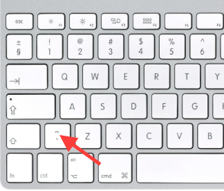

```{r, include=F, echo=F}
source("_first_chunk.R")
```


> Beginners mind (Shoshin) denotes openness, eagerness and lack of preconceptions when studying a subject, just as a beginner would, no matter what level of expertise the student has. 

Even black belt martial artists practice basic techniques like blocks and punches every time they train. 

This session doesn't assume any prior knowledge of R, and introduces the basics. For some this will be revision from
last year, but we provide additional material for advanced students test their knowledge and extend familiar skills.

## General principles

- Reproducibility and transparency in science (as a motivation for using R)
- Precision and attention to detail as an important skill.

## R techniques covered 

- [Using the RStudio interface, environment and files panes](#using)
- [Working interactively in R Markdown](#rmd)
- [loading packages, especially `tidyverse`, before anything else](#packages)
- [built-in 'dataframes' and tibbles (mtcars, diamonds); other datasets inside packages (gapminder)](#datasets)
- [`glimpse`, `head` and clicking on the Environment window to look at data](#data)
- [the pipe `%>%`](#pipe)
- [Introduce `ggplot`; demonstrate `geom_point` and `geom_boxplot`](#ggplot)
- [highlight types of data shown in `glimpse` (dbl, ord) and show the problem in a continuous color scale](#types)

<a name="using"></a>

# Using the RStudio interface, environment and files panes

These worksheets assume that you are using a web browser to access [the RStudio Server at Plymouth
University](https://rstudio.plymouth.ac.uk).

_NOTE_: RStudio works on most web browsers (e.g. Firefox, Safari, Chrome) but does not work that well on the default web browser in Windows 10 ("Edge"). If you're using Windows, we recommend [downloading Firefox](https://www.mozilla.org/en-US/firefox/new/) and using that. Firefox is free and open source.

## Using RStudio

When you login to RStudio, you'll be greeted with a screen that looks something like the image below. (If you've used RStudio before, you will see some additional folders and files.)


When you open RStudio for the first time, you can see three parts: 

1. The **Console** - This is the large rectangle on the left. This is where you tell R what to do, and it's also where R prints the answers to your questions. 

2. The **Environment** - This is the rectangle on the top right. This is where R keeps a list of the data it knows about. It's empty at the moment, because we haven't given R any data yet.

3. The **Files** - This is the rectangle on the bottom right. This is a bit like the _File Explorer_ in Windows, or the _Finder_ on a Mac. It shows you what files and folders R can see.

You should also be able to see that the two rectangles on the right have a number of other "tabs". These work like tabs on a web browser.  

The top rectangle has the tabs "Environment" and "History". The **History** tab keeps a record of commands you've recently typed into the Console. This can sometimes be useful.

The bottom rectangle has the tabs "Files", "Plots", "Packages", "Help", and "Viewer". We'll cover what these other tabs do later on. 

# Before you start

Before starting this module, you need to run an `R` command which makes a folder and downloads the files you will need
for each workshop.

:::{.exercise}

1. Click on the **Console** pane
1. Copy-paste the following command into the console

`source('https://raw.githubusercontent.com/benwhalley/lifesavR/main/bootstrap.R')`

Your console should now look like this:


Press return (enter) to run the command. If your console looks like the image below, then you are ready to start the
session.


:::

<a name="rmd"></a>

# R Markdown

TODO: Open the file `session-1.rmd`.

These have the file extension `.rmd`. You will store your work in one of these files in each session. For example, in session one you will only need to edit `session-1.rmd`.

R Markdown is a way of combining R with natural language. It allows you to integrate the results of your data analysis
into high quality reports, research papers, dissertations or books. Because it's such a powerful tool, this module
provides an early, gentle introduction R Markdown.

To combine R code with written text, RStudio needs to know which is which. This is done by putting the R code inside
some special characters, creating what's referred to as a `chunk`. A chunk is opened using the symbols `` ```{r} ``, and
closed using the symbols `` ``` ``. This is what a chunk looks like in RStudio:


_NOTE:_ The symbols which start and end a chunk are _backticks_, not single quotes.

`r hide("Can't find the backtick on your keyboard?")`




`r unhide()`

In the example, notice that when the chunk is opened, there is a space and the word `life` after the `r`. This *names* the chunk. Naming chunks is optional, but it's a good habit to develop, as it allows you to navigate between chunks using a menu in the R Markdown editor:


The R code inside a chunk can be run inside the editor, by pressing the green icon on the line where the chunk is
opened. The results are printed below the chunck.

:::{.exercise}
Try running the chunk below. The results should look something like this:
:::

```{r life, class.source = 'numberLines lineAnchors'}
meaningoflife <- 40 + 2
meaningoflife
```
Understanding variables is an important first step to writing R code. A variable is a name which can be assigned a value
using the `<-` operator. In this case, it stores the results of the addition `40 + 2`. Line 1 assigns the value `42` to
the variable `meaningoflife`. Line 2 displays the value of `meaningoflife`. Line 3 is the output of the `life` chunk.

Variables that you create are stored in what's called the `Global Environment`. You can see them in the **Environment**
pane. There is a menu which allows you to view your variables as a list or a grid:


As you will be creating lots of chunks in this module, you can save yourself some typing by using a keyboard shortcut
to insert both the opening and closing chunk characters:

|Windows & Linux   |          macOS        |
|:---------------------|:------------------|
|Ctrl+Alt+I      | Command+Option+I |

:::{.exercise}
1. Create a chunk named `myfirstchunk`
1. Inside the chunk, create a variable called `myfirstvariable` which stores the result of the addition `2 + 2`
1. Run the chunk
:::

After completing these steps, your environment should look like this:


# Loading packages

- loading packages, especially `tidyverse`, before anything else

# Built in data

- explain datasets
- explain that a data.frame is same as a tibble
- show mtcars, diamonds (by show I just mean type name and run it to see data in rmd window interactively)
- show that you can click around in this (e.g. to see all columns and all rows - only 10 shown on first page)

```{r mtcars}
mtcars
```

- show other datasets inside packages: gapminder

# Exploring and checking data

- `glimpse`, `head` and clicking on the Environment window to look at data
- highlight types of data shown in glimpse (dbl, ord)  (we will come back to this below)

# ggplot and the pipe

## Scatter plots

- the pipe `%>%` sends data to the next bit of code

- Introduce/recall `ggplot`
  - demonstrate `geom_point` and geom_jitter
    - TODO find an example dataset which requires geom_jitter because on integer scale

```{r}
# TODO find better example for this
attitude %>%
  ggplot(aes(rating, complaints)) +
  geom_point()

# vs.

attitude %>%
  ggplot(aes(rating, complaints)) +
  geom_jitter()
```


## Boxplots

```{r}
gapminder::gapminder %>%
  ggplot(aes(continent, lifeExp)) +
  geom_boxplot()
```

### Problems with x axes

Show this and highlight it's not what we expect

```{r}
mtcars %>%
  ggplot(aes(am, mpg)) +
  geom_boxplot()
```

The reason is visible here:

```{r}
mtcars %>% glimpse()
```

The `am` has type `dbl`...
 
We must tell R it's a factor:

```{r}
mtcars %>%
  ggplot(aes(factor(am), mpg)) +
  geom_boxplot()
```

Adding color. This works:

```{r}
diamonds %>%
  ggplot(aes(carat, price, colour = clarity)) +
  geom_point()
```

This doesn't so well:

```{r}
mtcars %>%
  ggplot(aes(wt, mpg, color = cyl)) +
  geom_point()
```

We can improve it like this:

```{r}
mtcars %>%
  ggplot(aes(wt, mpg, color = factor(cyl))) +
  geom_point()
```

# Check your knowledge

- What is `mtcars`?
- Explain what `glimpse` does
- What is the `%>%` symbol called and what does it do?
- What is the `<-` symbol called and what does it do?
- What is the difference between a `dbl` and an `ord`/`fct`?
- Give an example of when the difference between `dbl` and `fct` matters when making a plot
- How can you convert a variable from a `dbl` to a `fct`
- What is the difference between `geom_jitter()` and `geom_point()`? 
- Why is `geom_jitter` useful sometimes?

# Extensions

- Lots more practice plots with different datasets?
- Better plotting worksheet stage 4?

# Further reading

- [R Markdown cookbook](https://bookdown.org/yihui/rmarkdown-cookbook/) and [other resources](https://rmarkdown.rstudio.com/)