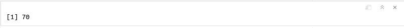

```{r, include=F, echo=F}
source("_first_chunk.R")
```


```{html, child="bs-tab-fix.html"}
```


```{css, child="video.css"}
```

# Overview

<!-- > Beginners mind (Shoshin) denotes openness, eagerness and lack of preconceptions when studying a subject, just as a beginner would, no matter what level of expertise the student has.  -->

<!-- Even black belt martial artists practice basic techniques like blocks and punches every time they train. -->

This session doesn't assume any prior knowledge of R, and introduces the basics. For some students this will include revision of material from stage 1. However we provide additional material for advanced students to test their knowledge and extend familiar skills.

To be clear, this repetition is intentional: we find most students will benefit from refreshing their knowledge at this stage in the course. **Even if you are quite confident when using RStudio please read the worksheet carefully and complete all of
the activities in the blue boxes.**

# R techniques covered

- [Using the RStudio interface](#using)
- [What can R do?](#cando)
- [Working interactively in R Markdown](#interactive)
- [Loading packages](#packages)
- [Built-in datasets](#datasets)
- [Exploring and checking data](#exploring)
- [Making a scatterplot with `ggplot()`](#scatterplots)

# Using the RStudio interface {#using}


```{r, echo=F}
video_data <- list(identifier = "using-r-studio-interface", ytidentifier = "yt-embed", showcode=F)
# makermds(video_data)
```

```{r child = '_content/_video_tabs.rmd'}
```


# Before you start

```{r, echo=F}
video_data <- list(identifier = "before-you-start", ytidentifier = "yt-embed")
# makermds(video_data)
```

```{r child = '_content/_video_tabs.rmd'}
```


:::{.exercise}

1. Click on the **Console** pane.
1. Copy-paste the following into the console:

`source("https://raw.githubusercontent.com/benwhalley/lifesavR/main/bootstrap.R")`

Your console should now look like this:


Press <span class="keyshape">↩</span> to run the code. If your console looks like the image below, then you are ready to start the session.


:::


# Using the workbooks

```{r, echo=F}
video_data <- list(identifier = "using-the-workbooks",
                   showcode = F,
                   ytidentifier = "yt-embed")
# makermds(video_data)
```

```{r child = '_content/_video_tabs.rmd'}
```


:::{.exercise}

Click on `session-1.rmd` in the **Files** pane.

If you're able to open this file you are now ready to start the rest of the session.

:::


# What can R do? {#cando}

```{r, echo=F}
video_data <- list(identifier = "what-can-r-do", ytidentifier = "yt-embed")
```

```{r child = '_content/_video_tabs.rmd'}
```


# Working interactively in R Markdown {#interactive}

```{r, echo=F}
video_data <- list(identifier = "working-interactively-in-r", ytidentifier = "yt-embed", showcode=F)
# makermds(video_data)
```

```{r child = '_content/_video_tabs.rmd'}
```


:::{.exercise}

**Exercise 1**

1. Locate the first chunk in `session-1.rmd` (you find this in the **Files** pane)
1. Place your cursor (anywhere) on the line that says `library(tidyverse)` (this code is explained in the next section)
1. Run the code by pressing <span class="keyshape">Ctrl</span> + <span class="keyshape">↵</span> (Windows, Linux) or
<span class="keyshape">⌘</span> + <span class="keyshape">↩</span> (Mac)

You will see some output appear beneath the chunk. Don't worry about the details for now, we'll explain those later.

:::


:::{.exercise}

**Exercise 2**

Position your cursor on the line that says `diamonds` and run the code.

You should see the following scatter plot of the diamonds data appear below the chunk:

```{r diamonds-plot, echo=FALSE}
diamonds %>%
  ggplot(aes(carat, price)) +
  geom_point()
```


:::


Congratulations! You have just run your first lines of R. The code to produce the plot consisted of three lines. You can
also run part of a line by highlighting just the code you want to run, as you'll see in the next exercise.


:::{.exercise}

**Exercise 3**

1. Select (highlight) the word `diamonds`.
1. Run the code.

This prints the first few lines of the diamonds data:


:::


:::{.exercise}

**Exercise 4: Making new chunks**

1. Find the instructions for Exercise 4 in your workbook.
1. Create a new chunk below the instructions.
1. Inside the chunk, write a line of code which adds together the numbers 9, 4, 55 and 2.
1. Run the the line of code you have written.

The output from the chunk should look like this:


:::

# Loading packages {#packages}

```{r, echo=F}
video_data <- list(identifier = "loading-packages", ytidentifier = "yt-embed")
# makermds(video_data)
```

```{r child = '_content/_video_tabs.rmd'}
```


:::{.tip}

If you've understood what packages are then it should be clear that you can't use the functions provided by `tidyverse`
until you've run the command: `library(tidyverse)`.

For example, if you tried to produce the scatter plot before loading `tidyverse` you'd see an error like this in the
console:

<pre style="color:red">
Error in diamonds %>% ggplot(aes(carat, price, colour = clarity)) :
  could not find function "%>%"
</pre>

**This is important** because `could not find function` errors are one of the most common problems
that beginners encounter. They normally mean that you have

1. forgotten to include `library(tidyverse)` as the first line in your code, or
1. forgotten to *run* that line.

:::


# Datasets {#datasets}


```{r, echo=F}
video_data <- list(identifier = "built-in-datasets", ytidentifier = "yt-embed")
# makermds(video_data)
```

```{r child = '_content/_video_tabs.rmd'}
```


:::{.exercise}

**Exercise 5**

1. Create a new chunk below the `Exercise 5` heading in your workbook (`session-1.rmd`).
1. Load the `psydata` package
1. Display the `fuel` dataset and try out the navigation buttons.
1. Make a list of columns in the `development` datset

The output should look like this:


:::


:::{.exercise}

**Exercise 6**

1. Create a new chunk below the `Exercise 6` heading in your workbook (`session-1.rmd`).
1. Load the `psydata` package if you haven't already done that in this work session
1. Show the first 10 rows of the `development` data 

Use the output to answer the following question. After entering your answer, click outside the box. The border will turn turn blue when the answer is correct.

The population of Afghanistan in 1967 was: `r fitb('11537966')`.

:::

# Scatterplots  {#scatterplots}

```{r, echo=F}
video_data <- list(identifier = "scatterplots", ytidentifier = "yt-embed")
# makermds(video_data)
```

```{r child = '_content/_video_tabs.rmd'}
```

:::{.exercise}

**Exercise 7**

1. Create a new chunk below the `Exercise 7` heading in your workbook.
1. Using the `fuel` dataset, create a scatterplot  with `engine_size` on the x-axis and `mpg` on the y-axis.
1. Run the chunk.

The scatterplot should look like this:

```{r, echo=FALSE}
fuel %>%
  ggplot(aes(engine_size, mpg)) +
  geom_point()
```
:::

# Check your knowledge

Write an answer to each of these questions in the `Check your knowledge` section of your workbook. The answers will be
revealed in Session 2.

1. How do you run part of a line of R code using the keyboard short cut?
1. Which library will you always need to load in your first R Markdown chunk?
1. What is `psydata`?
1. How would you look at/inspect a whole dataset?
1. What does `glimpse` do and when is it useful?
1. What is the 5th column in the `development` dataset?
1. Which function makes a plot?  (there are many, but we mean the one shown above)
1. Which function chooses the columns of data used in the plot?

# Extension exercises

:::{.exercise}

### Extension exercise 1

This scatterplot uses the `mtcars` dataset to show `engine_size` on the x-axis against `mpg` (miles per gallon, or fuel economy) on the y-axis.

```{r, echo=FALSE}
fuel %>% 
  ggplot(aes(engine_size, mpg)) +
  geom_point()
```

In a new chunk, write the R code to produce this plot.

:::


:::{.exercise}

### Extension exercise 2

There is another built-in dataset called `iris` which includes data about
different flower species.

Use `glimpse` to get a list of the column names.

Make a scatterplot which shows the relationships between petal widths and lengths.

:::


# Further reading

*Scatterplots and visualisation*: This book is an excellent resource for data visualisation in R. This chapter: <https://clauswilke.com/dataviz/visualizing-associations.html> shows many examples of 
plots which display relationships between variables (including scatter plots) and so 
would extend the material here.


