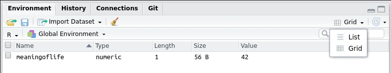

```{r, include=F, echo=F}
source("_first_chunk.R")
```


> Beginners mind (Shoshin) denotes openness, eagerness and lack of preconceptions when studying a subject, just as a beginner would, no matter what level of expertise the student has. 

Even black belt martial artists practice basic techniques like blocks and punches every time they train. 

This session doesn't assume any prior knowledge of R, and introduces the basics. For some this will be revision from
last year, but we provide additional material for advanced students test their knowledge and extend familiar skills.

## General principles

- Reproducibility and transparency in science (as a motivation for using R)
- Precision and attention to detail as an important skill.

## R techniques covered 

- [Using the RStudio interface](#using)
- [Working interactively in R Markdown](#rmd)
- [Creating a chunk](#chunk)
- [Loading packages](#packages)
- [built-in 'dataframes' and tibbles (mtcars, diamonds); other datasets inside packages (gapminder)](#datasets)
- [`glimpse`, `head` and clicking on the Environment window to look at data](#data)
- [the pipe `%>%`](#pipe)
- [Introduce `ggplot`; demonstrate `geom_point` and `geom_boxplot`](#ggplot)
- [highlight types of data shown in `glimpse` (dbl, ord) and show the problem in a continuous color scale](#types)

<a name="using"></a>

# Using the RStudio interface

These worksheets assume that you are using a web browser to access [the RStudio Server at Plymouth
University](https://rstudio.plymouth.ac.uk).

_NOTE_: RStudio works on most web browsers (e.g. Firefox, Safari, Chrome) but does not work that well on the default web browser in Windows 10 ("Edge"). If you're using Windows, we recommend [downloading Firefox](https://www.mozilla.org/en-US/firefox/new/) and using that. Firefox is free and open source.

When you login to RStudio, you'll be greeted with a screen that looks something like the image below. (If you've used RStudio before, you will see some additional folders and files.)


When you open RStudio for the first time, you can see three parts: 

1. The **Console** - This is the large rectangle on the left. This is where you tell R what to do, and it's also where R prints the answers to your questions. 

2. The **Environment** - This is the rectangle on the top right. This is where R keeps a list of the data it knows about. It's empty at the moment, because we haven't given R any data yet.

3. The **Files** - This is the rectangle on the bottom right. This is a bit like the _File Explorer_ in Windows, or the _Finder_ on a Mac. It shows you what files and folders R can see.

You should also be able to see that the two rectangles on the right have a number of other "tabs". These work like tabs on a web browser.  

The top rectangle has the tabs "Environment" and "History". The **History** tab keeps a record of commands you've recently typed into the Console. This can sometimes be useful.

The bottom rectangle has the tabs "Files", "Plots", "Packages", "Help", and "Viewer". We'll cover what these other tabs do later on. 

# Before you start

Before starting this module, you need to run an R command which makes a folder and downloads the files you will need
for each workshop.

:::{.exercise}

1. Click on the **Console** pane
1. Copy-paste the following command into the console

`source('https://raw.githubusercontent.com/benwhalley/lifesavR/main/bootstrap.R')`

Your console should now look like this:


Press return (enter) to run the command. If your console looks like the image below, then you are ready to start the
session.


:::

<a name="rmd"></a>

# Working interactively in R Markdown

Click on the `lifesavr` folder in the **Files** pane. Notice than some files have the extension `.rmd`. These are R
Markdown files. It is important that any R Markdown file you create has the extension `.rmd` (or .`Rmd`), because this
is how RStudio knows what they contain.

R Markdown is a way of combining R with natural language. It allows you to integrate the results of your data analysis
into high quality reports, research papers, dissertations or books. Because it's such a powerful tool, this module
provides an early, gentle introduction to R Markdown.

RStudio needs to distinguish R code from narrative text. This is done by putting the code inside some special
characters, creating what's referred to as a `chunk`. A chunk is opened using the symbols `` ```{r} ``, and closed using
the symbols `` ``` ``. This is what a chunk looks like in RStudio (this chunk has been given the optional name `life`):


_NOTE:_ The symbols which start and end a chunk are _backticks_, not single quotes.

`r hide("Can't find the backticks on your keyboard?")`


`r unhide()`

## Running R code within a chunk

Watch the following short video to see how to run code within a chunk.

<video width="100%" controls id="chunks">
  <source src="videos/chunks.mp4" type="video/mp4" />
  <track label="English" kind="subtitles" srclang="en" src="videos/chunks.vtt" />
</video>
<script>
v = document.getElementById("chunks")
v.textTracks[0].mode = "showing";  // or "hidden"
</script>

In each session you will work in a single R Markdown file.

:::{.exercise}
Click on `session-1.rmd`, which is the file you need for this session.
:::

As the video shows, one way to run code within a chunk is to execute the commands one at a time, using the following
keys:

```{=html}
<style>
 .keyshape {
    /*Box Properties*/
    display:inline-block;
    width:48px;
    height:48px;
    margin: 0px 4px;
    background: #fff;
    border-radius: 4px;
    box-shadow: 0px 1px 3px 1px rgba(0, 0, 0, 0.5);
    /*Text Properties*/
    font: 18px/48px Helvetica, serif;
    text-align: center;
    color: #666;
}
</style>
<p>Windows, Linux: <span class="keyshape">Ctrl</span> + <span class="keyshape">↵</span>
<p>Mac: <span class="keyshape">⌘</span> + <span class="keyshape">↩</span>
</p>
```

:::{.exercise}
1. Locate the first chunk in `session-1.rmd`
1. Place your cursor (anywhere) on the line that says `library(tidyverse)`
1. Run this line by pressing the keys above
:::

You will see some output appear in the console. Don't worry about the details for now, we'll explain those later.
However, one of the effects of the command you have just run is to load some data about diamonds.

:::{.exercise}
Now position your cursor on the line that says `diamonds` and run the commands.
:::

You should see the a scatterplot of the diamonds data appear below the chunk:

```{r diamonds-plot, echo=FALSE}
diamonds %>%
  ggplot(aes(carat, price, colour = clarity)) +
  geom_point()
```

Congratulations! You have just run your first lines of R. The code to produce the plot consisted of three lines. You can
also run part of a line by highlighting the code you want to run:

:::{.exercise}
1. Select (highlight) the word `diamonds`
1. Run the code
:::

This prints the first few lines of the diamonds data:

```{r diamonds-data, echo=FALSE}
diamonds %>% head(10) %>% pander
```

Why would you want to run part of a line of code? In these workshops you will combine simple steps into sequences which
do a particular job, such as generating a plot. It's natural, especially when you're new to R, that the full sequence
of commands won't do exactly what you want first time. Running part of your code allows you to identify the steps which
are correct. This allows you to modify subsequent steps until your code produces the required results. Remember this
technique as you will be using it extensively in these workshops.

## Variables

It is important to understand what a variable is in R. A variable is a name which can be assigned a value
using the assignment operator: `<-`.

:::{.exercise}
Run the lines in the chunk named `life`.
:::

The results should look similar to this:
 
```{r life, class.source = 'numberLines lineAnchors'}
meaningoflife <- 40 + 2
meaningoflife
```

This code stores the results of the addition `40 + 2`. Line 1 assigns the value `42` to the variable `meaningoflife`.
The assignment operator `<-` looks like an arrow that points to the left. This is a reminder that the results of the
calculation on the right hand side will be assigned to the variable on the left hand side. Line 2 displays the value of
`meaningoflife`. Line 3 is the output of the `life` chunk.

Variables that you create are stored in what's called the `Global Environment`. You can see them in the **Environment**
pane. 

<a name="chunk"></a>

## Creating a chunk

You will be creating many chunks, so learn the following keyboard shortcuts for inserting the opening and closing
characters:

```{=html}
<p>Windows, Linux: <span class="keyshape">Ctrl</span> + <span class="keyshape">Alt</span> + <span class="keyshape">I</span>
<p>Mac: <span class="keyshape">⌘</span> + <span class="keyshape">T</span>
</p>
```

:::{.exercise}
Exercise 1

1. Use the keyboard shortcut to create a chunk
1. Inside the chunk, create a variable called `myfirstvariable` which stores the result of the addition `2 + 2`
1. Run the chunk
:::

After completing these steps, your environment should look like this:


<a name="packages"></a>

# Loading packages

A powerful feature of R is that it can be extended to analyse or plot data in any way imaginable. A package (sometimes
called a library) is an extension to R that adds new commands. Packages are loaded using the `library()` command.

The first command you ran above was `library(tidyverse)`, which loaded the `tidyverse` package. We can now explain some
of the output that you saw in the console when you ran this command. Part of the output said **"Attaching packages"**.
Tidyverse is a special package in that it loads some additional packages. One of these packages contains the diamonds
data. Another, `ggplot2`, contains the commands you used to create the scatterplot.

The `tidyverse` package is so fundamental to this course that `library(tidyverse)` is likely to be the first line of R
in the first chunk of each of your R Markdown files.

:::{.tip}
If you've understood what packages are then it should be clear that you can't use the commands provided by `tidyverse`
(and the additional packages it loads) until you've run the command `library(tidyverse)`.

For example, if you tried to produce the scatterplot before loading `tidyverse` you'd see an error like this in the
console:

<pre style="color:red">
Error in diamonds %>% ggplot(aes(carat, price, colour = clarity)) : 
  could not find function "%>%"
</pre>

We mention this here, as `could not find function` errors are one of the most common problems that beginners encounter. This is almost always because they have

1. forgotten to include `library(tidyverse)` as the first line in their code, or
1. forgotten to *run* that line.
:::

# Built in data

- explain datasets
- explain that a data.frame is same as a tibble
- show mtcars, diamonds (by show I just mean type name and run it to see data in rmd window interactively)
- show that you can click around in this (e.g. to see all columns and all rows - only 10 shown on first page)

```{r mtcars}
mtcars
```

- show other datasets inside packages: gapminder

# Exploring and checking data

- `glimpse`, `head` and clicking on the Environment window to look at data
- highlight types of data shown in glimpse (dbl, ord)  (we will come back to this below)

There is a menu which allows you to view your variables as a list or a grid:



Grid view shows you the type in the `Type` column.

# ggplot and the pipe

## Scatter plots

- the pipe `%>%` sends data to the next bit of code

- Introduce/recall `ggplot`
  - demonstrate `geom_point` and geom_jitter
    - TODO find an example dataset which requires geom_jitter because on integer scale

```{r}
# TODO find better example for this
attitude %>%
  ggplot(aes(rating, complaints)) +
  geom_point()

# vs.

attitude %>%
  ggplot(aes(rating, complaints)) +
  geom_jitter()
```


## Boxplots

```{r}
gapminder::gapminder %>%
  ggplot(aes(continent, lifeExp)) +
  geom_boxplot()
```

### Problems with x axes

Show this and highlight it's not what we expect

```{r}
mtcars %>%
  ggplot(aes(am, mpg)) +
  geom_boxplot()
```

The reason is visible here:

```{r}
mtcars %>% glimpse()
```

The `am` has type `dbl`...
 
We must tell R it's a factor:

```{r}
mtcars %>%
  ggplot(aes(factor(am), mpg)) +
  geom_boxplot()
```

Adding color. This works:

```{r}
diamonds %>%
  ggplot(aes(carat, price, colour = clarity)) +
  geom_point()
```

This doesn't so well:

```{r}
mtcars %>%
  ggplot(aes(wt, mpg, color = cyl)) +
  geom_point()
```

We can improve it like this:

```{r}
mtcars %>%
  ggplot(aes(wt, mpg, color = factor(cyl))) +
  geom_point()
```

# Check your knowledge

- What is `mtcars`?
- Explain what `glimpse` does
- What is the `%>%` symbol called and what does it do?
- What is the `<-` symbol called and what does it do?
- What is the difference between a `dbl` and an `ord`/`fct`?
- Give an example of when the difference between `dbl` and `fct` matters when making a plot
- How can you convert a variable from a `dbl` to a `fct`
- What is the difference between `geom_jitter()` and `geom_point()`? 
- Why is `geom_jitter` useful sometimes?

# Extensions

- Lots more practice plots with different datasets?
- Better plotting worksheet stage 4?

# Further reading

- [R Markdown cookbook](https://bookdown.org/yihui/rmarkdown-cookbook/) and [other resources](https://rmarkdown.rstudio.com/)