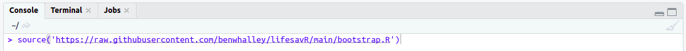
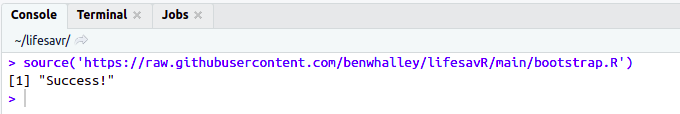
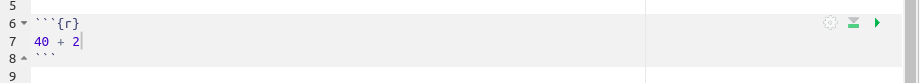
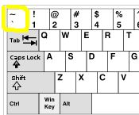
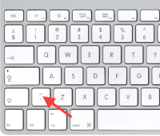
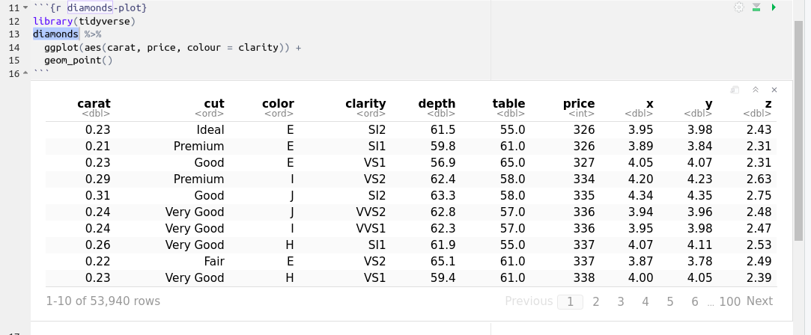
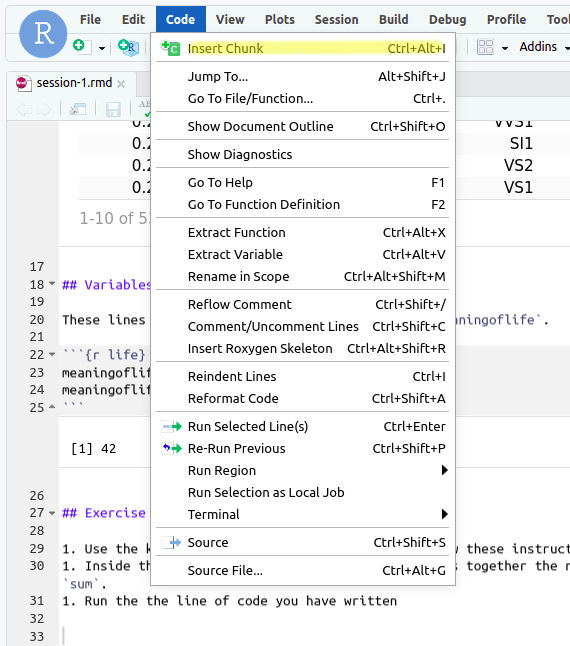

```{r, include=F, echo=F}
source("_first_chunk.R")
```


<!-- > Beginners mind (Shoshin) denotes openness, eagerness and lack of preconceptions when studying a subject, just as a beginner would, no matter what level of expertise the student has.  -->

<!-- Even black belt martial artists practice basic techniques like blocks and punches every time they train. -->

This session doesn't assume any prior knowledge of R, and introduces the basics. For some this will be revision from
last year, but we provide additional material for advanced students test their knowledge and extend familiar skills.
**Even if you are quite confident with R Studio from Stage 1, please read the worksheet carefully and complete all of
the activities in the blue boxes.**

# General principles

- Reproducibility and transparency in science (as a motivation for using R)
- Precision and attention to detail as an important skill.

<!-- TODO intro VIDEO -->

`r hide('Video script')`
I wonder if a video of Ben explaining success factors might be a replacement for the martial arts simile.

For now, this is a list of success factors observed in previous cohorts:

* 'Light' attitude
* Perseverence
* Go slow, don't go on until you've understood current section
* It's not a race or a competition with your peers
  * Hare and the tortoise
* Do all exercises
* Re-do parts of worksheet if you didn't understand them
* Work together
* Many instances of people who overcame initial lack of confidence to enjoy R
* Practise - learn by doing
`r unhide()`

# R techniques covered 

- [Using the RStudio interface](#using)
- [What can R do?](#cando)
- [Working interactively in R Markdown](#interactive)
- [Creating a chunk](#chunk)
- [Loading packages](#packages)
- [Built-in datasets](#datasets)
- [Exploring and checking data](#exploring)
- [`ggplot`: scatter plots](#scatterplots)
- [`ggplot`: boxplots](#boxplots)
- [`ggplot`: colour](#colour)
- [Introduction to Markdown](#markdown)

# Using the RStudio interface {#using}

These worksheets assume that you are using a web browser to access [the RStudio Server at Plymouth
University](https://rstudio.plymouth.ac.uk).

_NOTE_: RStudio works on most web browsers (e.g. Firefox, Safari, Chrome) but does not work that well on the default web browser in Windows 10 ("Edge"). If you're using Windows, we recommend [downloading Firefox](https://www.mozilla.org/en-US/firefox/new/) and using that. Firefox is free and open source.

When you login to RStudio, you'll be greeted with a screen that looks something like the image below.


When you open RStudio for the first time, you can see three parts: 

1. The **Console** - This is the large rectangle on the left. This is where you tell R what to do, and it's also where R prints the answers to your questions. 

2. The **Environment** - This is the rectangle on the top right. This is where R keeps a list of the data it knows about. It's empty at the moment, because we haven't given R any data yet.

3. The **Files** - This is the rectangle on the bottom right. This is a bit like the _File Explorer_ in Windows, or the _Finder_ on a Mac. It shows you what files and folders R can see.

You should also be able to see that the two rectangles on the right have a number of other "tabs". These work like tabs on a web browser.  

The top rectangle has the tabs "Environment" and "History". The **History** tab keeps a record of commands you've recently typed into the Console. This can sometimes be useful.

The bottom rectangle has the tabs "Files", "Plots", "Packages", "Help", and "Viewer". We'll cover what these other tabs do later on. 

# Before you start

Before starting this module, you need to run an R command which makes a folder and downloads the files you will need
for each workshop.

:::{.exercise}

1. Click on the **Console** pane
1. Copy-paste the following command into the console

`source('https://raw.githubusercontent.com/benwhalley/lifesavR/main/bootstrap.R')`

Your console should now look like this:


Press <span class="keyshape">↩</span> to run the command. If your console looks like the image below, then you are ready to start the
session.


:::

## Using the workbooks

Each session has an associated 'workbook' file which you will use to complete the exercises in the worksheet.

`r hide('Video script')`
Each session has an associated 'workbook' file which you will use to complete the exercises in the worksheet. The file
you need for this session is called `session-1.rmd`.

If you click on the file it opens the workbook in a tab of a new pane, called the **Source** pane. It's called the
**Source** pane because R commands are also referred to as 'R code', which is shorthand for 'R source code'. The
**source** pane allows you to write R code and explore your data.
`r unhide()`

:::{.exercise}
Click on `session-1.rmd` in the **Files** pane.
:::

You're now ready to start the session.

# What can R do? {#cando}

R can do simple arithmetic, generate data and produce plots.

<!-- TODO VIDEO of what R can do to provide context for where we’re going and what we’re doing. -->

`r hide('Video script')`
RStudio is a user interface to R, which is a computer language that is primarily designed for data analysis and
visualisation. R is a text-based language, so you interact with it by typing and then running commands.

R Studio makes it easy to run R commands and organise your work. For example, you can do simple arithmetic [`2 * 221`],
generate some random numbers [`(rnorm(10, 0,1))`], and plot some random numbers [`hist(rnorm(100, 0,1))`].

You should think of R as a robot. The robot is extremely fast, powerful and tireless, but it’s also literal-minded, and
won’t think for itself or take the initiative. You need to tell it *exactly* what to do, by providing very precise
instructions.
`r unhide()`

# Working interactively in R Markdown {#interactive}

<!-- TODO: VIDEO working interactively -->

R Markdown documents can be used interactively to run R code.

`r hide('Video script')`
R Markdown is a way of combining R with narrative text. It allows you to integrate the results of your data analysis
into high quality reports, research papers, dissertations or books. Because it's such a powerful tool, this module
provides an early, gentle introduction to R Markdown.

R Markdown documents can be used interactively to run R code. If you [click on the `lifesavr` folder in the **Files**
pane], you'll notice than some files have the extension `.rmd`. These are R Markdown files. The file extension `.rmd`
(or .`Rmd`) is important, because this is how R Studio knows that the files contain a mixture of R code and narrative
text.

RStudio needs to distinguish R code from narrative text. This is done by putting the code inside some special
characters, creating what's referred to as a `chunk`. A chunk is opened using the symbols `` ```{r} ``, and closed using
the symbols `` ``` ``. This is what a chunk looks like in RStudio:



_NOTE:_ The symbols which start and end a chunk are _backticks_, not single quotes.

`r hide("Can't find the backticks on your keyboard?")`



`r unhide()`
`r unhide()`

## Running R code within a chunk

There are three ways to run R code within a chunk.

<!-- TODO: re-record VIDEO of running code in a chunk -->

<video width="100%" controls id="chunks">
  <source src="videos/chunks.mp4" type="video/mp4" />
  <track label="English" kind="subtitles" srclang="en" src="videos/chunks.vtt" />
</video>
<script>
v = document.getElementById("chunks")
v.textTracks[0].mode = "showing";  // or "hidden"
</script>

```{=html}
<style>
 .keyshape {
    /*Box Properties*/
    display:inline-block;
    width:48px;
    height:48px;
    margin: 0px 4px;
    background: #fff;
    border-radius: 4px;
    box-shadow: 0px 1px 3px 1px rgba(0, 0, 0, 0.5);
    /*Text Properties*/
    font: 18px/48px Helvetica, serif;
    text-align: center;
    color: #666;
}
</style>
```

`r hide('Video script')`
There are three ways to run R code within a chunk. The first is to run a complete line of code. You can
see here that our cursor is on line 12. The cursor can be anywhere on that line. To run the line, press
<span class="keyshape">Ctrl</span> + <span class="keyshape">↵</span> on Windows or Linux, or <span
class="keyshape">⌘</span> + <span class="keyshape">↩</span> on a Mac.

You'll see some output beneath the chunk that you don't need to worry about for now, but one of the effects of running
this command is to load a dataset about diamonds.

The cursor has been automatically positioned online 13. Lines 13 to 15 are actually part of the same command. We use the
same keys, <span class="keyshape">Ctrl</span> + <span class="keyshape">↵</span>, to run these lines, which generate a
scatter plot using the diamonds dataset. Don't worry how these commands work for now.

The second way to run code is to select only the commands you want to execute. If you select just the word diamonds on line
13 and run that, you will see that it does something different. This prints the contents of the diamonds data. Because
the dataset is large, it just prints the first few rows.

Finally, you often want to run all of the code in a chunk. This can be done by pressing the green arrow on the right hand side of the chunk. Another way to run all of the code is to position your cursor anywhere within the chunk and press
<span class="keyshape">Ctrl</span> + <span class="keyshape">⇧</span> + <span class="keyshape">↵</span> (Windows, Linux) or
<span class="keyshape">⌘</span> + <span class="keyshape">⇧</span> + <span class="keyshape">↩</span> (Mac).
`r unhide()`

:::{.exercise}
**Exercise 1**

1. Locate the first chunk in `session-1.rmd`
1. Place your cursor (anywhere) on the line that says `library(tidyverse)`
1. Run the commands by pressing <span class="keyshape">Ctrl</span> + <span class="keyshape">↵</span> (Windows, Linux) or
<span class="keyshape">⌘</span> + <span class="keyshape">↩</span> (Mac)
:::

You will see some output appear beneath the chunk. Don't worry about the details for now, we'll explain those later.

:::{.exercise}
**Exercise 2**

Position your cursor on the line that says `diamonds` and run the commands.

You should see the following scatter plot of the diamonds data appear below the chunk:

```{r diamonds-plot, echo=FALSE}
diamonds %>%
  ggplot(aes(carat, price)) +
  geom_point()
```
:::

Congratulations! You have just run your first lines of R. The code to produce the plot consisted of three lines. You can
also run part of a line by highlighting the code you want to run:

:::{.exercise}
**Exercise 3**

1. Select (highlight) the word `diamonds`
1. Run the command

This prints the first few lines of the diamonds data:


:::

Why would you want to run part of a line of code? In these workshops you will combine simple steps into sequences which
do a particular job, such as generating a plot. It's natural, especially when you're new to R, that the full sequence
of commands won't do exactly what you want first time. Running part of your code allows you to identify the steps which
are correct. This allows you to modify subsequent steps until your code produces the required results. Remember this
technique as you will be using it extensively in these workshops.

## Inserting a chunk {#chunk}

You insert a new chunk by positioning your cursor on the line where you want the chunk to appear, and selecting the
`Code > Insert Chunk` menu option:



There are also keyboard shortcuts for inserting a chunk:

```{=html}
<p>Windows, Linux: <span class="keyshape">Ctrl</span> + <span class="keyshape">Alt</span> + <span class="keyshape">I</span>
<p>Mac: <span class="keyshape">⌘</span> + <span class="keyshape">I</span>
</p>
```

:::{.exercise}
**Exercise 4**

1. Find the instructions for Exercise 4 in your workbook
1. Create a new chunk below the instructions
1. Inside the chunk, write a line of code which adds together the numbers 9, 4, 55 and 2, and assigns the result to a variable named `sum`.
1. Run the the line of code you have written

After completing these steps, your environment should look like this:


:::

# Loading packages {#packages}

By loading 'packages', you can add commands and datasets to R.

<!-- TODO: VIDEO loading packages -->

`r hide('Video script')`
By loading 'packages', you can add commands and datasets to R. Packages are a powerful feature which all R to be
extended to analyse or plot data in any way imaginable. A package (sometimes called a library) is an extension to R that
adds new commands and/or datasets. Packages are loaded using the `library()` command.

The first command you ran above was `library(tidyverse)`. This loaded the commands needed to create the scatter plot, and
also the diamonds data. The `tidyverse` package is so fundamental to this course that `library(tidyverse)` is likely to
be the first line of R in the first chunk of each of your R Markdown files.

:::{.tip}
If you've understood what packages are then it should be clear that you can't use the commands provided by `tidyverse`
(and the additional packages it loads) until you've run the command `library(tidyverse)`.

For example, if you tried to produce the scatter plot before loading `tidyverse` you'd see an error like this in the
console:

<pre style="color:red">
Error in diamonds %>% ggplot(aes(carat, price, colour = clarity)) : 
  could not find function "%>%"
</pre>

We mention this here, as `could not find function` errors are one of the most common problems that beginners encounter. They normally mean that you have

1. forgotten to include `library(tidyverse)` as the first line in your code, or
1. forgotten to *run* that line.
:::
`r unhide()`

# Built-in datasets {#datasets}

R has a number of built-in datasets, and more can be loaded from packages.

<!-- TODO: VIDEO built-in datasets -->

`r hide('Video script')`
A dataset is a set of data relating to a particular topic. Most datasets we will be working with consist of rows and
columns, just like a spreadsheet. In R this type of data is stored in a special type of variable called a
**data.frame**. You will also see references to datasets as **tibbles**. A tibble is just a special type of data.frame,
so you can treat the two types of variable as being equivalent.

One data.frame that is built-in to R is called `mtcars`. This is a dataset about cars that was published in a US
magazine called Motor Trend. Let's display this data in using a new chunk. As we did with the `diamonds` tibble, if we
type `mtcars`, select the variable name and execute it, we can see the data it contains.

By default this displays only the first ten rows and columns of the data. You can see other rows using the `Next`,
`Previous` and number buttons below the data. You can see additional columns using the arrow next to the final,
right-hand column.

You already know that the diamonds dataset was loaded using `library(tidyverse)`. The `gapminder` package includes a
tibble that contains data about life expectancy, GDP per capita, and population by country. We can load and explore this
dataset in a the same way we loaded diamonds dataset. We load the `gapminder` package, type the name of the tibble (also
`gapminder`) and run it. Again, we can use the navigation buttons to explore the data.
`r unhide()`

:::{.exercise}
**Exercise 5**

1. Create a new chunk at the bottom of your workbook
1. Display the `mtcars` data.frame and try out the navigation buttons
1. Load the `gapminder` package
1. Display and explore the gapminder tibble
:::

# Exploring and checking data {#exploring}

R Studio has a few different ways to explore datasets.

## The `head` command and the Environment pane

The `head` command allows you to explore the first few rows of a dataset.

<!-- TODO: VIDEO head() -->

`r hide('Video script')`
The `head` command allows you to explore the first few rows of a dataset. The command `mtcars %>% head()` prints the
first six rows of `mtcars`. The `%>%` command is called the 'pipe'. We'll explain more about how it works in the next
session. For now, all you need to know is that the command on the right hand side of the pipe (`head`) is applied to
whatever is on the left hand side (in this case, the `mtcars` dataset).

You can also explore your variables using the **Environment** pane. A data.frame will have an icon that looks like a
spreadsheet. If you click on the icon, the data.frame is displayed in a new tab in the **Source** pane.

This tab shows you the same information as printing the data.frame, such as the number of rows and columns, but it
also provides tools for exploring the data interactively.

* The arrows next to the column names allow you to arrange the rows in ascending or descending order based on the column
values.
* The `Filter` button allows you to specify a value for one or more columns to filter out non-matching rows. For
example, we could display just cars with 4 gears. Click the button again to turn off the filter.
`r unhide()`

:::{.exercise}
**Exercise 6**

1. Create a new chunk at the bottom of your worksheet
1. Use `head` to show the first six rows of `gapminder`

Use the output to answer the following question. After entering your answer, click outside the box. The border will turn
turn blue when the answer is correct.

The population of Afghanistan in 1967 was `r fitb('11537966')`.
:::

## The `glimpse` command

The `glimpse` command is useful for exploring datasets with lots of columns, as it allows you to see all columns at once.

<!-- TODO: VIDEO glimpse() -->
<!-- REVIEW "can we find a simpler dataset, or perhaps do this after you introduce loading a dataset over the web then we could provide a short link to a cut-down version of it?" -->

`r hide('Video script')`
The `glimpse` command is useful for exploring datasets with lots of columns, as it allows you to see all columns at
once. Using the `glimpse` command we can have the columns of a dataset run down the page, and data run across.

The command [`library(causaldata)`] loads a data.frame called `nhefs` containing lots of columns relating to health and
nutrition. Running the command `nhefs %>% glimpse()` shows all of the columns. This is like rotating the output you saw
earlier anti-clockwise by 90 degrees. The command displays all of the columns as rows, and as many observations from the
dataset as will fit on a single line.

Each column in a data.frame has an associated type. The second column of the `glimpse` output shows you the type of each column. The `nhefs` includes columns with various types:

* *dbl* is short for 'double-precision number', a number with one or more decimal places
* *int* is short for 'integer', a variable which contains whole numbers (e.g. a participant id number)
* *fct* is short for 'factor', a categorical variable (e.g. a specific response to a multiple-choice question)

Other types include:

* *chr* — short for 'character', a variable which contains text (e.g. an email address), and
* *ord* — short for 'ordered'; a variant of *fct* where the categories have a particular order (e.g. responses like 'Wost' < 'Better' < 'Best')

The importance of knowing the type associated with a column will become clear in a later session.
`r unhide()`

:::{.exercise}
**Exercise 7**

1. Create a new chunk at the bottom of your worksheet
1. Use `glimpse` to display the `diamonds` dataset.

The `clarity` variable in the `diamonds` tibble is of type `r fitb('ord')`.
:::

# ggplot: Scatter plots {#scatterplots}

A scatterplot shows the relationship between two variables by plotting their values as points.

```{r}
mpg %>% ggplot(aes(cty, hwy)) +
  geom_point()
```

<!-- TODO: VIDEO scatter plots -->

`r hide('Video script')`
A scatterplot shows the relationship between two variables by plotting their values as points.

This chunk creates a scatter plot by piping the `mpg` data into a `ggplot` command. The plot is built in two steps. The
first step, `ggplot(aes(cty, hwy))` selects variables for the x and y axes. In this case, miles per gallon (mpg) when
cars are driven in the city (`cty`) will be the x-axis, and mpg when cars are driven on the highway (`hwy`) will be the
y-axis. We can [see the axes by running just this part of the command].

In `ggplot`, each step is separated by `+` and goes on a new line. Because R Studio knows this is all part of the same
'pipeline', it automatically indents the code.

The second step `geom_point()` is a command which plots the data as points. If we [run the chunk], we see a scatter plot. A
point is plotted for each row, using the values for the `cty` and `hwy` variables.
`r unhide()`

:::{.exercise}
**Exercise 8**

1. Create a new chunk at the bottom of your worksheet
1. Create a scatterplot with `displ` (engine 'displacement') on the x-axis and `hwy` on the y-axis
1. Run the chunk.

The scatterplot should look like this:

```{r, echo=FALSE}
mpg %>% ggplot(aes(displ, hwy)) +
  geom_point()
```
:::

# ggplot: Boxplots {#boxplots}

Boxplots are useful for visualising categorical data.

```{r}
mpg %>%
  ggplot(aes(class, cty)) +
  geom_boxplot()
```

<!-- TODO: VIDEO boxplots -->

`r hide('Video script')`
Boxplots are useful for visualising categorical data. In a boxplot, the thick line is the median. That thick line is
enclosed inside a rectangle (the 'box'), and the size of the box indicates the inter-quartile range (IQR). The IQR
contains the middle 50% of the ordered data. A wider IQR indicates greater variation in a dataset.

The top and bottom of the box are called ‘hinges’. The vertical lines connected to each hinge are called 'whiskers', and
give some indication of the broader range of the data. Exactly what the whiskers show differs depending on the
particular command you use to draw a boxplot. In this case, the upper whisker shows the largest data point that is no
more than 1.5 times the IQR above the upper hinge. The lower whisker is the lowest point no more than 1.5x the IQR below
the lower hinge. In this version of a boxplot, any data point outside the range of the whiskers is described as an
'outlying point' and is shown individually as a dot.
`r unhide()`

:::{.exercise}
**Exercise 9**

1. Create a new chunk at the bottom of your worksheet
1. Create a boxplot with `drv` (front-wheel/rear-wheel/4-wheel drivetrain) on the x-axis and `hwy` on the y-axis
1. Run the chunk.

The boxplot should look like this:

```{r, echo=FALSE}
mpg %>%
  ggplot(aes(drv, hwy)) +
  geom_boxplot()
```
:::

# ggplot: Colour {#colour}

Colour can be added to a scatterplot to categorise the points.

<!-- TODO: VIDEO boxplots -->

`r hide('Video script')`
Colour can be added to a scatterplot to categorise the points. So far, you've used the `aes` command to define which variable is plotted on the x and y axes. The `aes` command is short for 'aesthetics', and it is a way to map variables to visual aspects of a plot. In addition to mapping variables to the x and y axes, the `colour` option maps colours to a categorical variable.

We could enhance the scatterplot showing mpg for city and highway driving, by adding a colour for each drivetrain.

```{r}
mpg %>%
  ggplot(aes(cty, hwy, color = drv)) +
  geom_point()
```
`r unhide()`

:::{.exercise}
**Exercise 10**

1. Create a new chunk at the bottom of your worksheet
1. Create a scatterplot using the `gapminder` dataset with `gdpPercap` on the x-axis, `lifeExp` on the y-axis, and `continent` in colour.
1. Run the chunk.

Your plot should look like this:

```{r ex10, echo=FALSE}
library(gapminder)
gapminder %>%
  ggplot(aes(gdpPercap, lifeExp, color = continent)) +
  geom_point()
```
:::

# Introduction to Markdown {#markdown}

This section shows you how to use 'markdown' to format the narrative text in your R Markdown files.

<!-- TODO: VIDEO rmarkdown -->

`r hide('Video script')`
Markdown uses special characters to style text in the same way you might use menus in a word processor to define
headings, font styles, lists etc. Your workbook contains examples of the main markdown commands you will need:

* The `#` at the start of `# lifesaveR: Workbook 1` assigns the text `lifesaveR: Workbook 1` as a first level heading (the largest size)
* The sentence below that heading is ordinary text
* `## An example plot` is a second level heading (next largest). Using `###` and `####` makes even smaller headings
* `**bold text**` makes **bold text**
* `*italic text*` makes *italic text*
* The lines beginning `1.` under `# Exercise 1` create a numbered list, starting at 1

The `Knit` button combines the markdown and R chunks, 'knitting' them together into an output document. It works through
your document converting markdown to formatted text, and running each of your R chunks, **in the order you have written
them**. You can see that this is the case by 'knitting' the R Markdown workbook for this session.

The following simple approach will give you regular practice writing markdown:

1. Each time you reach a new section in a worksheet, copy the section name (e.g. 'Exploring and checking data') into a
level 2 heading in your workbook
1. Before starting each exercise, create a level 3 heading for the exercise number [e.g. `### Exercise 5`]
1. Copy the exercise instructions below this as a bullet list
1. Add any additional notes that remind you what you have learnt in this section [e.g. `Some data is *built-in* to R.`]
1. Complete the exercise.

This methodical approach will allow you to complete each workbook step by step. At the end of each session, you will
have written a neat, 'summary' document which will be a useful revision aid. The same approach works for all R
worksheets at the University of Plymouth. If you get into this habit, you will be adding to your 'reference library'
whenever you complete a worksheet. These summary documents are invaluable when you are more familiar with R but need to
quickly remind yourself how to use a particular feature.

The [outline button] in R Studio shows you an outline of your document using the headings you have defined. This makes it easy to find a particular topic and the exercises you have completed to learn about each topic.

The [R Markdown Cheat Sheet](https://www.rstudio.com/wp-content/uploads/2015/02/rmarkdown-cheatsheet.pdf) is a useful
quick reference for markdown syntax.
`r unhide()`

:::{.exercise}
**Exercise 11**

1. For each of the chunks you wrote for Exercises 4-7
  1. Add the section name as a level 2 heading
  1. Add the exercise number as a level 3 heading
  1. Add the instructions as a numbered list (or as plain text if there's only one instruction)
1. Use the outline feature to explore the document
1. Knit the document
:::

# Check your knowledge

Write an answer to each of these questions in the `Check your knowledge` section of your workbook. The answers will be
revealed in Session 2.

- How to you run part of an R command?
- Which library do you need to load in your first R Markdown chunk?
- What is `gapminder`?
- Which command would you use to explore the first few rows of a dataset?
- What is the 5th column in `gapminder`?
- Explain what `glimpse` does.
- Which command makes a plot?
- Which command defines the axes on a plot?
- Which command makes a boxplot?
- How do you use markdown to make a level 3 heading?

# Extension exercises

<!-- TODO: practice plots with different datasets -->

## Extension exercise 1

:::{.exercise}

This scatterplot uses the `mpg` dataset to show `displ` (displacement) on the x-axis against `cty` (mpg when driving in
a city) on the y-axis.

```{r, echo=FALSE}
mpg %>% ggplot(aes(displ, cty)) +
  geom_point()
```

In a new chunk, write the R code to produce this plot.
:::

## Extension exercise 2

:::{.exercise}
This boxplot uses the `gapminder` dataset to show `lifeExp` (life expectancy) on the y-axis for each `continent` on the
x-axis.

```{r, echo=FALSE}
gapminder %>%
  ggplot(aes(continent, lifeExp)) +
  geom_boxplot()
```

In a new chunk, write the R code to produce this plot.
:::

## Extension exercise 3

:::{.exercise}
Create a boxplot which shows drivetrain on the x-axis and miles per gallon when a car is driven in the city on the
y-axis. Your plot should look like this:

```{r, echo=FALSE}
mpg %>%
  ggplot(aes(drv, cty)) +
  geom_boxplot()
```
:::

## Extension exercise 4

:::{.exercise}
Make a scatterplot of the `diamonds` data. Show carat on the x-axis, price on the y-axis and the clarity of the diamond
in colour. Try to produce your plot before comparing it against the answer using the button below.

`r hide('show answer')`
```{r, echo=FALSE}
diamonds %>%
  ggplot(aes(carat, price, colour = clarity)) +
  geom_point()
```
`r unhide()`
:::

## Extension exercise 5

:::{.exercise}
Make a scatterplot of the `mpg` data. Show city mpg on the x-axis, highway mpg on the y-axis and the vehicle class
in colour. Try to produce your plot before comparing it against the answer using the button below.

`r hide('show answer')`
```{r, echo=FALSE}
mpg %>%
  ggplot(aes(cty, hwy, colour = class)) +
  geom_point()
```
`r unhide()`
:::

# Further reading

- The [R Markdown Cheat Sheet](https://www.rstudio.com/wp-content/uploads/2015/02/rmarkdown-cheatsheet.pdf)
- The [R Markdown cookbook](https://bookdown.org/yihui/rmarkdown-cookbook/)
- Other [R Markdown resources](https://rmarkdown.rstudio.com/)
