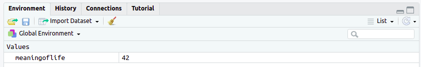

```{r, include=F, echo=F}
source('_first_chunk.R')
```

# Overview

We think the analogy to using R is clear:

- If you are anxious, stressed or avoidant you will be distracted
- Getting confident with the basics makes more complex techniques possible 


`r hide('Video script')`
In this session we cover:

- Loading data from files
- Using simple techniques to answer research questions with data
- Saving intermediate steps using variables

<!-- A literal translation of Mushin is something like 'mind without mind', but in karate and other martial arts the term -->
<!-- denotes the state of mind achieved when free from thoughts of anger, fear, or ego during combat, or in everyday life.  -->

<!-- To achieve mushin takes **repeated practice** and complete familiarity with the technique required to act, such that  -->
<!-- technical details can fade into the background. This leaves the student free to act, responding effortlessly to  -->
<!-- the challenge at hand. -->
`r unhide()`

<!-- - Provide stereotyped examples of the sorts of students positive/negative traits which relate to the theme of session - make it all more concrete -->
<!-- Use quotes from previous students illustrating? -->

# Principles/ideas 

- Using data to answer questions
- Precision and literal-mindedness of R
- Paths and directories

# R techniques covered

- [Storing data in variables](#variables)
- [Passing data to commands using the pipe `%>%`](#pipe)
- [The `read_csv` command](#readcsv)
- [The **Files** pane](#filespane)
- [Uploading data files](#upload)
- [The `filter` command](#filter)
- [The `arrange` command](#arrange)
- [The `group_by` command](#groupby)
- [The ``summarise`` command](#summarise)
- [R comments](#comments)

<!-- Activity: -->

<!-- ???  set up the teaching as a kind of treasure hunt where students have to find use data to answer questions, gather -->
<!-- clues and spell out a word? Alternatively, just ask them to make *LOTs* of different plots using the techniques above, not -->
<!-- just one: -->

# Storing data in variables {#variables}


Video summary:

- In R, a **variable** is the name for a *container* which *stores data*.
- We make variables using the **assignment operator**, which looks like this: `<-`.
- Values on the right hand side of `<-` are stored in the variable on the left hand side.
- Variables that you create are stored in the `Global Environment`, which you can see using the **Environment** pane.

```{r}
# calculate 40 + 2 and assign the result to a variable
meaning_of_life <- 40 + 2
# print variable
meaning_of_life
```

`r hide('Video script')`
As we work, it's useful to be able to save the results of the code we write. 

As one example, we might have a dataset with multiple columns, each holding participants' answers 
to an individual questionnaire item. We might want to calculate a new column —— maybe an average of each 
person's scores on all of the questions —— and keep track of this so we can use it in later calculations. 

Alternatively, we might want to save the result of a specific calculation and use it later on.

To do this we can create a **variable**. 

A variable is just a container to store data in. To make variables we use the assignment operator, which looks like this `<-`

That is, like an arrow that points to the left. This is a reminder that the results of the calculation on the right hand
side will be assigned (stored) in the variable on the left hand side.

The code in this chunk runs the calculation on the right hand side of the assignment operator, `40 + 2`, and assigns the
result to a new variable named `meaningoflife`. The output of the chunk is `42`, the value of `meaningoflife`.

Give your variables short names which describe the data they contain. Use the underscore `_` if you need to use more
than one word e.g. `meaning_of_life`.

You might wonder *where* these variables get saved. In most cases, variables you create are stored in what's called the
`Global Environment`. You can see them in the **Environment** pane in RStudio. Double-clicking on any variable there
will show you what is stored inside the container.
`r unhide()`

:::{.exercise}
**Exercise 1**

1. Open `session-2.rmd` using the **Files** pane. This is the workbook you will be using in this session.
1. Run the first chunk in the workbook.

The output should look like this:


Your **Environment** pane should look like this:


:::

:::{.exercise}
**Exercise 2**

1. Create a level 3 markdown heading named "Exercise 2" in your workbook
1. Create a new chunk beneath the heading
1. Assign the results of the calculation `2 * 35` to the variable `seventy`
1. Run the chunk

Your **Environment** should now look like this:


**Exercise 3**

1. Create a level 3 markdown heading named "Exercise 3" in your workbook
1. Use R to calculate your age in the year 2051.
1. Save the result in a variable _with a descriptive name_.
:::

# Passing data to commands using the pipe `%>%` {#pipe}


Video summary:

- We pass data from one piece of code to another using **the pipe** command, which looks like this: `%>%`.
- A **pipeline** is a sequence of two or more commands joined by `%>%`.
- You can use the assignment operator to store the results of a pipeline in a variable.

```{r}
# pipe mtcars into head()
mtcars %>% head()

# store first few rows of mtcars
mtcars_head <- mtcars %>%
  head()
```

`r hide('Video script')`
Sometimes we need to link together multiple steps in our analysis.

For example, if we're working with a big dataset we might want to select only some of the columns, and then filter out some of the rows of data, and the finally calculate descriptive statistics.

We could do this by creating lots of variables, each one saving the results at each intermediate step. This can get confusing, though.

Instead we can use what's known as a 'pipe' — it's another way to link together multiple instructions.

The pipe sends data from one piece of code to another.

The pipe looks like this `%>%`.  

In session 1, you used this command to "pipe" the `mtcars` dataset into `head`, which shows just the first few rows:

```{r}
mtcars %>% head()
```

You can think of your data as flowing along lengths of pipe, joined by commands which do things to the data, step by
step, until the result you want plops out at the end.

Each command should be read as the word "then", e.g. "pipe `mtcars` data, *then* `head()` it".

The `>` in the pipe command reminds you of the direction in which your data is flowing (it only works left to right).

It's important to know that the pipe command *doesn't store the results* of these steps. 

Sometimes that's OK. In our first example we just wanted to look at the first few rows of the `mtcars` data. 

But, you will usually want to save the result of a pipeline in a new variable.  
For example, if we wanted to save the first few rows of the `mtcars` data  to a *new* variable we would write:

```{r}
mtcars_head <- mtcars %>% head()
```

Here we combine *assignment* with a *pipeline*.

The result of the pipeline (a `data.frame` containing the first few rows of `mtcars`) is saved to a
new variable called `mtcars_head`.

You can explore your variables using the **Environment** pane. A `data.frame` will have an icon that looks like a
spreadsheet. If you [click on the icon], the `data.frame` is displayed in a new tab in the **Source** pane.

This tab shows you the same information as printing the `data.frame`, such as the number of rows and columns, but it
also provides tools for exploring the data interactively.

* The arrows next to the column names allow you to arrange the rows in ascending or descending order based on the column
values.
* The `Filter` button allows you to specify a value for one or more columns to filter out non-matching rows. For
example, we could display just cars with 4 gears. Click the button again to turn off the filter.
`r unhide()`

:::{.exercise}
**Exercise 4**

1. Create a level 3 markdown heading named "Exercise 4" in your workbook. (You should be used to doing this for every exercise by now, so we won't remind you again.)  <!-- TODO is this true enough yet? -->
1. Create a new chunk beneath the heading
1. Load the `tidyverse` library
1. Pipe the `mpg` `data.frame` into `head()` and assign the results to a variable called `mpg_head`
1. Use the **Environment** pane to open `mpg_head`

In 1999, a 6 cylinder, manual transmission, Audio A4 could cover `r fitb('18')` miles per gallon when driven in the
city.
:::

# Loading data from elsewhere


- Often we want to load data into R (not just use built in data)
- The preferred format for data files in R is comma-separated value (CSV)
- CSV data can be read using the `read_csv` command
- You can load data from an internet address (URL) or a file uploaded to the server

<!-- TODO Paul can you clarify — is the data to be usedf the shooting or school data? Perhaps introducing 2 different files 
will be confusing? was the idea to have one as example then diff as exercise? -->

### Loading data

`r hide('Video script')`

In a lot of these sessions we use datasets that are built-in to R because it's quick and convenient to illustrate
the points we make.

[demo opening glancing some built in data like gapminder, iris, mtcars etc]


Normally, though, you will need to load your own data.

R can read data from two places:

- A URL (web address), if the data file is available on the internet somewhere
- A file on computer that R is running on

The link below is a URL (web address) for a file containing data about US police shootings.

- [https://benwhalley.github.io/lifesavR/lifesavr/shootings.csv](https://benwhalley.github.io/lifesavR/lifesavr/shootings.csv)


The final part of the url tells us the name of the file: `shootings.csv`

The final 3 (sometimes 4) letters of the filename is called the file extension.

Here the file *extension* is `.csv`, which stands for 'comma separated values' or CSV.

CSV is a common data type. Most data-oriented programmes (e.g. Excel or Open Office or SPSS) can read and write `.csv` files, so it's a good choice for storing and sharing data.

If you click on the link [click link in vid] you'll see the first line is a list of column names separated by commas. 

The remaining lines contain rows of data matching the column headings. For example, the value of the `arms_category` column in row 1 is `Guns`.

The `read_csv()` command reads a CSV file, and converts it to a `data.frame`, which is the format we use in R. 

We can use `read_csv()` to load data from either a file, or over the internet, which is shown in the next video.

`r unhide()`

## Reading CSV files from the internet


Video summary:

- `read_csv('http://...')` can load data from a URL 
- it converts the data to a `data.frame`
- you must assign the loaded data to a variable (and give it a descriptive name)
- once loaded, you can view the data using the Environment pane


`r hide('Show full video transcript and code')`

CSV files are a common format to store and share data. As shown in the previous video, the first line of a CSV file tells the column names, and the remaining lines are rows of data. 

The `read_csv()` command reads a CSV file, and converts it to a `data.frame`, which is the format we use in R.  We can load data either from a file, or over the internet.


In this example, I'm reading a CSV directly over the Internet and storing the resulting data.frame in a variable.

The URL (the link to the CSV file) needs to be in quotes (single or double quotes both work).

```{r}
shootings <- read_csv('https://benwhalley.github.io/lifesavR/lifesavr/shootings.csv')
```

Because we made a new variable, the result is stored in the Environment, and we can double-click it to have a look at the data.

An alternative (and recommended) way is to type the name of the variable as a very simple command:

```{r}
shootings
```


XXX TDY UP

The following code reads the US police shootings CSV file from the Internet, and stores the resulting `data.frame` in the
variable `shootings`.

```{r}
shootings <- read_csv('https://benwhalley.github.io/lifesavR/lifesavr/shootings.csv')
```

`r unhide()`


:::{.exercise}

EXERCISES HERE....

- Read the data stored at <https://benwhalley.github.io/lifesavR/lifesavr/shootings.csv>
- View it useing the Env pane
- View it using glimpse

:::


## Using data from your computer {#upload}


VIDEO (covers these things)

- To use data from your computer you need to upload it to the server
- The files pane allows this
- Once on the server, read_csv needs a path
- Always store data next to your R code
- you must assign the loaded data to a variable (and give it a descriptive name)
- once loaded, you can view the data using the Environment pane


XXX TODO TIDY THIS


The [British School Success Survey](https://www.kaggle.com/brsdincer/schooldata/) is a dataset used to predict school performance. 

:::{.exercise}
**Exercise 4**

1. Copy the code above into a new chunk your workbook and run it
1. Add a line that reads `schoolpredict.csv` into the variable `school_predict`
1. Open `school_predict` in the **Source** window

The school with the most teaching assistants has `r fitb('141')` teachers.
:::

## The **Files** pane {#filespane}

You can also use `read_csv()` to read CSV files from within R Studio.

<!-- TODO read_csv from files pane VIDEO -->

`r hide('Video script')`
The CSV files which you read from the Internet are also included in the folder which contains your workbooks. [You can
see them using the **Files** pane.]

The command `shootings <- read_csv('shootings.csv')` reads the US police shootings data *from the same folder as the R
Markdown file* into `shootings`.
`r unhide()`


<!-- TODO Upload from files pane VIDEO -->

`r hide('Video script')`

The `Upload` button in the **Files** pane lets you upload a file from your computer to R Studio. R Studio uses file
extensions to guess what the file contains. A file extension is a sequence of characters, starting with a `.` at the end
of a file name.

- `.csv` - CSV file
- `.rmd` - R Markdown file

Make sure that any file you upload has the correct file extension.

We'll upload a CSV file which contains data about students who took a maths class.

1. Click the `Upload` button.
1. Ensure the `Target directory` is where you want the uploaded file to appear. For this module it should read `~/lifesavr`. The `~` (pronounced "tilde") means your `Home` directory on the R Studio server. The `/lifesavr` means the folder named `lifesaver` in `Home`.
1. Click the `Choose file` button and select the file you want to upload. After you select a file, its name appears next to the button.
1. Click the `**OK**` button.

The file should appear in the **Files** pane in your `lifesavr` folder.
`r unhide()`


:::{.exercise}

**Exercise 5**

1. Open `https://benwhalley.github.io/lifesavR/data/student-mat.csv` in a web browser
1. Use your web browser to save the file as `student-mat.csv`
1. Upload `student-mat.csv` to the folder containing your workbooks
1. Read `student-mat.csv` into the variable `student_maths`
1. Open `student_maths` in the **Source** window

The oldest student drinks `r fitb('5')` units of alcohol (column `Walc`) at the weekend.
:::

# Selecting rows with `filter()` {#filter}


Video summary:

- `filter()` selects rows from a dataset which match criteria we set
- the simplest way to filter is to use `==`, to test if the row is an exact match
- we can use other filters like `<` or `>` too, for numeric columns
- we can combine multiple filters to get exactly the rows we need

```{r}
## code from video with summary as comments
## EXAMPLE - DO AFTER VIDEOS DONE - EASY TO DO AT THE END ONCE CODE IS DECIDED

# filter rows where country is equal to the word "Kenya"
# remember to use two = signs together, ==
gapminder %>% 
  filter(country == "Kenya")

# filter only rows where year is greater than 2000
gapminder %>% 
  filter(year > 2000)

# show rows with low life expectancy
gapminder %>% 
  filter(lifeExp < 35)

# combine multiple filters
gapminder::gapminder %>% 
  filter(country=="Kenya") %>% 
  filter(year > 2000) %>% 
  filter(lifeExp < 35)
```


```{r}
library(gapminder)
gapminder %>% filter(country == "Kenya")
```

This chunk filters the `gapminder` dataset to include only rows where the `country` column equals "Kenya".

The `==` is called an "operator". It compares values from the column on the left hand side with the value specified on
the right hand side. The value *must* match the column type. The value `"Kenya"` was in quotes because the country
column is a factor.

## The > operator

The "greater than" operator `>` filters numeric data.

```{r}
gapminder %>% filter(year > 2000)
```

This chunk filters rows where `year` is greater than 2000.

## The < operator

The opposite of the `>` operator is the `<` operator. This filters numeric columns which are *less than* a value.

:::{.exercise}
**Exercise 6**

Filter `gapminder` to show rows where life expectancy is less than 35.

The results should look like this:

```{r, echo=FALSE}
gapminder %>% filter(lifeExp < 35)
```
:::

## Combined filters

```{r}
gapminder::gapminder %>% 
  filter(country=="Kenya") %>% 
  filter(year > 2000)
```

# Sorting data using `arrange()` {#sorting}

remind them they know how to make scatter and boxplots
 
- "what is the size of the largest diamond (by carat) in the `diamonds` dataset? 
- "what cut were the three largest diamonds in that dataset?"


```{r}
diamonds %>% arrange(-carat) %>% head(3)
```


# Combine filtering and sorting


What was the year Kenyans had the lowest life exp:

```{r}
gapminder::gapminder %>% filter(country=="Kenya") %>% 
  arrange(lifeExp) %>% 
  head(6)
```


What was the highest year? All that changes is the minus sign (reverse sorting)

```{r}
gapminder::gapminder %>% 
  filter(country=="Kenya") %>% 
  arrange(-lifeExp) 

```

# Combining rows using `summarise()`


- Often you have lots of data and need to make summaries of it — e.g. to calculate the average of a column
- The `summarise()` function takes many rows and uses a **function** to convert those into fewer rows.
- We can use many different functions with summarise, but
- common choices are functions for descriptive statistics, like `mean`, `median`, or `sd` (short for standard deviation)


<!-- TODO VIDEO

Show

mtcars %>% summarise(average_mpg = mean(mpg))

and aldo

mtcars %>% summarise(mean(mpg))

emphasising that the former is better

Also show replacing with median, sd etc.

This is where we fist encounter the need to give things R-legal names so explan about spaces and special characters
Emphasise everything should be lower case with underscores.


Then show calculating two new cols at once:


mtcars %>% summarise(M = mean(mpg), SD = sd(mpg))


Point out the comma between the two in commentary
-->


```{r}
mtcars %>% summarise(average_mpg = mean(mpg))
```


<!-- TODO ADD EXERCISE

- Copy the code above into your workbook
- Amend the code to calculate the median of the mpg 
- Amend the code to calculate the mean and sd of weight


 -->
 
 

## Using `filter()` and `summarise()` together


- Using the pipe (`%>%`), we can combine multiple steps
- It's common to want to filter out certain rows, before using `summarise`


```{r}
mtcars %>% 
  filter(am==1) %>% 
  summarise(mean(mpg))
```

# Grouping results with `group_by`


- In our data we may have categorical variables (e.g. gender, or country)
- We often want to compute summaries for each group
- Using `filter()`, we could make a summary for each group, one by one;  the `group_by` function does this for us
- If you add `group_by()` to a pipeline then all the subsequent steps are run *once for each group*
- Be careful only to group by categorical variables


<!-- TODO make this explanation into a VIDEO -->


We might make a plot like this:

```{r}
mtcars %>% 
  ggplot(aes(factor(cyl), mpg)) + 
  geom_boxplot()
```

But what if we want these numbers in a table (or to report in our report)? We can 
do that using group_by and summarise...

```{r}
mtcars %>% 
  group_by(cyl) %>% 
  summarise(average_mpg = mean(mpg))
```

We can also group by two variables at once and get a row for each combination:

```{r}
mtcars %>% group_by(cyl, am) %>% summarise(mean(mpg))
```


<!-- END VIDEO TODO-->


<!-- TODO ADD EXERCISE FOR THIS -->


<!-- PAUL HAVE COMMENTED THIS OUT>>> IT"S MOVED TO A LTER WORKSHEET -->
<!-- # Dividing up graphs -->

<!-- In our previous plot we only showed the difference between cars of 4, 6 and 8 cylinders. We can break the plot down -->
<!-- into multiple panels using '**facets**': -->


<!-- ```{r} -->
<!-- mtcars %>%  -->
<!--   ggplot(aes(factor(cyl), mpg)) +  -->
<!--   geom_boxplot() +  -->
<!--   facet_wrap(vars(am))   # note to paul... use vars here to avoid quoting of variable names which is confusing/inconsistent with other use -->
<!-- ``` -->

# Check your knowledge

Write an answer to each of these questions in the `Check your knowledge` section of your workbook. The answers will be
revealed in Session 3.

- What is the `%>%` symbol called and what does it do?
- What is the `<-` symbol called and what does it do?

<!-- TODO ADD MORE HERE -->

# Practice problems

Additional questions

- In the gapminder dataset, what country had the highest life expectancy in  1952?  (Use `arrange`, `filter` and `head`)


```{r}
gapminder::gapminder %>% 
  filter(year == 1952) %>% 
  arrange(-lifeExp) %>% 
  head(1)
```

- What continent had the highest GDP in 2011? (Use `arrange`, `group_by`, and `summarise`)

```{r}
gapminder::gapminder %>% 
  group_by(continent) %>% 
  summarise(average_gdp = mean(gdpPercap)) %>% 
  arrange(-average_gdp)
```


- Make a boxplot showing life expectancy by continent. (Use `filter`, `ggplot` and `geom_boxplot`)

```{r}
gapminder::gapminder %>% 
  filter(year > 2000) %>% 
  ggplot(aes(continent, lifeExp)) + 
  geom_boxplot()

```


# "Mega problem"


Describe these as the 'end of level boss characters'. You need to combine all your skills to beat them...


Make a table which shows the average life expectancy for each continent, sorted from highest to lowest:


```{r}
gapminder::gapminder %>% 
  group_by(continent) %>% 
  summarise(life_expectancy = mean(lifeExp)) %>% 
  arrange(-life_expectancy)
```

# Broken script to fix

- Fix a 'broken' script: Start a NEW R session and make this code work:
 

```{r, eval=F}
liibrary(todyverse)

# make a density plot of of life expectacy with different color lines for each continent
gapminder::gapminder %>% 
  ggplote(aes("lifeExp", colr = "Continent"))  geom_density()

# select only years after 1990
gapminder::gapminder %>% 
  filter(year > 1990)

ggplot(aes(year, lifeExp, color=continent)) + 
  geom_jitter()
  
```


NOTE - we will know all the errors they will see so can provide hints for each of them


Correct version would be: 

```{r}
library(tidyverse)

# make a density plot of of life expectacy with different color lines for each continent
gapminder::gapminder %>% 
  ggplot(aes(lifeExp, color = continent))  + 
  geom_density()

# select only years after 1990
gapminder::gapminder %>% 
  filter(year > 1990) %>%
  ggplot(aes(year, lifeExp, color=continent)) + 
  geom_jitter()
```


