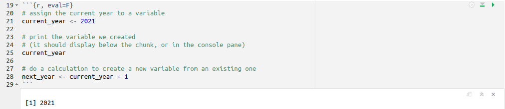
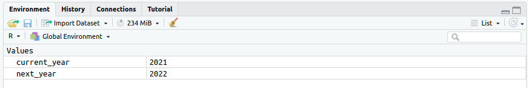
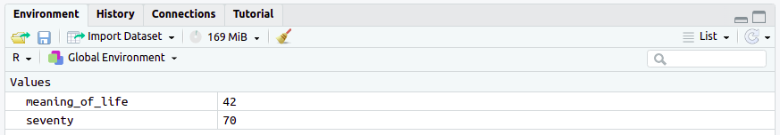

```{r, include=F, echo=F}
source('_first_chunk.R')
```


```{html, child="bs-tab-fix.html"}
```


```{css, child="video.css"}
```


# Overview

**Make sure you are confident with all the material in the [previous 'getting started' session](session-1.html) before continuing.**

Here we introduce extra tricks for working
with RStudio that are important to build confidence and make you productive.

At the end of the session, you will have used variables to store the result of your calculations,
loaded data into R from a file, and used commands to select and summarise
subsets of the data. These are important building blocks for later sessions.

# Techniques covered

- [Storing data in variables](#variables)
- [Passing data with pipes `%>%`](#pipe)
- [Loading data from elsewhere](#loadingdata)
- [Selecting rows with `filter()`](#filter)
- [Summarising data using `summarise()`](#summarise)
- [Learning how to fix broken code](#fixing)

<!-- Activity: -->

<!-- ???  set up the teaching as a kind of treasure hunt where students have to find use data to answer questions, gather -->
<!-- clues and spell out a word? Alternatively, just ask them to make *LOTs* of different plots using the techniques above, not -->
<!-- just one: -->


# Storing data in variables {#variables}

```{r, echo=F}
video_data <- list(identifier = "variables", ytidentifier = "yt-embed")
# makermds(video_data)
```

```{r child = '_content/_video_tabs.rmd'}
```

:::{.exercise}
**Exercise 1**

1. Open `session-2.rmd` using the **Files** pane. This is the workbook you will be using in this session.
1. Run the first chunk in the workbook.

The output should look like this:



Your **Environment** pane should look like this:


:::

:::{.exercise}
**Exercise 2**

1. Create a new chunk below the `Exercise 2` heading in your workbook (`session-2.rmd`).
1. Assign the results of the calculation `2 * 35` to the variable `seventy`
1. Run the chunk

Your **Environment** should now look like this:



:::

:::{.exercise}

**Exercise 3**

1. Create a new chunk below the `Exercise 3` heading in your workbook.
1. Use R to calculate your age in the year 2051.
1. Save the result in a variable _with a descriptive name_.
:::

# Passing data with pipes `%>%` {#pipe}

```{r, echo=F}
video_data <- list(identifier = "pipes", ytidentifier = "yt-embed")
# makermds(video_data)
```

```{r child = '_content/_video_tabs.rmd'}
```

:::{.exercise}
**Exercise 4**

1. Create a new chunk below the `Exercise 4` heading in your workbook.
1. Load the `tidyverse` library.
1. Pipe the `fuel` dataset into `head()` and assign the results to a variable called `fuel_head`.
1. Use the **Environment** pane to open `fuel_head`.

The engine size of the vehicle with the second highest miles per gallon was `r fitb('1770')`cc.
:::


# Loading data from elsewhere {#loadingdata}

```{r, echo=F}
video_data <- list(identifier = "loading-data", ytidentifier = "yt-embed", showcode=F)
# makermds(video_data)
```

```{r child = '_content/_video_tabs.rmd'}
```

:::{.exercise}
**Exercise 5**

1. Use your web browser to download
[https://benwhalley.github.io/lifesavR/data/world-happiness-report-2021.csv](https://benwhalley.github.io/lifesavR/data/world-happiness-report-2021.csv) to your computer.
1. Upload `world-happiness-report-2021.csv` to the server.
1. Create a new chunk below the `Exercise 5` heading in your workbook.
1. Read `world-happiness-report-2021.csv` into a variable with a descriptive name.

Which country had the highest **Healthy life expectancy**? `r fitb('Singapore')`
:::

# Selecting rows with `filter()` {#filter}

```{r, echo=F}
video_data <- list(identifier = "filter", ytidentifier = "yt-embed")
# makermds(video_data)
```

```{r child = '_content/_video_tabs.rmd'}
```

:::{.exercise}
**Exercise 6**

Filter the `development` dataset to show countries with a population greater than 100 million.

Your results should look like this:

```{r, echo=FALSE}
development %>% filter(population > 100000000)
```

:::

:::{.exercise}

**Exercise 7**

Show countries with a population greater than 100 million and life expectancy greater than 70.

The results should look like this:

```{r, echo=FALSE}
development %>%
  filter(population > 100000000) %>%
  filter(life_expectancy > 70)
```

:::

# Summarising data using `summarise()` {#summarise}

```{r, echo=F}
video_data <- list(identifier = "summarise", ytidentifier = "yt-embed")
# makermds(video_data)
```

```{r child = '_content/_video_tabs.rmd'}
```

:::{.exercise}
**Exercise 8**

1. Copy the code for calculating the median miles per gallon into your workbook.
1. Amend the code to calculate the median weight.
1. Note that `fuel` stores `weight` in kilos.

The median car weight is `r fitb(median(fuel$weight))` kg.

**Exercise 9**

1. Amend the code to also calculate the mean and standard deviation of `weight`.

To the nearest kilo, the mean car weight is `r fitb(round(mean(fuel$weight), 0))` kg, and the standard deviation is `r fitb(round(sd(fuel$weight), 0))` kg.
:::


:::{.exercise}
**Exercise 10**

```{r, echo=FALSE, eval=T}
sd6 <- fuel %>%
  filter(cyl == 6) %>%
  summarise(x = sd(mpg)) %>% pull(x)

mubig <- fuel %>%
  filter(engine_size > 3000) %>%
  summarise(x = mean(mpg)) %>% pull(x)

```
Use `filter()` and `summarise()` together to calculate the answers to these questions **to 1 decimal place**:

- the mean `mpg` of cars with engine size > 3000:  `r fitb(mubig, tol=.1)`
- the standard deviation of `mpg` in cars with 6 cylinders: `r fitb(sd6, tol=.1)`
:::

# Learning how to fix broken code{#fixing}

[WIP: ignore for now]

```{r, echo=F}
video_data <- list(identifier = "fixing-code", ytidentifier = "yt-embed", showcode = F)
#makermds(video_data)
```

```{r child = '_content/_video_tabs.rmd'}
```

:::{.exercise}
**Exercise 11**

Start a NEW R session and make this code work:

```{r, eval=F}
liibrary(todyverse)

# select only years after 1990
development %>%
  filter(year > "1990")

# calculate the average life expectancy in Africa
development 
  filter(continent = "africa") %>% 
  summarise(average(life_expectancy))

ggplot(aes(year, lifeExp, color=continent)) +
  geom_jitter()
```

:::
NOTE - we will know all the errors they will see so can provide hints for each of them

```{r}
# correct version
library(tidyverse)

# select only years after 1990
development %>%
  filter(year > 1990)

# calculate the average life expectancy in Africa
development %>%
  filter(continent == "Africa") %>%
  summarise(mean(life_expectancy))

development %>%
  ggplot(aes(year, life_expectancy, color=continent)) +
  geom_point()
```

# Check your knowledge

Write an answer to each of these questions in the `Check your knowledge` section of your workbook. The answers will be
revealed in Session 3.

1. What is the `<-` symbol called and what does it do?
1. What is the `%>%` symbol called and what does it do?
1. Which function would you pipe a dataset into if you wanted to see the first few rows?
1. Which function is used to load data from a CSV file?
1. What must you do before you can load data on the RStudio server?
1. Which function is used to select rows from a dataset?
1. How would you select rows where values in a numeric column are between 10 and 20?
1. Which function is used to summarise data?
1. Which summary function would you use to calculate the mean of a numeric column?
1. How would you calculate the median of a subset of rows in a `data.frame`?


# Extension exercises


```{r, child="_content/extension-exercises-premable.rmd"}
```


:::{.exercise}

**Extension exercise 1**

This output uses the `fuel` dataset to show vehicles with 8 cylinders and an engine size greater than 5 litres.

```{r, echo=FALSE}
guzzle <- fuel %>%
  filter(cyl == 8) %>%
  filter(engine_size > 5000)
guzzle
```

In a new chunk, write the R code to produce this `data.frame`.

:::

:::{.exercise}

**Extension exercise 2**

Filter and summarise the `iris` dataset in order to answer the following question **to 2 decimal places**:

```{r, echo=FALSE}
correct <- iris %>%
  filter(Species == 'versicolor') %>%
  summarise(mean_petal_width = round(mean(Petal.Width), 2)) %>%
  pull(mean_petal_width)

```

The mean petal width of the versicolor species of iris is `r fitb(correct, tol=.2)`cm.

:::

