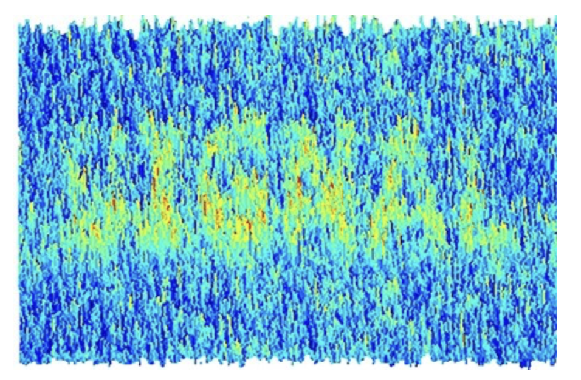

# Extension exercises


## Thinking about Bayes Factors

<!--  -->

The size of a Bayes Factor is mostly dependent on three things:

- *How large* the effect is (how big is the group difference or how steep is the slope)
- *How clear* the difference is (e.g., how much do the scores from each group overlap)
- *How much data* we collect (more data lets us be more confident; data quality also matters)


:::{.tip}

Bayes Factors can also be influenced by what what we thought was more likely BEFORE we collected
the data. In the discussion here we always assume that either hypothesis was equally likely, this
doesn't have to be the case.

:::


### Signals, noise and decisions

In any data we collect there will be some randomness, or chance error.

Researchers call this sort of randomness "noise". The metaphor here is that this noise it makes it harder for us
to 'listen' for the true signal in the data.

Using statistics to analyse psychological data is mostly about deciding

- what is signal and what is noise?
- what conclusions we should draw from our data?


We can think of the Bayes Factor as a measure of *how much signal* our data provides,
and so ***how much we should update our current viewpoint, based on the data***.

What we ***do*** with that information will depend on the context, though, especially:

- our *prior beliefs*, before collecting the data
- the potential *risks and benefits* of the decisions we might make


### Prior beliefs

If we start out with the view that each possibility (A or B) is *equally likely*
then a Bayes Factor of 10 tells us that that A is 10 times more likely than B.
That is, we should update (increase) our estimate of how likely A is by 10 times.

The ratio of probabilities shifts from 1:1 to 10:10.

But, if we started with the belief that A was very likely --- perhaps twice as likely --- as B, then a Bayes Factor of 10 says we should update so that we consider option A 20-times more likely than B.

The ratio of probabilities goes from 2:1 to 20:1.


In contrast, if we start by thinking A is very *unlikely* (perhaps B is 10 times more likely than A)
then a Bayes Factor of 10 says we should update to be indifferent between the options: we think both are equally likely.

The ratio of probabilities goes from 1:10 to 10:10 (i.e. 1:1)

#### Telepathy example


A concrete example: I (personally) think telepathy is quite unlikely. My guess is that there is (generously) a less than 1 in 1 billion chance that a human alive today can read my thoughts through a brick wall. So I estimate the probability of telepathy being 'real' as about 1 in a billion.

If I analysed a telepathy experiment and saw a Bayes Factor of 1000 in favour of telepathy, I would still be right to be quite sceptical.  I would update my view — and accept the chances are now 1,000 in 1,000,000,000 (that is, 1 in a million).

But---even though the Bayes Factor was very large---I still wouldn't believe in telepathy. It would take a lot more
data to convince me!

How we should analyse data from telepathy experiments has actually caused real controversy in the past, see [@wagenmakers2015skeptical].


### Risks, benefits

When making decisions based on our data, it's important to remember that what we decide
isn't only based on what we think the probability of each hypothesis is, after calculating the Bayes Factor.

We also have to factor in the risks attached to each decision, any uncertainty we have about the specific
case we are dealing with, and the size of any possible benefit.

The Bayes Factor (alone) can't tell us these things. We need to consider the broader context in which
we make the decision.

Imagine a case where we find a very large Bayes Factor suggesting a new drug is more effective than an old drug, which
has been prescribed safely for many years.

We might update our belief so that we're fairly sure that the new drug is more effective, but still carry on
prescribing the old one. Why? Because efficacy isn't the only criteria: we also need to consider _how much_ benefit
patients stand to gain, any differences in costs for a new treatment, and factor in any potential risks of harm
which haven't emerged yet.

***In short, it's worth remembering that statistical tests alone can't make decisions for us.*** We can
use Bayes Factors as a way of updating what we believe, but real world decisions normally involve trading-off
multiple sources of evidence about risks and benefits.


```{r, child="_content/extension-exercises-premable.rmd"}
```


TODO XXX
