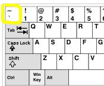

```{r, include=F, echo=F}
source("_first_chunk.R")
source('tabbed-rmd.R')
```

```{html, child="bs-tab-fix.html"}

```

```{css, child="video.css"}

```


# Overview

<!-- > Beginners mind (Shoshin) denotes openness, eagerness and lack of preconceptions when studying a subject, just as a beginner would, no matter what level of expertise the student has.  -->

<!-- Even black belt martial artists practice basic techniques like blocks and punches every time they train. -->

This session doesn't assume any prior knowledge of R, and introduces the basics. For BSc students this will include some
revision of material from stage 1. However we provide additional explanation and extension material for students to test their
knowledge and extend familiar skills. We find most students benefit from refreshing their knowledge at this stage in the course.

**Even if you are quite confident when using RStudio please read the worksheets carefully and complete all of
the activities in the blue boxes.**


# Techniques covered today

- [Using the RStudio interface](#using)
- [What can R do?](#cando)
- [Working interactively in RMarkdown](#interactive)
- [Loading packages](#packages)
- [Datasets](#datasets)
- [Making a scatterplot with `ggplot()`](#scatterplots)

# Using the RStudio interface {#using}


<!-- https://youtu.be/EE3mANH29_g -->
`r video("EE3mANH29_g")`
`r make_tabs('using-r-studio-interfacetabs')`

:::{.tab-content}

:::{#using-r-studio-interfacetabs-summary .tab-pane .active}
- Access RStudio at <https://psyrstudio.plymouth.ac.uk>
- SSO stands for "Single Sign On"
- Use your standard University login details
- Use the latest version of the [Chrome web browser](https://www.google.co.uk/chrome/), or Firefox
- Tell R what to do in the `Console` pane
- See the `Environment` pane for stored data
- Use the `Files` pane to open code and data from a folder on the server

:::

:::{#using-r-studio-interfacetabs-code .tab-pane .fade}
```{r, eval=F}
# in the video I enter this simple calculation in the console and R computes the result
2 + 2
```
:::


:::{#using-r-studio-interfacetabs-explanation .tab-pane .fade}

*The following is not a verbatim transcript of the video, but summarises the main points covered:*

To access R we use a web browser, go to [the RStudio Server at Plymouth University](https://psyrstudio.plymouth.ac.uk).

This gives us access to the R software, without having to install it on our own computer.


:::{.tip}
If you're using Windows or an older Mac we strongly recommend [downloading Chrome](https://www.google.co.uk/chrome/) or Firefox and using that.  If you have any issues with RStudio this is likely the first suggestion we will make.

- [Install Chrome now](https://www.google.co.uk/chrome/)
:::


-----------------------

When you login to RStudio, you'll be greeted with a screen that looks something like the image below.


You can see three parts:

1. The **Console** - This is the large rectangle on the left. It is where you tell R what to do, and where R prints the answers to your questions.

2. The **Environment** - This is the rectangle on the top right. It is where R keeps a list of the data it knows about. It's empty at the moment, because we haven't given R any data yet.

3. The **Files** - This is the rectangle on the bottom right. It's a bit like the _File Explorer_ in Windows, or the _Finder_ on a Mac. It shows you what files and folders R can see.

You should also be able to see that the two rectangles on the right have a number of other "tabs". These work like tabs on a web browser.  

The top rectangle has the tabs **Environment** and **History**. The **History** tab keeps a record of what you've recently typed into the **Console**. This can sometimes be useful.

The bottom rectangle has the tabs **Files**, **Plots**, **Packages**, **Help**, and **Viewer**. We'll cover what these other tabs do later on.


:::

:::


# Before you start


<!-- https://youtu.be/RaYd2ryUIaA -->
<!-- https://youtu.be/vqwkRpAzNCg -->
`r video("vqwkRpAzNCg")`
`r make_tabs('beforeyoustarttabs')`

:::{.tab-content}

:::{#beforeyoustarttabs-summary .tab-pane .active}
- Before starting you must run some R code to get set up.
- **See the code tab or the exercise below and follow the instructions.**
:::

:::{#beforeyoustarttabs-code .tab-pane .fade}
```{r, eval=F}
# run this to get copies of all the exercises in your account
lifesavr::setup()
```
:::


:::{#beforeyoustarttabs-explanation .tab-pane .fade}

To get everyone off to the same start we have created an R script that copies
some files into your home folder on the RStudio server, and sets up some preferences
for you.

To run this script, we just copy and paste the following line into the Console:

```{r, eval=F}
lifesavr::setup()
```


You will see various messages about copying files. 

R will then change the directory shown in the "files" pane. You will see
a list of "workbooks". These are documents we have created for you to use
to record your work during the course.

:::

:::


:::{.exercise}

1. Click on the **Console** pane.
1. Copy-paste the following into the console:

`lifesavr::setup()`

Your console should now look like this:


Press <span class="keyshape">↩</span> to run the code. If your console looks like the image below, then you are ready to start the session.


:::


# Introducing RMarkdown {#interactive}


`r video("KQPdyIApW0s")`
`r make_tabs('introducingrmarkdown')`

:::{.tab-content}

:::{#introducingrmarkdown-summary .tab-pane .active}

- RMarkdown documents combine 'chunks' of R code with regular text
- This means you can keep notes and explanations right next to where you process and analyse data
- RMarkdown files end with "`.rmd`" or "`.Rmd`"
- Make a new chunk: `Ctrl + Alt + I` or `⌘ + ⌥ + I` (Mac)
- Run a line of code `Ctrl + Enter` or `Cmd + Enter` (Mac)
- You can select part of a statement and run that in the same way

---

Finding backticks: 

:::

:::{#introducingrmarkdown-code .tab-pane .fade}
```{r, eval=F}
# some arithmetic in R used to show how
# we can run all or part of a statement

2 + 2 + 8 + 16

42 * 42

2 +
  4 +
  8 +
  16
```
:::


:::{#introducingrmarkdown-explanation .tab-pane .fade}


Rmarkdown documents are a good way to use R and RStudio. 
They help us organize our code alongside explanatory text and notes.

We can work interactively with multiple analyses at once on screen, 
and do things like comparing different ways of summarizing the same data or 
different graphs of the same data.

(At this point, it's probably best to watch the video for a demo of what 
RMarkdown can do.)


### Code chunks

RMarkdown makes a distinction between R code and regular text.

Markers in the document tell RStudio how to treat each part of your work — whether to display
it as text, or format it as code (and give us warnings when there are errors and so on).

To mark something as code, we put it inside some special
characters, called backticks, creating a  ***code chunk***.

A chunk is opened using the symbols `` ```{r} ``, and closed using
the symbols `` ``` ``. This is what a chunk looks like in RStudio:


---------


_NOTE:_ The symbols which start and end a chunk are _backticks_, not single quotes. The difference is quite subtle.


Backticks are on your keyboard here if you're on Windows:



Or here if you're on a Mac:


### Running R code inside chunks

<!-- TODO: re-record VIDEO of running code in a chunk -->

In the picture of a chunk above you might have noticed that we had both some code (`2+2`) and the
result from that code was shown beneath the chunk (`4`!). To show the result of our code, we first need to ***run*** it.


There are three ways to run R code within a chunk:

- Run a whole chunk at once (can include multiple statements)
- Run one or more related lines, called a ***statement***
- Select and run just part of a statement


#### Running the whole chunk

:::{.direction}

- Show the green play button in action

:::


#### Running a statement

The most common case is when we have given R an instruction (written a *statement*) and we want to run
just that new code.

A statement is sometimes one line of code, but it can include multiple lines that are related — we'll see more of that later.

For now, you can see we have a code chunk here:


```{r, eval=F}
# some arithmetic in R

2 + 4 + 8

```

:::{.direction}

In the video we: 

1. Show cursor interacting with this code chunk
1. Click anywhere on the line (this moves your cursor there, highlighting it)
1. Run the statement using Ctrl + Enter

:::

You can see that we put the cursor in the middle of this line of numbers that we wanted to add up.
Then I pressed <span class="keyshape">Ctrl</span> + <span class="keyshape">↵</span>  (this would be the `Cmd` key on a Mac).

This runs or *executes* the whole line, and the result is shown *below* the code chunk.


#### Code chunks with multiple statements

We might want to add some extra calculations to our chunk.

```{r, eval=F}
# some arithmetic in R

2 + 2 + 8 + 16

42 * 42

2 +
  4 +
  8 +
  16

```

Now we have 2 statements: `2 + 4 + 8 + 16` and `42 * 42` (the star means multiply).
We can run either of the statements in the same way: by putting the cursor anywhere on the line
and pressing `Ctrl/Cmd + Enter`


:::{.direction}

In the video we:

- Demonstrate doing this in rstudio show that the cursor can be anywhere on the line and also
- That if we execute a second statement the result of the first one disappears
- Also point out that I did separate all the statements with a blank line to make it easier for myself to read (but R doesn't care about this and can work out whether the lines are related by itself)

:::

:::

:::


# What can R do? {#cando}

`r video("zFBw6OuOX9k")`
`r make_tabs('whatcanrdotabs')`

:::{.tab-content}

:::{#whatcanrdotabs-summary .tab-pane .active}
- R is a multi-purpose tool
- It is a text-based computer language
- RStudio is an *interface* to that language; it organises your work and makes R easier to use


- R can do simple arithmetic, load data, make plots etc.
- It can also run any statistical analysis you like
- You need to tell R *exactly* what to do, by providing precise instructions
- These instructions (code) provide a *reproducible record* of your work
:::

:::{#whatcanrdotabs-code .tab-pane .fade}
```{r, eval=F}
# multiply two numbers
2 * 221

# generate some random numbers with a normal distribution
rnorm(10, 0,1)

# histogram plot of random numbers
hist(rnorm(100, 0,1))
```
:::


:::{#whatcanrdotabs-explanation .tab-pane .fade}
R is a computer language for data analysis and visualisation.

RStudio is a user interface to R; it helps you organise your work.

R is a text-based language. You interact with it by typing commands and running (also called 'executing') them.

R can do everything from simple arithmetic and plotting to complex data analysis.

For example, you can do simple arithmetic like

```{r eval=F}
2 * 221
```


Or, we could generate some random numbers with a [normal distribution](https://www.khanacademy.org/math/statistics-probability/modeling-distributions-of-data/normal-distributions-library/a/normal-distributions-review)

```{r}
rnorm(10, 0,1)
```


And we could plot random numbers using a histogram

```{r}
hist(rnorm(100, 0,1))
```

------------

You should think of R as a robot.

The robot is extremely fast, powerful and tireless; but it’s also literal-minded, and
won’t think for itself or take the initiative. You need to tell it *exactly* what to do, by providing very precise
instructions.

### Aids reproducibility

The advantage of writing detailed instructions is that you have a detailed, reproducible
version of all your analyses.

Reproducibility is a key topic in psychology and other natural sciences — learning R (or something like it)
is an important skill for new psychologists.

:::

:::


# Using the workbooks


<!-- https://youtu.be/7Gb5EWL35Vo -->

`r video("7Gb5EWL35Vo")`
`r make_tabs('usingtheworkbooks')`

:::{.tab-content}

:::{#usingtheworkbooks-summary .tab-pane .active}
- Each session has an associated "workbook" file
- They end with the file extension `".rmd"`
- These were copied to your home folder by the setup script (above)
- Use them to complete the exercises in the worksheet

:::

:::{#usingtheworkbooks-code .tab-pane .fade}
```{r, eval=F}
# No code shown in this video
```
:::


:::{#usingtheworkbooks-explanation .tab-pane .fade}

Each session has an associated "workbook" file which you will use to complete the exercises in the worksheet. The file
you need for this session is called `session-1-workbook.rmd`.

If you click on the file it opens the workbook in a tab of a new pane, called the **Source** pane. It's called the
**Source** pane because statements writting in the R language are often referred to as 'R code', which is shorthand for 'R source code'. The **source** pane allows you to write R code and explore your data.

:::

:::


:::{.exercise}

**Exercise 1**

Click on `session-1-workbook.rmd` in the **Files** pane to open it

1. Locate the first code chunk
1. Place your cursor (anywhere) on the line of R code.
1. Run the code by pressing <span class="keyshape">Ctrl</span> + <span class="keyshape">↵</span> (Windows, Linux) or
   <span class="keyshape">⌘</span> + <span class="keyshape">↩</span> (Mac).

You should see the result of the sum appear below the chunk, something like this 
(although the colours will be different):

```{r runchunkexample}
10 + 12 + 20
```


Congratulations! You have just run your first line of R. You can also run part of a line by highlighting just the code
you want to run, as you'll see in the next exercise.


:::


:::{.exercise}

**Exercise 2**

1. Select (highlight) the last two numbers in the sum.
1. Run the code.

This adds up two of the three numbers:


:::


:::{.exercise}

**Exercise 3: Making new chunks**

1. Find the instructions for Exercise 3 in your workbook.
1. Create a new chunk below the instructions.
1. Inside the chunk, write a line of code which adds together the numbers 9, 4, 55 and 2.
1. Run the the line of code you have written.

The output from the chunk should look like this:


1. If you typed the backticks to make the code chunk by hand, try making a new 
chunk using the keyboard shortcut. On a PC that's `Ctrl + Alt + I` and on a Mac
it's  `Command + Option + I`.

:::


# Packages {#packages}


`r video("tG875lqOVN4")`
`r make_tabs('loadingpackagestabs')`

:::{.tab-content}

:::{#loadingpackagestabs-summary .tab-pane .active}

- Loading a ***package*** adds functionality to R
- Some packages (like `tidyverse` and `psydata`) also include example datasets
- To load tidyverse write `library(tidyverse)`
- **Load `tidyverse` and `psydata` before each session**

:::

:::{#loadingpackagestabs-code .tab-pane .fade}
```{r, eval=F}
# load the tidyverse package which includes the ggplot function
# (this also loads the diamonds example dataset, and some others)
library(tidyverse)
# make a plot using new functions available to us
diamonds %>%
  ggplot(aes(carat, price)) +
  geom_point()
```
:::


:::{#loadingpackagestabs-explanation .tab-pane .fade}
By loading 'packages', you can add extra functions and datasets to R.

Packages are a powerful feature which allow R to be extended. This means you can run almost
any analysis, or make any type of plot.

Packages are loaded using the `library()` function.

The command `library(tidyverse)` loads some additional functions and data which will allow us to make a scatter plot.

**The `tidyverse` package is so fundamental to this course that `library(tidyverse)` is
likely to be the first line of R code, in the first chunk, in all your RMarkdown files.**

It's a good idea to start your documents with a chunk which loads any packages you need. This makes it easy to see which
have been loaded, and avoids loading them twice which is occasionally a problem.

You also need to remember to actually **run** the lines of code to load the libraries.
Beginners often forget to do this — but it's an easy error to fix.

:::{.direction}
* Demonstrate error when running following plot if `tidyverse` hasn't been loaded
:::

```{r, eval=F}
library(tidyverse)
diamonds %>%
  ggplot(aes(carat, price)) +
  geom_point()
```

:::{.direction}
1. Load `tidyverse`
1. Re-run example plot to show that it now works
:::

:::

:::


:::{.tip}

If you've understood what packages are it should be clear you need to load them *first*, before doing
anything else.


You can't use the functions provided by `tidyverse`
until you've run the command: `library(tidyverse)`. And the data in `psydata` is not available until
after you load that package.


For example, if you tried to produce a scatter plot before loading `tidyverse` you'd see an error like this in the
console pane:

<pre style="color:red">
Error in diamonds %>% ggplot(aes(carat, price, colour = clarity)) :
  could not find function "%>%"
</pre>

**This is important to remember**: `could not find function` errors are one of the most common problems
that beginners encounter. They normally mean that you have

1. forgotten to include `library(tidyverse)` as the first line in your code, or
1. forgotten to _run_ that line.

:::


# Datasets {#datasets}


`r video("NNiApHNKl18")`
`r make_tabs('datasetstabs')`

:::{.tab-content}

:::{#datasetstabs-summary .tab-pane .active}
### Datasets are like spreadsheets. They have have:

- multiple rows, with one row per *observation*
- multiple columns; each column has a name.
- columns also (sometimes) get called *variables*; this can be confusing


### Where are datasets?

- R has some built-in datasets as learning examples
- The `psydata` package includes datasets used in this course
- Later on, we will import data from files (e.g. actual spreadsheets)


### Exploring and checking data

- View a whole dataset by typing its name and running it in a code chunk
- `glimpse()` shows a list of all the columns, plus a few of the datapoints
- The **Environment** pane shows a spreadsheet-like view of the data

:::

:::{#datasetstabs-code .tab-pane .fade}

```{r, eval=F}
# always load the tidyverse first
library(tidyverse)

# the psydata package contains datasets for this course
library(psydata)

# display the `fuel` dataset, by typing the name
# and running this in a code chunk
fuel

# show only the first 6 rows of the `fuel` data
head(fuel)

# shows a list of columns in the `development` dataset
# plus the first few datapoints (as many as will fit)
glimpse(development)
```

:::


:::{#datasetstabs-explanation .tab-pane .fade}


When we say "dataset" or "data", we mean something like a spreadsheet:
In R, datasets contain values are organised into columns and rows.

One distinction to make though is that by *dataset* we mean data that has
been loaded into R--- data *files* are different thing.

In R, datasets are normally stored in a container called a `data.frame`. They can also be stored in a `tibble` (these are basically the same thing).


### Packaged datasets

Some datasets are built into R packages as examples for beginners.

For this course, we created a package called [`psydata`](https://github.com/benwhalley/psydata/) which includes the data we need for teaching.

This is installed on the RStudio server. To load it we run:

```{r}
library(psydata)
```

We can see from the loading message that one of the datasets is called `fuel`. This contains data about cars --- things like weight, fuel economy, engine size.

Let's display this data in using a new chunk.  If we type the word `fuel`, select this variable name with our cursor, and 'execute' it, we can see the data it contains:

```{r}
fuel
```


By default this shows the first ten rows and columns of the data. You can see other rows using the `Next`,
`Previous` and number buttons below the data.

If your browser window is very narrow you may need to view some of the columns by using the arrow next to the final, right-hand column.


You can get information about the columns in all these example datasets by typing:
`help(name_of_the_dataset_you_want_to_know_about)`. For example:

```{r}
help(fuel)
```


### Columns

Each column in a dataset has a name.

We sometimes call the columns *variables*, because each column will often relate to
a variable in our study.

However, this can be a bit confusing because --- in R --- variables can actually contain whole datasets.
`fuel`, for example, is the name of a variable which contains an example dataset, provided by the `psydata` package.

:::{.direction}

- Show `library(psydata)` and then the `fuel` dataset

:::


But these words are used flexibly and interchangeably, so we'll just have to get used to it.
It's normally clear which type of variable we mean from the context.


### Rows

Each row in a dataset represents an *observation*.

In different datasets an observation might correspond to an individual participant, a whole country, or even just a single button press in an experiment.


### Exploring and checking data

There are a two ways we recommend you use inspect and check data you are using.

1. Typing the name of the dataset, and running that as code
2. The `glimpse()` function, which shows a list of all the columns and some of the data

To use glimpse:

```{r}
fuel
glimpse(fuel)
```

`glimpse` shows a list of all the columns in the dataset, the type of data stored in each column, and as many observations (datapoonts) as will fit on a single line.

`glimpse` is a really useful view to check which columns are available in a dataset before using them.


### Why are we talking about cars and flowers and not psychology?

In this course we mostly use very simple datasets, and some of them aren't even about psychology.

Some students ask why we don't always use psychological examples. If this hasn't troubled
you then you could skip to the next section, but we thought we should explain:


We think the `fuel` dataset (and others, like `iris`, and `development`) have a number of benefits.

First, they are either built into R, loaded in common packages, or available in the `psydata` package.
This makes them easily available for everyone.

Second, these data relate to concrete, easy to understand phenemena (e.g. weight, length, number of gears).
This means you don't have to hold in mind any complex psychological/theoretical ideas for the examples to make sense.

Third, the relationships in these datasets are clear, and there aren't too many data points. Real data are
often more messy because many psychological constructs are hard to measure.

Our experience is that, when learning R, it pays to keep everything as simple as it possibly can be.
The skills and concepts involved in analysing these data are the same though.

R --- and the techniques and statistics we teach --- are used right across the natural sciences


If you're still not convinced — don't worry ... we do include some clinical examples, and we will
be collecting our own psychological data soon enough and analysing that.


:::

:::


:::{.exercise}

**Exercise 4**

1. Open your workbook for this workshop (called `session-1.rmd`).
1. Create a new chunk below the `Exercise 4` instructions.
1. Load the `psydata` package.
1. Look at the fuel data using the `glimpse()` function.
1. Display the `fuel` dataset and try out the navigation buttons.
1. Write a line of code which makes a list of columns in the `development` dataset.

-----------

The output should look something like this:


:::

:::{.exercise}

**Exercise 5**

In your workbook (`session-1.rmd`):

1. Create a new chunk below the `Exercise 5` instructions.
1. Load the `psydata` package (if you haven't already).
1. Show the first 6 rows of the `development` data using `head()`.

Use the output to answer the following question. After entering your answer, click outside the box. The border will turn turn blue when the answer is correct.

The population of Afghanistan in 1967 was: `r fitb('11537966')`.

:::


:::{.tip}

### Take a break!

Our student pilot-testers suggested that now would be a good time for a short break!

:::


# Scatterplots {#scatterplots}

`r video("RoK0ToZzwI0")`
`r make_tabs('scatterplotstabs')`

:::{.tab-content}

:::{#scatterplotstabs-summary .tab-pane .active}

- A scatterplot shows the *relationship* between two *continuous* variables (columns)
- Each observation (row) must have at least two values (so we need two columns)
- These define the position of a point on the x and y axes of the plot
- Use `ggplot()`
- `aes(x = ..., y = ...)` chooses the x and y data *columns* and creates the axes
- `geom_point()` adds the points

:::

:::{#scatterplotstabs-code .tab-pane .fade}

```{r, eval=F}
# if you have not already, load these packages
library(tidyverse)
library(psydata)

# make a scatterplot from the fuel dataset
fuel %>%
  ggplot(aes(x=weight, y=mpg)) + # selects the columns to use
    geom_point()                 # adds the points to the plot

# the same plot, this time we left out x= and y= in
# the aes code. These are implicit from the order of weight and mpg
# (the x-axis comes first)
fuel %>%
  ggplot(aes(weight, mpg)) +
    geom_point()         

```
:::


:::{#scatterplotstabs-explanation .tab-pane .fade}
A scatterplot shows the *relationship* between two variables by plotting their values as points on the x-axis (the
left-right position) and the y-axis (up-down).

This code chunk creates a scatterplot using the `fuel` dataset.

:::{.direction}
- Create chunk and type code
:::

```{r}
library(tidyverse)
library(psydata)
fuel %>%
  ggplot(aes(x = weight, y = mpg)) +
    geom_point()
```

:::{.direction}
- select the pipe with the cursor to highlight
:::

The `%>%` symbol is special, it's called a 'pipe'. We'll cover the pipe in a later session, but for now you just need to
know that it sends the `fuel` data on to the next line of code — like it's passing it down a pipe.

The second line receives the data. The `ggplot()` function means we're making a plot.

The plot is built in two steps:

The first step 

:::{.direction}
- select `ggplot(aes(weight, mpg))`
:::

selects columns in our dataset to use for the x and y axes. In this case, the x-axis is `weight`, which is the weight of
the cars in kg. And `mpg` is miles per gallon, or fuel efficiency. This will be the y-axis.

:::{.direction}
- select `weight` in the code - highlight it is the x-axis
- same for `mpg` and y-axis
:::


We can see the plot if we run this statement using the keyboard shortcut — `Ctrl` or `Cmd` (Mac) + `Enter`

:::{.direction}
- run the code and show the resulting plot
- emphasise this is shown below the code chunk when using RMarkdown
:::


### Building plots in layers

A useful thing to know is that `ggplot` works by building up plots in multiple layers.

If we run just this part of the code, we can see the plot with just the axes, and no data shown.


:::{.direction}
1. run just the first two lines of code by selecting and pressing `ctrl+enter`
2. emphasise the axes are there but no data shown
3. rerun all code to plot points
:::


So, conceptually, we make plots by:

1. *selecting* data
2. *defining* the axes, and then
3. *drawing* the data points

Each part of the plot is separated by a `+` symbol and goes on a new line.

RStudio is smart and knows all this is part of the same statement.
This means it automatically indents the code.

### Cutting corners

There's just one final thing to explain:  In the previous code we wrote `x = weight` and `y = mpg`.

This makes things explicit, which is nice, but takes longer to type. You can also write the plot this way:

```{r, eval=F}
fuel %>%
  ggplot(aes(weight, mpg)) +
    geom_point()         
```

R assumes that the first column is the x-axis and the second is the y-axis.

:::{.direction}
- select x-axis and y-axis in turn when describing
:::

We normally drop the `x =` and `y =` in these guides, and you should too.

:::

:::


:::{.tip}

The `aes()` function, used with `ggplot` is short for 'aesthetics' (what we can see). 
This part of the code *connects columns in our data to visual aspects of a plot*, like the x and y axes.

:::


:::{.exercise}

**Exercise 6**

1. Create a new chunk below the `Exercise 6` instructions in your workbook.
1. Using the `fuel` dataset, create a scatterplot with `engine_size` on the x-axis and `mpg` (miles per gallon, or fuel economy) on the y-axis.
1. Run the chunk.

The scatterplot should look like this:

```{r, echo=FALSE}
fuel %>%
  ggplot(aes(engine_size, mpg)) +
  geom_point()
```

:::


# Working interactively {#rmarkdown-recap}


`r video("KUUOqO7uZwE")`
`r make_tabs('workinginteractivelytabs')`

:::{.tab-content}

:::{#workinginteractivelytabs-summary .tab-pane .active}

- A ***statement*** is one of more lines of code which R knows are linked
- Run a statement: `Ctrl + ↵` (or `⌘ + ↩` Mac)
- Run the whole chunk: `Shift + Ctrl + ↵` (or `Shift + ⌘ + ↩` Mac)

:::

:::{#workinginteractivelytabs-code .tab-pane .fade}
```{r, eval=F}
# No new code shown in this video
```
:::


:::{#workinginteractivelytabs-explanation .tab-pane .fade}

In an earlier video we introduced RMarkdown. In this clip, we recap on some useful things
to know when using RMarkdown files in RStudio. It's intended as a kind of reference
for later on.

- Running just part of a statement
- Run a whole chunk using `Cmd+Shift+Enter` or `Ctrl+Shift+Enter` (Windows)
- How R knows where statements start and end
- The importance of blank lines
- Loading packages first


Running parts of statements:

```{r}
happy %>%
  filter(year==2018) %>%
  ggplot(aes(gdp_per_capita, happiness)) +
  geom_point()
```


- Demonstrate selecting each part in turn again
- Point out that we can check what data has been sent to the plot and amend if necessary
- Demonstrate making an error where column is misspelled

:::

:::


# Check your knowledge

Write an answer to each of these questions in the `Check your knowledge` section of your workbook. The answers will be
revealed in Session 2.

1. How do you run part of a line of R code using the keyboard short cut?
1. Which library will you always need to load in your first RMarkdown chunk?
1. What is `psydata`?
1. How would you look at/inspect a whole dataset?
1. What does `glimpse()` do and when is it useful?
1. What is the 5th column in the `development` dataset?
1. Which function makes a plot? (there are many, but we mean the one shown above)
1. Which function chooses the columns of data used in the plot?


# Extension exercises


```{r, child="extension-exercises-premable.rmd"}
```


:::{.exercise}

### Extension exercise 1

This scatterplot uses the `fuel` dataset to show a vehicle's `power` on the x-axis against `mpg` on the y-axis.

```{r, echo=FALSE}
fuel %>%
  ggplot(aes(power, mpg)) +
  geom_point()
```

In a new chunk, write the R code to produce this plot.

:::

:::{.exercise}

### Extension exercise 2

There is another built-in dataset called `iris` which includes data about
different flower species.

Use `glimpse()` to get a list of the column names.

Make a scatterplot which shows the relationships between petal widths and lengths.

:::


# Reading

Strongly suggested:

- Read the RMarkdown guide for a complete overview of what they can do: https://rmarkdown.rstudio.com/lesson-1.html
- The page on "Markdown basics" is especially helpful if you want to format your document


Extended material:

- _Scatterplots and visualisation_: [Fundamentals of Data Visualization](https://clauswilke.com/dataviz/) is an excellent resource for data visualisation in R. 
- This chapter: <https://clauswilke.com/dataviz/visualizing-associations.html> shows many examples of plots which display relationships between variables (including scatter plots) which would extend the material covered above.
