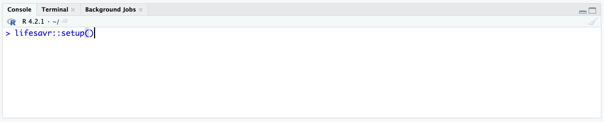
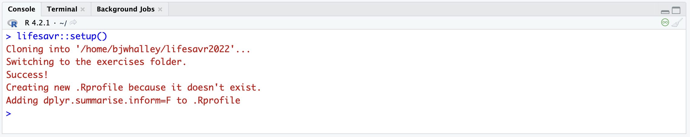
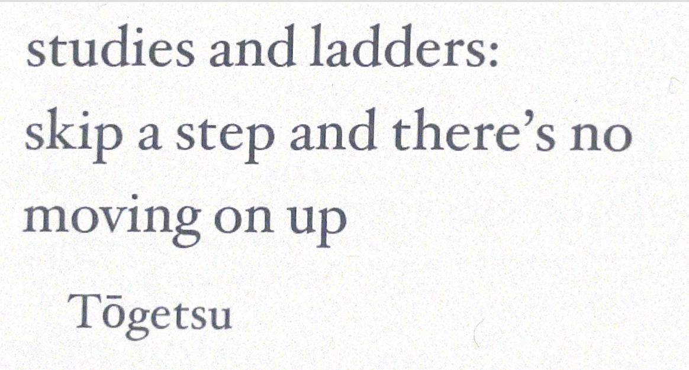

```{r, include=F, echo=F}
source("_first_chunk.R")
```

```{html, child="bs-tab-fix.html"}

```

```{css, child="video.css"}

```


# Overview

<!-- > Beginners mind (Shoshin) denotes openness, eagerness and lack of preconceptions when studying a subject, just as a beginner would, no matter what level of expertise the student has.  -->

<!-- Even black belt martial artists practice basic techniques like blocks and punches every time they train. -->

This session doesn't assume any prior knowledge of R, and introduces the basics. For BSc students this will include some
revision of material from stage 1. However we provide additional explanation and extension material for students to test their
knowledge and extend familiar skills. We find most students benefit from refreshing their knowledge at this stage in the course.

**Even if you are quite confident when using RStudio please read the worksheets carefully and complete all of
the activities in the blue boxes.**


# Techniques covered today

- [Using the RStudio interface](#using)
- [What can R do?](#cando)
- [Working interactively in R Markdown](#interactive)
- [Loading packages](#packages)
- [Datasets](#datasets)
- [Making a scatterplot with `ggplot()`](#scatterplots)

# Using the RStudio interface {#using}

```{r, echo=F}
video_data <- list(identifier = "using-r-studio-interface",
                   showcode=F,
                   yt_id = "E0Lvfzp1F7s")
# makermds(video_data)
```


```{r child = '_content/_video_tabs.rmd'}
```


# Before you start

```{r, echo=F}
video_data <- list(identifier = "before-you-start", yt_id="HqXmNmwumvU")
# makermds(video_data)
```

```{r child = '_content/_video_tabs.rmd'}

```

:::{.exercise}

1. Click on the **Console** pane.
1. Copy-paste the following into the console:

`source("https://raw.githubusercontent.com/benwhalley/lifesavR/main/bootstrap.R")`

Your console should now look like this:


Press <span class="keyshape">↩</span> to run the code. If your console looks like the image below, then you are ready to start the session.


:::


# Using the workbooks



```{r, echo=F}
video_data <- list(identifier = "using-the-workbooks",
                   showcode = F,
                   yt_id = "t359FSOPEnw")
# makermds(video_data)
```

```{r child = '_content/_video_tabs.rmd'}

```

:::{.exercise}

Click on `session-1.rmd` in the **Files** pane.

If you're able to open this file you are now ready to start the rest of the session.

:::


# What can R do? {#cando}

```{r, echo=F}
video_data <- list(identifier = "what-can-r-do", yt_id="zFBw6OuOX9k")
```

```{r child = '_content/_video_tabs.rmd'}

```


# Introducing RMarkdown {#interactive}

```{r, echo=F}
video_data <- list(identifier = "introducing-rmarkdown", yt_id = "TfkL_b92r_E", showcode=F)
# makermds(video_data)
```

```{r child = '_content/_video_tabs.rmd'}

```

:::{.exercise}

**Exercise 1**

1. Locate the first chunk in `session-1.rmd` (you find this in the **Files** pane).
1. Place your cursor (anywhere) on the line of R code.
1. Run the code by pressing <span class="keyshape">Ctrl</span> + <span class="keyshape">↵</span> (Windows, Linux) or
   <span class="keyshape">⌘</span> + <span class="keyshape">↩</span> (Mac).

You should see the result of the sum appear below the chunk:

```{r diamonds-plot, echo=FALSE}
10 + 12 + 20
```

:::

Congratulations! You have just run your first line of R. You can also run part of a line by highlighting just the code
you want to run, as you'll see in the next exercise.

:::{.exercise}

**Exercise 2**

1. Select (highlight) the last two numbers in the sum.
1. Run the code.

This adds up two of the three numbers:


:::

:::{.exercise}

**Exercise 3: Making new chunks**

1. Find the instructions for Exercise 3 in your workbook.
1. Create a new chunk below the instructions.
1. Inside the chunk, write a line of code which adds together the numbers 9, 4, 55 and 2.
1. Run the the line of code you have written.

The output from the chunk should look like this:


:::


# Packages {#packages}

```{r, echo=F}
video_data <- list(identifier = "loading-packages", yt_id = "tG875lqOVN4")
# makermds(video_data)
```

```{r child = '_content/_video_tabs.rmd'}
```

:::{.tip}

If you've understood what packages are it should be clear you need to load them *first*, before doing
anything else.


You can't use the functions provided by `tidyverse`
until you've run the command: `library(tidyverse)`. And the data in `psydata` is not available until
after you load that package.


For example, if you tried to produce a scatter plot before loading `tidyverse` you'd see an error like this in the
console pane:

<pre style="color:red">
Error in diamonds %>% ggplot(aes(carat, price, colour = clarity)) :
  could not find function "%>%"
</pre>

**This is important to remember**: `could not find function` errors are one of the most common problems
that beginners encounter. They normally mean that you have

1. forgotten to include `library(tidyverse)` as the first line in your code, or
1. forgotten to _run_ that line.

:::


# Datasets {#datasets}

```{r, echo=F}
video_data <- list(identifier = "built-in-datasets", yt_id = "hro-RRKO1Oo")
# makermds(video_data)
```

```{r child = '_content/_video_tabs.rmd'}

```

:::{.exercise}

**Exercise 4**

1. Open your workbook for this workshop (called `session-1.rmd`).
1. Create a new chunk below the `Exercise 4` instructions.
1. Load the `psydata` package.
1. Look at the fuel data using the `glimpse()` function.
1. Display the `fuel` dataset and try out the navigation buttons.
1. Write a line of code which makes a list of columns in the `development` dataset.

-----------

The output should look something like this:


:::

:::{.exercise}

**Exercise 5**

In your workbook (`session-1.rmd`):

1. Create a new chunk below the `Exercise 5` instructions.
1. Load the `psydata` package (if you haven't already).
1. Show the first 10 rows of the `development` data using `head()`.

Use the output to answer the following question. After entering your answer, click outside the box. The border will turn turn blue when the answer is correct.

The population of Afghanistan in 1967 was: `r fitb('11537966')`.

:::


:::{.tip}

### Take a break!

Our student pilot-testers suggested that now would be a good time for a short break!

:::


# Scatterplots {#scatterplots}

```{r, echo=F}
video_data <- list(identifier = "scatterplots", yt_id = "RoK0ToZzwI0")
# makermds(video_data)
```

```{r child = '_content/_video_tabs.rmd'}

```

:::{.exercise}

**Exercise 6**

1. Create a new chunk below the `Exercise 6` instructions in your workbook.
1. Using the `fuel` dataset, create a scatterplot with `engine_size` on the x-axis and `mpg` (miles per gallon, or fuel economy) on the y-axis.
1. Run the chunk.

The scatterplot should look like this:

```{r, echo=FALSE}
fuel %>%
  ggplot(aes(engine_size, mpg)) +
  geom_point()
```

:::


# Working interactively {#rmarkdown-recap}

```{r, echo=F}
video_data <- list(identifier = "working-interactively-in-r", yt_id="KUUOqO7uZwE", showcode=F)
# makermds(video_data)
```

```{r child = '_content/_video_tabs.rmd'}

```


# Check your knowledge

Write an answer to each of these questions in the `Check your knowledge` section of your workbook. The answers will be
revealed in Session 2.

1. How do you run part of a line of R code using the keyboard short cut?
1. Which library will you always need to load in your first R Markdown chunk?
1. What is `psydata`?
1. How would you look at/inspect a whole dataset?
1. What does `glimpse()` do and when is it useful?
1. What is the 5th column in the `development` dataset?
1. Which function makes a plot? (there are many, but we mean the one shown above)
1. Which function chooses the columns of data used in the plot?


# Extension exercises


```{r, child="_content/extension-exercises-premable.rmd"}
```


:::{.exercise}

### Extension exercise 1

This scatterplot uses the `fuel` dataset to show a vehicle's `power` on the x-axis against `mpg` on the y-axis.

```{r, echo=FALSE}
fuel %>%
  ggplot(aes(power, mpg)) +
  geom_point()
```

In a new chunk, write the R code to produce this plot.

:::

:::{.exercise}

### Extension exercise 2

There is another built-in dataset called `iris` which includes data about
different flower species.

Use `glimpse()` to get a list of the column names.

Make a scatterplot which shows the relationships between petal widths and lengths.

:::


# Congratulations!

You've completed all the exercises for this session, and are well on the way to working fluently in R. Well done!


# Further reading

_Scatterplots and visualisation_: [Fundamentals of Data Visualization](https://clauswilke.com/dataviz/) is an excellent
resource for data visualisation in R. This chapter: <https://clauswilke.com/dataviz/visualizing-associations.html> shows
many examples of plots which display relationships between variables (including scatter plots) which would extend the
material here.
