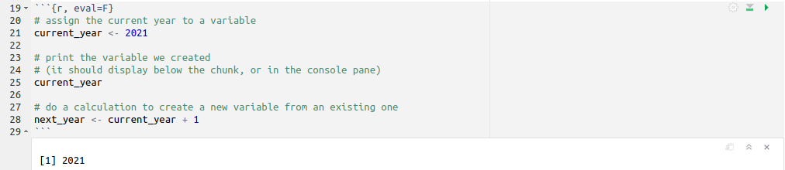
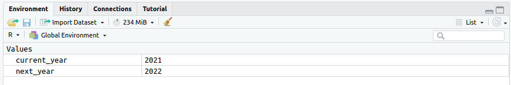
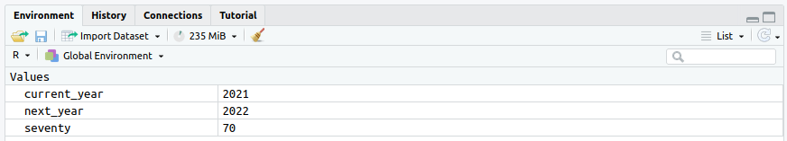
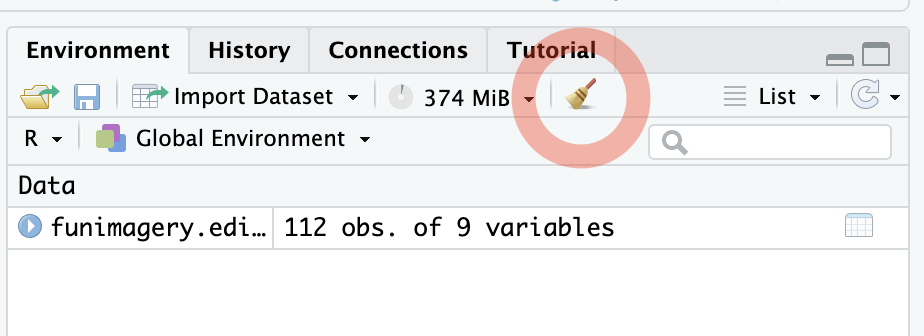

```{r, include=F, echo=F}
source('_first_chunk.R')
source('tabbed-rmd.R')
```


```{html, child="bs-tab-fix.html"}
```


```{css, child="video.css"}
```


# Overview

**Make sure you are confident with all the material in the [previous 'getting started' session](session-1.html) before continuing.**

Here we introduce extra tricks for working
with RStudio that are important to build confidence and make you productive.

At the end of the session, you will have used variables to store the result of your calculations,
loaded data into R from a file, and used commands to select and summarise
subsets of the data. These are important building blocks for later sessions.

# Techniques covered

- [Storing data in variables](#variables)
- [Passing data with pipes `%>%`](#pipe)
- [Loading data from elsewhere](#loadingdata)
- [Selecting rows with `filter()`](#filter)
- [Summarising data using `summarise()`](#summarise)
- [How to fix code errors](#fixing)

<!-- Activity: -->

<!-- ???  set up the teaching as a kind of treasure hunt where students have to find use data to answer questions, gather -->
<!-- clues and spell out a word? Alternatively, just ask them to make *LOTs* of different plots using the techniques above, not -->
<!-- just one: -->


# Storing data in variables {#variables}


`r video("rZbJrccgk80")`
`r make_tabs('makingvariables')`

:::{.tab-content}

:::{#makingvariables-summary .tab-pane .active}

- In R, a **variable** is the name for a *container*
- Variables can contain anything — not just data
- ***Columns*** in a dataset sometimes get called variables too (sorry)
- Create variables with **`<-`** (called the ***assignment operator***)
- The order is: `name_of_variable <- stuff_being_stored`
- Use short, descriptive names. Don't use spaces or capitals

:::

:::{#makingvariables-code .tab-pane .fade}
```{r}
# assign the current year to a variable
current_year <- 2021

# print the variable we created
# (it should display below the chunk, or in the console pane)
current_year

# do a calculation to create a new variable from an existing one
next_year <- current_year + 1
```
:::


:::{#makingvariables-transcript .tab-pane .fade}

Each instruction we give R produces a result.

By default, these results are shown below the code chunk.

Sometimes, though, we'd like to save the results. Perhaps we want to use them in another
calculation later?

To do this we can create a **variable**.

A variable is just a *container*.  We can store things in it: the results of simple
calculations, datasets, tables, plots, or even statistical models.

To make variables we use the assignment operator, which looks like this `<-`.

It looks like an arrow that points to the left, but it's made up of an left angle bracket (`<`) and a hyphen (`-`),
placed next to each other.

The arrow is a reminder that the value on the right hand
side will be assigned (stored) in the variable named on the left hand side.


For example, we can write this:

```{r}
# assign the current year to a variable
current_year <- 2021
```

:::{.direction}
* Run variable assignment
:::

And we now have a variable called `current_year` which contains the number `2021`.

The simplest way to check what a variable contains is to write it's name, and then
run that line of code:

```{r}
# print the variable we created to the console window
current_year
```

You might wonder *where* these variables get saved. In most cases, variables you create are stored in what's called the
`Global Environment`. You can see them in the **Environment** pane in RStudio.

The names of variables are shown in the column on the left, and their values in the column on the right.

:::{.direction}

- Point at variable name and value in **Environment**

:::

---------------

Once stored, we can use variables as the *input* to new calculations.

For example, in this example we are adding 1 to the current year and storing the result in another
variable called `next_year`:


```{r}
# do a calculation to create a new variable from an existing one
next_year <- current_year + 1
```

:::{.direction}
* Run variable assignment
:::

### Variable names

Giving variables sensible names is more important than you might imagine.

You will save yourself a lot of trouble if you give your variables short names which describe the data they contain.

Variable names can't contain spaces, and it's best to avoid special characters or capital letters.

Use the underscore `_` if you need to create a variable made up of more than one word e.g. `current_year`.

:::

:::


:::{.exercise}
**Exercise 1**

1. Open `session-2-workbook.rmd` using the **Files** pane. This is the workbook you will be using in this session.
1. Run the first chunk in the workbook.

The output should look like this:



Your **Environment** pane should look like this:


:::

:::{.exercise}
**Exercise 2**

1. Create a new chunk below the `Exercise 2` heading in your workbook (`session-2.rmd`).
1. Assign the results of the calculation `2 * 35` to the variable `seventy`
1. Run the chunk

Your **Environment** should now look like this:



:::

:::{.exercise}

**Exercise 3**

1. Create a new chunk below the `Exercise 3` heading in your workbook.
1. Use R to calculate your age in the year 2051.
1. Save the result in a variable _with a descriptive name_.
:::


# Passing data with pipes `%>%` {#pipe}

<!-- https://youtu.be/APFXK-xoxR0 -->
`r video("APFXK-xoxR0")`
`r make_tabs('usingpipestabs')`

:::{.tab-content}

:::{#usingpipestabs-summary .tab-pane .active}
- The **pipe** passes data from one piece of code to another
- The pipe looks like this: `%>%`
- Type `Ctrl + Shift + M` to add a pipe  (use `⌘` on Macs)
- A **pipeline** is a list of operations, joined by pipes
- Store the pipe output in a variable (using `<-`)

:::

:::{#usingpipestabs-code .tab-pane .fade}
```{r}
library(tidyverse)
library(psydata)

# pipe mtcars into head()
fuel %>% head()

# store first few rows of mtcars
fuel_head <- mtcars %>% head()

# see the stored subset
fuel_head
```
:::


:::{#usingpipestabs-transcript .tab-pane .fade}
We often need to link a few commands together which modify data before analysing it.

For example, if we're working with a big dataset we might only want analyse part of the data. We could do this in stages by selecting only the columns we want to analyse, filtering out any rows we don't want to analyse, and then calculating some descriptive statistics for the data that's left.

One way to do this would be to use variables to save the results of each stage, but this would produce lots of variables which can get confusing.

A different approach is to use what's known as a 'pipe' — it's another way to link together multiple instructions.

The pipe sends data from one piece of code to another.

It looks like this `%>%`.  

Press `Ctrl + Shift + M` (Windows/Linux) or `⌘ + Shift + M` (Mac) to add a pipe.

In session 1, you used the following code to "pipe" the `mtcars` dataset into `head()`, which shows just the first few rows:

```{r}
fuel %>% head()
```

:::{.direction}

Visual reminder that the `tidyverse` package needs loading first

:::


You can think of your data as flowing along lengths of pipe, joined by functions which do things to the data, step by
step, until the result you want plops out at the end.

Each `%>%` should be read as the word "then", e.g. "pipe the `mtcars` dataset, *then* `head()` it".

The `>` in the pipe function reminds you of the direction in which your data is flowing (it only works left to right).

It's important to know that the pipe *doesn't store the results* of these steps.

Sometimes that's OK. In our first example we just wanted to look at the first few rows of the `mtcars` data.

But, you will usually want to save the result of a pipeline in a new variable.  
For example, if we wanted to save the first few rows of the `mtcars` data  to a *new* variable we would write:

```{r}
fuel_head <- fuel %>% head()
```

Here we combine *assignment* with a *pipeline*.

Remember that it is the final result of the commands on the right hand side of the `<-` that are assigned to the variable.

The result of the pipeline (a `data.frame` containing the first few rows of `mtcars`) is saved to a
new variable called `mtcars_head`.

You can explore your variables using the **Environment** pane. A `data.frame` will have an icon that looks like a
spreadsheet. If you click on the icon, the `data.frame` is displayed in a new tab in the **Source** pane.


:::{.direction}

- click on the `fuel_head` icon

:::


This tab shows you the same information as printing the `data.frame`, such as the number of rows and columns, but it
also provides tools for exploring the data interactively.

* The arrows next to the column names allow you to arrange the rows in ascending or descending order based on the column
values.
* The `Filter` button allows you to specify a value for one or more columns to filter out non-matching rows. For
example, we could display just cars with 4 gears. Click the button again to turn off the filter.

:::

:::


:::{.exercise}
**Exercise 4**

1. Create a new chunk below the `Exercise 4` heading in your workbook.
2. Load the `tidyverse` and `psydata` libraries.
1. Pipe the `fuel` dataset into `head()` and assign the results to a variable called `fuel_head`.
1. Use the **Environment** pane to open `fuel_head`.

The engine size of the vehicle with the highest miles per gallon was `r fitb('1770')`cc.
:::


# Selecting rows with `filter()` {#filter}


`r video("9N8sRAoFYzc")`
`r make_tabs('usingfiltertabs')`

:::{.tab-content}

:::{#usingfiltertabs-summary .tab-pane .active}

- `filter()` selects *rows* from a dataset
- We define criteria to match rows we want
- To match exactly, we use `==` (two equals symbols) 
- Other filters like `<` (less than) or `>` (greater than) are also useful
- Combine multiple filters to be more specific
- Upper/lower case, spaces, and punctuation all matter (watch out!)


:::

:::{#usingfiltertabs-code .tab-pane .fade}
```{r}

# load example data
library(psydata)

# filter on a categorical variable
# == means 'match exactly'
development %>% 
  filter(country == "Kenya")

# this doesn't match any rows because the data spells Kenya with a capital 'K'
development %>% 
  filter(country == "kenya")

# filtering on a numeric variable
development %>% filter(year > 2000)


# combining multiple filters makes things more specific
development %>%
  filter(country == "Kenya") %>%
  filter(year > 2000)

# assign filtered data to a new variable for re-use later on
# if you don't store the data, it is displayed but then lost
development.europe <- development %>% 
  filter(continent == "Europe") %>% 
  filter(year > 1980)

# show the stored subset
development.europe

# make a plot with the subset
development.europe %>% 
    ggplot(aes(gdp_per_capita, life_expectancy)) + 
  geom_point()

```
:::


:::{#usingfiltertabs-transcript .tab-pane .fade}

Some datasets are very large. We often want to work with a subset of the data, and `filter()` makes this possible.

### Categorical and text filters

The following chunk filters the `development` dataset (from `psydata`) to include only rows where the `country` column equals "Kenya".

:::{.direction}
* Enter and run code
:::

```{r}
library(psydata)

development %>%
  filter(country == "Kenya")
```


The `==` is called an "operator". It compares values from the column on the left hand side with the value specified on the right hand side.

The value we are filtering for *must* match the column type.

The value `"Kenya"` was in quotes because the country column is a factor (not numeric), and we need to
match the text of the name of the country.

It's important to be accurate when matching text. Capitalisation, punctuation and spaces all matter, so you need to be precise. Copy and paste wherever you can. For example:

```{r}
development %>%
  filter(country=="kenya")
```
This doesn't match any rows because from R's point of view `"kenya"` and `"Kenya"` are completely different!

### Numeric filters

The "greater than" operator `>` filters on numeric columns. For example, `year` is
a column in the `development` dataset.

```{r}
development %>%
  filter(year > 2000)
```

The code above filters rows where `year` is greater than 2000, showing us the result.

The opposite of the `>` operator is the `<` operator. This filters numeric columns which are *less than* a value.

:::{.direction}
* Change `>` to `<` and run code
:::

### Combined filters

You can combine filters in a pipeline to filter rows using multiple operators.

:::{.direction}
* Enter and run code
:::

```{r}
development %>%
  filter(country == "Kenya") %>%
  filter(year > 2000)
```

This code filters rows leaving those where the country is `Kenya` and the year is greater than `2000`.

### Storing and re-using filtered data


When filtering, it's common to want to save a subset of a dataset to use again.

For example, we might want to filter the data, make a table, and then also make a plot.

The key step is to ***assign your filtered data to a new variable***.

For example:

:::{.direction}
* Enter and run code
:::

```{r}
development.europe <- development %>%
  filter(continent == "Europe") %>%
  filter(year > 1980)
```

This code filters rows leaving us with data for European countries after 1980.

Importantly, it also stores this data in a *new variable*, called `development.europe`.

We can look at this new subset of the data by typing and running its name, or by looking in the **Envrionment** pane.


:::{.direction}

- Demonstrate evaluating data subset and exploring this using the environment pane.

:::


Now that it is stored in a new variable, we can use these data in other code, for example to
make a plot:

:::{.direction}
* Enter and run code
:::

```{r}
development.europe %>%
    ggplot(aes(gdp_per_capita, life_expectancy)) +
  geom_point()
```

In the next section you'll see how we could also use the saved data to calculate descriptive statistics for particular
groups.

### Don't forget to store filtered data

Beginners often forget to assign their filtered data to a new variable. Remember to give your variables
short but descriptive names so you know what they are.

:::

:::


:::{.exercise}
**Exercise 6**

Filter the `development` dataset to show countries with a population greater than 100 million.

Your results should look like this:

```{r, echo=FALSE}
development %>% filter(population > 100000000)
```

:::

:::{.exercise}

**Exercise 7**

Show countries with a population greater than 100 million and life expectancy greater than 70.

The results should look like this:

```{r, echo=FALSE}
development %>%
  filter(population > 100000000) %>%
  filter(life_expectancy > 70)
```

:::

# Summarising data using `summarise()` {#summarise}


`r video("ZoCJTBdfVwQ")`
`r make_tabs('usingsummarisetabs')`

:::{.tab-content}

:::{#usingsummarisetabs-summary .tab-pane .active}

- Summarising data means reducing lots of numbers to a smaller number
- For example, the mean is a summary which tells us about the central tendency
- `summarise()` allows us to use different *summary functions* like `mean()`, `median()` or `sd()` (standard deviation)
- It reduces many rows into a smaller number (sometimes a single number)
- `summarise()` returns a new dataset
- You can store the result in a variable, or use it in later code
- You can use `filter()` and `summarise()` together

:::

:::{#usingsummarisetabs-code .tab-pane .fade}
```{r}
# use function mean() to summarise mpg column
# the result is a data.frame with a single column named 'mean_mpg'
fuel %>%
  summarise(mean_mpg = mean(mpg))

# if you omit the column name, the summarised column is named after the summary function
# this produces column names which can be awkward to process later in a pipeline
# for example:
fuel %>%
  summarise(mean(mpg))

# median mpg (rather than mean)
fuel %>%
  summarise(median_mpg = median(mpg))

# standard deviation
fuel %>%
  summarise(sd_mpg = sd(mpg))

# summarise two columns at once 
# the mean and sd functions are separated with a comma
# the resulting data frame is stored in a variable called fuel_summary
fuel_summary <- fuel %>%
  summarise(m = mean(mpg), sd = sd(mpg))

# see the stored summary
fuel_summary

# remember, this summary is still a new dataset; you could do more processing on it in extra steps if needed

# combining filter() and summarise()
development %>% 
  filter(continent=="Asia") %>% 
  summarise(Average_life_expectancy = mean(life_expectancy))

```
:::


:::{#usingsummarisetabs-transcript .tab-pane .fade}
Patterns within a dataset are often easier to see after the data is summarised.

Summarising data means reducing lots of numbers to a smaller number.

For example, the mean is a summary which tells us about the central tendency.

To summarise data in R, we use `summarise()`, with a "summary function" which reduces some data values.

For example, the `mean()` summary function calculates the mean of some data values, in this case the `mpg` column:

```{r}
fuel %>%
  summarise(mean_mpg = mean(mpg))
```
The result is a `data.frame` with a single column named `mean_mpg` (`mean_mpg =` defined the column name).

If you don't assign the result of the summary function to a column name, it is named after the summary function:

```{r}
fuel %>%
  summarise(mean(mpg))
```

You should normally specify a column name, because columns named after summary functions
are awkward to process later in a pipeline.

The mean is just one of many summary functions.

We could also summarise `mpg` using a different measure of central tendency, the median.

In this case we would use the `median()` summary function:

```{r}
fuel %>%
  summarise(median_mpg = median(mpg))
```

Another common summary is the standard deviation, which tells us how far, on average, data values are from the mean.

We can calculate the standard deviation using the `sd()` summary function:

```{r}
fuel %>%
  summarise(sd_mpg = sd(mpg))
```

R only allows certain characters for column (and variable) names.

Errors caused by invalid characters can be confusing, but they're easy to avoid if you follow these simple rules:

1. Only use lower case letters from the alphabet (a-z)
1. Use underscores `_` instead of spaces

You can also use `summarise()` with more than one summary function.

Seperate each summary function with a comma:

:::{.direction}


- Highlight comma in `summarise()`.

:::


```{r}
fuel_summary <- fuel %>%
  summarise(m = mean(mpg), sd = sd(mpg))
```

:::{.direction}

- Show `fuel_summary` in **Environment**

:::

Remember, the out from `summarise()` (in this case `fuel_summary`) is a `data.frame` that you could do more processing
on in extra steps if needed.

### Using `filter` with `summarise`

One powerful thing about R and the `tidyverse` is that you can combine the techniques
you learn to make more sophisticated analyses.

A simple example of this is using `filter()` with `summarise()`.

For example, if we want to calculate the average life expectancy of only Asian countries
in the `development` dataset we can write:

```{r}
development %>%
  filter(continent=="Asia") %>%
  summarise(asian_life_expectancy = mean(life_expectancy))
```

:::

:::


:::{.exercise}
**Exercise 8**

1. Copy the code for calculating the median miles per gallon.
1. Paste this code into a new chunk your workbook.
1. Amend the code to calculate the median weight.
1. Note that `fuel` stores `weight` in kilos.

The median car weight is `r fitb(median(fuel$weight), tol=.1)` kg.

**Exercise 9**

1. Amend the code to also calculate the mean and standard deviation of `weight`.

To the nearest kilo, the mean car weight is `r fitb(round(mean(fuel$weight), 0), tol=.1)` kg, and the standard deviation is `r fitb(round(sd(fuel$weight), 0), tol=.1)` kg.
:::


:::{.exercise}

**Exercise 10**

```{r, echo=FALSE, eval=T}
sd6 <- fuel %>%
  filter(cyl == 6) %>%
  summarise(x = sd(mpg)) %>% pull(x)

mubig <- fuel %>%
  filter(engine_size > 3000) %>%
  summarise(x = mean(mpg)) %>% pull(x)

```
Use `filter()` and `summarise()` together to calculate the following numbers:

- the mean `mpg` of cars with engine size > 3000:  `r fitb(mubig, tol=.1)`
- the standard deviation of `mpg` in cars with 6 cylinders: `r fitb(sd6, tol=.1)`

:::

# How to fix code errors{#fixing}


`r video("NByWIgA9LA0")`
`r make_tabs('fixingcodetabs')`

:::{.tab-content}

:::{#fixingcodetabs-summary .tab-pane .active}

- R Studio has features to help you spot errors
- Start by correcting errors that produce the yellow triangle, or red circle with white cross
- The blue circle suggests ways to make your code more readable
- Detect errors methodically by running mini "experiments" in which you change and re-run parts of your code
- You may need to run a number of these "experiments" to detect logical and data-driven errors
- Lists of [common R errors](https://www.andywills.info/rminr/common-errors.html) can be useful

:::

:::{#fixingcodetabs-code .tab-pane .fade}
```{r, eval=FALSE}
# code chunk containing various errors - try fixing them!

liibrary(tidyverse)

library(psydata

# select only years after 1990
development %>%
  filter(year < 1990)

# select Asian countries for years after 1990
development %>%
  filter(country == "Asia") %>%
  filter(year > 1990)
```
:::


:::{#fixingcodetabs-transcript .tab-pane .fade}
We said earlier that R is a bit like an obedient robot; it will do exactly what you tell it to do.

This means that you need to be very precise when writing R code.

One of the key skills to develop is your ability to spot, and correct errors which will prevent your code from doing
what you want it to.

It's natural to make one or two mistakes, especially when you're first learning to use R. This video gives you some tips for avoiding and correcting errors in your R code.

The more you practice, the less mistakes you will make and the easier you will find it to spot errors which creep into
your code.

R Studio has some features which can help you spot errors.

Here's a chunk of code with various errors which we'll correct one by one.

:::{.direction}

1. Open `broken.rmd`

:::

The first errors are in this line:

```{r, eval=FALSE}
liibrary(todyverse)
```

## Yellow triangle

The yellow triangle with an exclamation mark is telling us that there is something wrong with this code.

If we try to run this line, we get a red bar next to the code, and some errors in the console.

:::{.direction}

- Run code to show that it doesn't work

:::

It's best to fix errors that produce the yellow triangle before going any further.

If you hover your pointer over the triangle, you will see a list of errors which R Studio has detected in the code.

:::{.direction}

- Hover over yellow triangle to show two warnings

:::

The language used in these suggestions can be a bit confusing, but you can probably work out that R Studio is warning you that there's `no symbol named 'liibrary' in scope`, because of a simple typing error in the `library()` function.

If we correct this, the warning goes away.

:::{.direction}

1. Fix error in function name
1. Point out yellow triangle gone

:::

You'll also notice that the function name `library` is now blue. This is another way to check that your functions have the correct spelling.

If we run the code again, we now get a different error in the **Console**.

:::{.direction}

- Run code to show that it still doesn't work

:::

This error message is quite helpful. It tells us that "there is no package called ‘todyverse’".

If you haven't spotted the problem already, the error message gives you a clue. It should be enough for us to realise that we meant to type 'tidyverse'.

This line of code now works.

:::{.direction}

1. Fix error in package name
1. Execute line
1. Point out green bar

:::

### The edit/change/execute loop

The approach to fixing errors I just demonstrated is a bit like testing hypotheses with experiments.

Ideas about why your code isn't doing what you expect can be thought of as hypotheses.

Making a change and then running the code is like designing and running an experiment. If the change you made resolves the error, then your experiment supports your hypothesis and you are one step closer to having working code.

By repeating these "experiments" you should eventually resolve all errors and have the code which does exactly what you expect.

## Red circle with white cross

Another symbol that R Studio uses to tell you that your code contains an error is the red circle with a white cross.

```{r, eval=F}
library(psydata
```

Hovering over the cross gives you a clue about what the error is.

:::{.direction}

- Hover over red circle

:::

R Studio doesn't always correctly identify the correct way to resolve an error.

Here, the suggestion is that we've missed a comma. In actual fact, we've forgotten to close the parentheses to the `library()` function.

Notice happens when we fix this error.

:::{.direction}

- Add missing close parenthesis

:::

Not only does the cross on this line disappear, but a number of other crosses on subsequent lines also disappear, because they were also due to the missing close parenthesis.

This explains why it's worth the effort to methodically resolve errors in the order they appear in your code.

### Blue circle

The other symbol you may see is a blue circle with a white "i".

Your code will still work if this symbol is present, but it suggests something that will make it easier for you (and others) to read the code.

:::{.direction}

- Hover over blue 'i'

:::

In this case, adding spaces around `%>%` makes the code easier to read.

### Errors which R Studio can't detect

Although your code my run, it may still not do what you expect.

This is normally because your code contains errors relating to logic or data types.

For example, we have a useful comment here which says that the next code selects only years after 1990.

Whilst this code does run ...

:::{.direction}

- Run `filter()` code

:::

... all of the rows in the the output have values for `year` which are *less than* 1990.

This is a clue that we've made a logical error, and used `<` where we meant `>`.

:::{.direction}

- Run `filter()` code

:::

The code to filter out non-Asian countries also runs, but doesn't return any rows.

:::{.direction}

- Run corrected `filter()` code

:::

This is an example of a data-driven error. The column containing "Asia" is `continent` not `country`.

If we fix this error then the code does what we expect.

:::{.direction}

- Run corrected `filter()` code

:::

Remember, if you have a pipeline with multiple steps, you may need to select and execute just part of the pipeline to
detect an error.

### Common errors

Common errors that you may run into at this stage in the module are:

* Missing assignment operator `<-`
* Missing pipe symbol `%>%`
* Forgetting to include `library(tidyverse)`
* Using `=` where `==` is required
* Incorrect capitalisation
* Using `%>%` rather than `+` in `ggplot()`

You may also find this [more extensive list of common R errors](https://www.andywills.info/rminr/common-errors.html) useful.
:::

:::


:::{.exercise}
**Exercise 11**

1. Select the R Studio menu option `Session > Restart R`
1. Ensure that the **Environment** pane is empty ([see here for how to do this](#clearenv))
1. Correct all of the errors in the chunk below

```{r, eval=F}
libary(Tidyverse)
library(psydata

# select cars with less than 8 cylinders
development %>%
  filter(cyl > 8)

# calculate the average life expectancy in Africa
development
  filter(continent = "africa") %>%
  summarise(average(life_expectancy))

# scatterplot of life expectancy against year with continent in colour
ggplot(aes(year, lifeExp, colour=continent)) %>%
  geom_scatterplot()
```

:::


:::{#clearenv .tip}

 You can clear the `Environment` pane by pressing the small broom icon in the menu bar:


 

This removes ALL your stored variables, which can be useful when you want to test your code, but do bear that in mind.

Restarting the R session WON'T always clear all variables, because R saves your progress and reloads variables when the session restarts. You shouldn't rely on this though — it could fail sometimes (e.g. if the R server restarts).

:::


```{r, echo=FALSE, eval=FALSE}
# correct version
library(tidyverse)
library(psydata)

# select cars with less than 8 cylinders
fuel %>%
  filter(cyl < 8)

# calculate the average life expectancy in Africa
development %>%
  filter(continent == "Africa") %>%
  summarise(mean(life_expectancy))

# scatterplot of life expectancy against year with continent in colour
development %>% ggplot(aes(year, life_expectancy, colour=continent)) +
  geom_point()
```


# Check your knowledge

Write an answer to each of these questions in the `Check your knowledge` section of your workbook. The answers will be
revealed in Session 3.

1. What is the `<-` symbol called and what does it do?
1. What is the `%>%` symbol called and what does it do?
1. Which function would you pipe a dataset into if you wanted to see the first few rows?
1. Which function is used to select rows from a dataset?
1. How would you select rows where values in a numeric column are between 10 and 20?
1. Which function is used to summarise data?
1. Which summary function would you use to calculate the mean of a numeric column?
1. How would you calculate the median of a subset of rows in a `data.frame`?


# Extension exercises


```{r, child="extension-exercises-premable.rmd"}
```


:::{.exercise}

**Extension exercise 1**

This output uses the `fuel` dataset to show vehicles with 8 cylinders and an engine size greater than 5 litres.

```{r, echo=FALSE}
guzzle <- fuel %>%
  filter(cyl == 8) %>%
  filter(engine_size > 5000)
guzzle
```

In a new chunk, write the R code to produce this `data.frame`.

:::

:::{.exercise}

**Extension exercise 2**

Filter and summarise the `iris` dataset in order to answer the following question **to 2 decimal places**:

```{r, echo=FALSE}
correct <- iris %>%
  filter(Species == 'versicolor') %>%
  summarise(mean_petal_width = round(mean(Petal.Width), 2)) %>%
  pull(mean_petal_width)

```

The mean petal width of the `versicolor` species of iris is `r fitb(correct, tol=.2)`cm.

:::


# Additional resources


## How to save as CSV in Excel {#saveascsv}

`r video("_c37nEV65Os")`