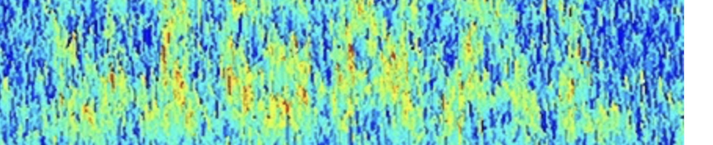

```{r, include=F, echo=F}
source('_first_chunk.R')
source('tabbed-rmd.R')
```


<!-- THIS SESSION IS A BIT LIGHT... PERHAPS ADD SOME MORE EXTENSION EXERCISES -->


```{html, child="bs-tab-fix.html"}
```


```{css, child="video.css"}
```





# Overview


An important task for quantitative researchers is to **answer questions using data**.
We can often divide this activity into:

- Describing patterns in the data
- Quantifying how *sure* we are about those patterns

This session is all about describing and visualising patterns in the data to answer research questions.


### Techniques covered

- [Central tendency and spread](#centralspread)
- [The *frequency* of responses](#responsefrequency)
- [Relationships](#relationships)


`r video("DNla39W33II")`
`r make_tabs('describeoverviewtabs')`

:::{.tab-content}

:::{#describeoverviewtabs-summary .tab-pane .active}

- We collect data to ***answer questions***
- The first step is to describe and visualise pattens in our data
- Common descriptions include measures of:
  - *central tendency* and *spread* of continuous variables (and of *differences* in these values)
  - the *frequency* of categorical responses
  - the *relationships* between variables (correlation)
- After that, we can quantify our confidence (see next workshop)
- Visualisation is an undervalued method for understanding data

:::

:::{#describeoverviewtabs-code .tab-pane .fade}
```{r}
# no code shown
```
:::


:::{#describeoverviewtabs-explanation .tab-pane .fade}


An important task for researchers is to ***answer questions using data***.
We can often divide this activity into:

1. **Describing patterns in the data**
2. **Quantifying how *sure* we are about those patterns**


This session is all about describing and visualising patterns in the data to answer
research questions.

In this session we will cover four techniques psychologists use to answer research questions.

1. summarising numeric variables by *central tendency* and *spread*
3. calculating the *frequency* of categorical responses
2. calculating *differences* between scores or groups
3. describing *relationship* between two variables


In the past psychologists have often neglected the first part (spotting and describing patterns) and jumped straight to the second --- for example, they have been very keen to run hypothesis tests and calculate *p* values...

More recently, researchers have placed much more emphasis on describing and visualising the data — to really get a feel for the patterns they see — *before* trying to quantify the evidence it provides or make inferences from it.

We have already seen how to implement some of these techniques in R (e.g. using `summarise()`) and with ggplot.

However, more important than any specific technique in R, is this idea that we ***collect data to answer questions*** (not just for it's own sake!).


:::

:::


# Central tendency and spread{#centralspread}

`r video("4mn_XxnSjUQ")`
`r make_tabs('describe-centrantend')`

:::{.tab-content}

:::{#describe-centrantend-summary .tab-pane .active}

- the *central tendency* of the data describes the "middle" of a set of values
- the mean and median are the most common measures
- measures of *spread* or distribution of the data show where most of the values fall (i.e. what range of values are most likely)
- common measures are the standard deviation or interquartile range
- we have already seen how to calculate these statistics using `summarise()` and `group_by()`

:::

:::{#describe-centrantend-code .tab-pane .fade}
```{r}
# this is a recap of earlier material

# calculate an average
# typical weight at baseline in the FIT trial
funimagery %>%
  summarise(mean(kg1))

# boxplots show the interquartile range (IQR) as the height of the box.
# The IQR is the range which includes 50% of the data points
funimagery %>%
  ggplot(aes(intervention, kg1)) +
  geom_boxplot() +
  scale_y_continuous(n.breaks = 10) # this extra line just adds more marks on the y-axis
```
:::


:::{#describe-centrantend-explanation .tab-pane .fade}


If we have a single continous variable — that is, one stored in a numeric column in R —  then can describe a few things about it, including:

1. the *central tendency* of the data: e.g. mean, median ([see here for refresher](https://www.graduatetutor.com/statistics-tutor/measures-of-central-tendency-mean-median-mode/))
2. the *spread* or distribution of the data: e.g. the standard deviation or interquartile range ([see refresher here](https://www.statisticshowto.com/probability-and-statistics/standard-deviation/#SDD))

It's important to remember that even simple descriptive statistics like the mean or standard deviation enable us to *answer research questions* — you don't always need fancy statistics! For example, if we consider the `funimagery` data describing the RCT of functional imagery training, we could ask:

- *"what was the typical weight of participants at baseline?"* or
- *"what was the **range** in which most participants' weight fell?"*

In part, you have already seen how techniques like `group_by()` and `summarise()`, or graphs like boxplots, can help calculate and present these *descriptive statistics*.


```{r}
# (this is a recap of earlier material)
# typical weight at baseline
funimagery %>%
  summarise(mean(kg1))


# a boxplot showing the IQR as the box. The IQR includes 50% of participants
# so, we can see 50% of participants weighed between 80 and 100kg at baseline
funimagery %>%
  ggplot(aes(intervention, kg1)) +
  geom_boxplot() +
  scale_y_continuous(n.breaks = 10) # this extra line just adds more marks on the y-axis
```


## Describing *differences*

The previous table and boxplot showed patients' weights at the start of the study.

There is also a variable in this dataset called `weight_lost_end_trt`,
which shows how much weight people lost between starting and completing FIT or MI.
In a previous session we made a boxplot like this:

```{r, echo=F}
funimagery %>%
  ggplot(aes(intervention, weight_lost_end_trt)) +
  geom_boxplot()
```

However, in clinical trials, it's important to measure participants for longer periods to judge whether the effect of a treatment is sustained.

Interventions for obesity and overweight can be successful, but patients may later regain weight [@hall2018maintenance]. And estimating how long weight loss is sustained for is important because it changes the long term prognosis of patients, and so how cost-effective an intervention is.

The `funimagery` data come from a study which followed people for 6 months after completing treatment (12 months after joining the study). The `kg1` column records weights at baseline, and the`kg3` columns
records observations made at the end of follow-up


This means we can calculate weight loss from baseline to follow-up (not just the end of treatment, which has already been done for us).

To do this we need to create a *new column* in our dataset. Let's call this `weight_lost_end_followup`.

To calculate this new column we need to subtract weight at baseline (`kg1`) from weight at the end of follow-up (`kg3`).

In R, we can do this with the `mutate` function:

```{r, eval=T}
# use `mutate` to create a NEW COLUMN of data
# this code shows the result just below the code chunk
funimagery %>%
  mutate(weight_lost_end_followup = kg3 - kg1)
```


:::{.direction}

- run the code above and show students the result
- point out that this has not been stored anywhere — just displayed in the RStudio GUI, below the code chunk

:::


What mutate does is to make a copy of our dataset, but with a new column in. That
is, it always gives us back a new dataset.

We almost always want to STORE this new copy of the dataset so we
can use the new column that was created.
To do this we assign the result of mutate `funimagery` dataset by *assigning*
the result of `mutate())` to a new variable (the 'container' type of variable).

The assignment operator is the left hand arrow, `<-`:

```{r}
funimagery.edited <- funimagery %>%
  mutate(weight_lost_end_followup = kg3 - kg1)
```


:::{.direction}

- show how a new variable has been created in the ***Environment*** window

:::


So the code above:

- takes the `funimagery` data and pipes it to the `mutate()` function, which
- adds a new column, called `weight_lost_end_followup`
- this new column is made by subtracting `kg1` (baseline) from `kg3` (end of followup); it then
- stores this new copy of the dataset (with the extra column) in a new *variable* called `funimagery.edited`:


We can then use this new variable, `funimagery.edited`, to do more work, like making a boxplot:

```{r}
# boxploot of weight lost at end of follow-up using new column
funimagery.edited %>%
  ggplot(aes(intervention, weight_lost_end_followup)) +
  geom_boxplot()
```

If anything, it looks like the difference between groups is even BIGGER after follow-up than it was at the end of treatment, which is very promising for FIT.

:::

:::


:::{#ex1 .exercise}

<!-- REMEMBER TO UPDATE THE WORKBOOK IF YOU TOUCH THIS !!! -->

**Exercise 1**

1. Open `session-4.rmd` using the **Files** pane. This is the workbook you will be using in this session.
1. Use `group_by()` and `summarise()` with the built-in `iris` dataset to calculate the mean `Sepal.Width` for each `Species` of flower.
1. Make a boxplot that shows the sepal width for each species of flower.

These are the correct numbers to check your work against:

```{r, echo=F, include=T}
iris %>%
  group_by(Species) %>%
  summarise(`Mean sepal width` =  sprintf("%.1f", mean(Sepal.Width) )) %>%
  pander()
```

Your plot should look like this:

```{r, echo=F, include=T}
iris %>%
  ggplot(aes(Species, Sepal.Width)) +
  geom_boxplot()
```


```{r, echo=F, include=F}
aesmcqq <- c("aes(Species, Sepal.Width))", "aes('Species', 'Sepal.Width')", "aes((species, sepal.width))", answer="aes(Species, Sepal.Width)")
```


The `aes` part of your ggplot code should be: `r mcq(aesmcqq)`

:::


:::{.exercise}
**Exercise 2**

In the video you saw how to use `mutate()` to create a new column which is the difference between values in two other columns.

1. Using the `funimagery` dataset, create a column representing weight lost between end of treatment and at the end of
followup.
1. Make a boxplot of these data.

Your plot should look like this:

```{r, echo=FALSE}
funimagery.edited <- funimagery %>%
  mutate(weight_lost_trt_followup = kg3 - kg2)

funimagery.edited %>%
  ggplot(aes(intervention, weight_lost_trt_followup)) +
  geom_boxplot()
```


`r hide("Show the correct code")`

This code would produce the plot above:

```{r, eval=F}
funimagery.edited <- funimagery %>%
  mutate(weight_lost_trt_followup = kg3 - kg2)

funimagery.edited %>%
  ggplot(aes(intervention, weight_lost_trt_followup)) +
  geom_boxplot()
```


`r unhide()`


:::


# The *frequency* of responses{#responsefrequency}


`r video("XB-b454apj4")`
`r make_tabs('describefrequencytabs')`

:::{.tab-content}

:::{#describefrequencytabs-summary .tab-pane .active}

- We can't calculate a mean or SD for Categorical variables
- We still want to describe the pattern of responses
- We can use `count()` and `group_by()` to make a *frequency table*
- This is common in journal results sections (e.g. to describe characteristics of the sample like gender or education)

:::

:::{#describefrequencytabs-code .tab-pane .fade}
```{r}
# this gives us the total number of rows
earnings %>% count()

# numbers of men and women
earnings %>%
  count(gender)


# We can do arithmetic on these numbers
# calculate percentage
2353 / 4483 * 100


# counts for multiple subgroups
earnings %>%
  count(job, gender)


# making a plot
earnings %>%
  ggplot(aes(gender)) +
  stat_count()
```

:::


:::{#describefrequencytabs-explanation .tab-pane .fade}

With categorical data it's not possible to calculate things like an average;
what would the average of 3 apples and 4 oranges be, for example?

Nonetheless, it is still useful to be able to describe the data and spot patterns.

For example, if we were thinking about the `earnings` dataset we might
ask things like:

- *"How many men and women were included in the sample?"*
- *"What proportion of participants worked in the public sector?"*
- *"Was this proportion similar for men and women?*"


The earnings data contained variables called `gender` and `job`, which give us
information to answer these questions:


```{r}
earnings %>% glimpse
```


### Using `count()`


To count the frequency of different responses we can use the `count` function, which
is again from the tidyverse package. [load tidyverse now]

For example, the following statement counts the total number of responses in our sample:


```{r}
# this gives us the total number of rows
earnings %>% count()
```

However, we often want to count the number of observations by-group. For example, if we write:

```{r}
# numbers of men and women
earnings %>%
  count(gender)
```

Here we added `gender` inside `count()` so R knows to count the responses from each group separately.


Note, this does the same thing as writing this, although one line shorter:

```{r}
earnings %>%
  group_by(gender) %>%
  count()
```


We can do arithmetic on these numbers to get the percentage of women in the sample:

```{r}
2353 / 4483 * 100
```

Later on you'll find ways to create a new column containing percentages (using mutate), but this is fine for now.


### Multiple subgroups

What's neat about `count()` is that we can add more than one variable at once, and we get a count for each sub-grouping that is formed. For example:

```{r}
earnings %>%
  count(job, gender)
```

You can re-order the table by changing the order in which you include `gender` and `job`.


:::

:::


:::{.exercise}
**Exercise 3**

```{r, echo=F, include=F}
funcounts <- funimagery %>% count(intervention, gender)
```

1. Use the `funimagery` data and `count()` to count how many participants there were in each intervention group.
1. How many men were in the FIT group? `r mcq(c(12,14,answer=funcounts$n[4], 18, 33, 28))`

<!-- funimagery %>% count(intervention, gender) -->

:::


# Relationships {#relationships}


`r video("PGV-MZlCoOc")`
`r make_tabs('describerelationshipstabs')`

:::{.tab-content}

:::{#describerelationshipstabs-summary .tab-pane .active}

- With 2 continuous variables we can also describe a *relationships* between them:
  - Scatterplots (using `geom_point()`)
  - Correlations (using `correlate()` and `correlationBF`)
- For correlations, the relationship must be *linear* (check with plot)
- Correlations describe the ***strength of the relationship*** (< 0.3 is weak; >.7 is strong)
- A Bayes Factor describes the ***strength of the evidence*** (>3 is considered moderate evidence)
- If we collect lots of data we could have *strong* evidence for a *weak*
relationship. With a small dataset we might only have weak evidence for a strong
relationship.

:::

:::{#describerelationshipstabs-code .tab-pane .fade}
```{r}
# load the libraries
library(corrr)
library(psydata)

# select weight at baseline and follow-up in the funimagery study
# and correlate them
funimagery %>%
  select(kg1, kg2, kg3) %>%
  correlate()

```

:::


:::{#describerelationshipstabs-explanation .tab-pane .fade}

When we have 2 or more continuous variables, we can also describe the *relationships* between them.

We have already seen how to use scatterplots to show the relationship between variables. For example,
using the trial data again, we can show the relationship between weight at baseline and end of treatment:

```{r, echo=F}
# show the relationship between weight at baseline and end of treatment
funimagery %>%
  ggplot(aes(kg1, kg2)) +
  geom_point() + coord_equal()
```


The scatterplot shows there is a ***strong, postive relationship*** between participants' weights at
baseline and after treatment.

Even though participants' weight does change in the trial, it is not by much.
We can see this by the way the points for each participant line up close to the diagonal: if their weight
stayed exactly the same we would see all the points in a line at 45 degrees from the graph origin.

***The scatterplot is a powerful description of the data in its own right***. Psychologists have tended to undervalue data visualisation, so it's important to make plots like this with your own data.


However, we do sometimes want to summarise the relationship further and describe the strength of the relationship in a single number. For this we use correlation.


## Correlation

A *correlation* is a single number which describes *how related* two continuous variables are.

For a correlation to work the relationship between the variables must be ***linear***. That is, the line on the graph has to be (fairly) straight (as it is in the example above).


To calculate a correlation we use the `correlate()` function in the `corrr` library.

First we load the library:

```{r}
library(corrr)

```


Next we need to select the columns we want to correlate. In this case we want to use `kg1`, `kg2`, and `kg3` in the `funimagery` dataset.

We can use `select()` to choose only these columns, and then use another pipe to send just those columns to `correlate()`:


:::{.direction}

- show selecting part of the code below
- ie. select and run just the line up to `select()`
- show how R spits out two columns of data below the chunk, rather than the whole dataset

:::


```{r, message=F}
# select weight at baseline and follow-up an correlate them
funimagery %>%
  select(kg1, kg2, kg3) %>%
  correlate()
```

The result of `correlate()` is a new dataset.

It has one column for each of the variables we selected, plus an extra column called `term` for the variable
being correlated.

The numbers represent the **correlation coefficient** for each pair of variables.
The correlation between a variable and itself is always perfect, so the numbers on
the diagonal of the table are not shown (they are `NA`).


:::{.direction}

- show and talk through some of the values in the table at this point

:::


We can see here that the correlations are all above 0.9, which is very high.

This isn't surprising though. Even when trying to lose weight if we
measure the same person twice these observations are likely to be quite closely related.


### Interpreting correlation coefficients

A *correlation coefficient* (the number) can be between -1 and 1. It is never outside this range.

The plot below shows examples of positive an negative correlations:

```{r, echo=F, include=F}
library(lavaan)
f <- '
y ~~ 1*y
a ~~ 1*a
b ~~ 1*b
c ~~ 1*c
y ~ 0*a
y ~ 1*b
y ~ -1*c
'
set.seed(1245)
cordata <- simulateData(f, sample.nobs = 100, standardized = T)
correlate(cordata)
```

```{r, echo=F}
cordata %>%
  rename(`Zero correlation`=a, `Positive (0.6)`=b, `Negative (-0.6)`=c) %>%
  pivot_longer(-y) %>%
  ggplot(aes(value, y)) + geom_point() + facet_wrap(~name) + coord_fixed()
```


# Summary

***Both plots and descriptive statistics are valuable ways of answering questions from the data.***
Psychologists sometimes neglect them (especially plots) but they are important steps in developing
understanding.

- Boxplots are useful for describing the differences between groups
- Scatterplots and smoothed-line plots help describe relationships

:::

:::


:::{.exercise}
**Exercise 4**

```{r, include=F}
pwreng.cor <- fuel %>% select(power, engine_size) %>% corrr::correlate() %>% pull(engine_size) %>% first()
```


1. Load the `corrr` package (use the `library()` function).
1. Use the `fuel` dataset from the `psydata` package, to calculate the correlation between `power` and `engine_size`. The correlation between these variables is: `r fitb(pwreng.cor, tol=.05)`
1. This means that as engine size increases, power `r mcq(c(answer="Increases", "Decreases", "Stays the same"))`


`r hide("Show the code")`

```{r}
library(corrr)
fuel %>% 
  select(power, engine_size) %>% 
  correlate()
```


`r unhide()`

:::


:::{.exercise}
**Exercise 5**

{width=40%}

It's helpful to get a feel for what the data would look like for different correlation coefficients.
<http://guessthecorrelation.com> is a game designed to help with this.

- The game shows you a scatterplot; your job is to guess the correlation coefficient.
- Try and get to about 30 points without losing any lives!  If you like you can get competitive and play a two-player game!

- Play now: <http://guessthecorrelation.com>


:::


# Check your knowledge

Write an answer to each of these questions in the `Check your knowledge` section of your workbook. The answers will be
revealed in Session 5.


- What functions in R describe the central tendency of a variable?
- What type of column can we use with `mean`?
- How might you describe patterns in a categorical variable?
- What function did we use to create a new column in the `funinmagery` dataset?
- In the `funimagery` data, how much weight did FIT participants lose AFTER the end of treatment?
- What type of plot describes the relationship between two variables?
- What function do we use to make a plot that shows a relationship between two variables in `ggplot`?


# Extension exercises


```{r, child="extension-exercises-premable.rmd"}
```


:::{.exercise}
**Extension exercise 1**

Correlations require that there is a *linear relationship* between the two variables. That is, the pattern in a
scatterplot should be fairly close to a straight line.

1. Plot pairs of variables from the `fuel` dataset.
2. Which pairs would be NOT be suitable for calculating a correlation?

`r hide()`

Engine size and MPG would be one example. There is a curved relationship between them:

```{r, echo=F, warning=F, message=F}
fuel %>% ggplot(aes(engine_size, mpg)) + geom_point() + geom_smooth(method=lm, formula=y~poly(x, 2), se=F)
```

The problem here is that a single straight line isn't appropriate for the data: The slope is
much less steep at the right hand side of the plot, but the correlation doesn't capture that, so
it's not a good statistic to describe the pattern we see here.


`r unhide()`

:::


# References
