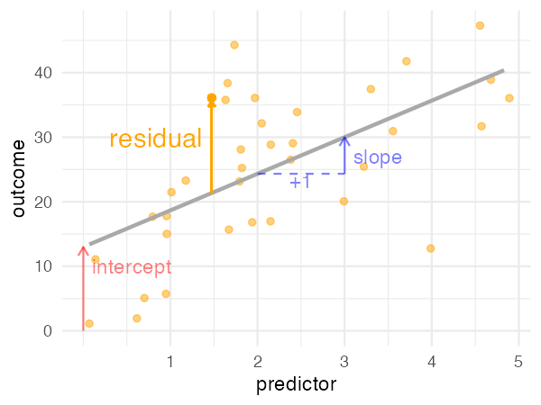

```{r, include=F, echo=F}
source('_first_chunk.R')
source('tabbed-rmd.R')
library(broom)
knitr::opts_chunk$set(
  cache = T
)
```

```{html, child="bs-tab-fix.html"}
```

```{css, child="video.css"}
```


](images/estimation.png)


# Overview

> 'Linear regression' is a fancy term for drawing the 'best-fitting' line through
> a scatterplot of two variables, and summarising *how well the line describes
> the data*.

> When doing regression in R, the relationship between an **_outcome_** and one
> or more **_predictors_** is described using a **_formula_**. When a model is
> '**_fitted_**' to a sample it becomes tool to make **_predictions_** for
> future samples. It also allows us to quantify our **_uncertainty_** about
> those predictions.

> **_Coefficients_** are numbers telling us how strong the relationships between
> predictors and outcomes are. But the meaning of coefficients depend entirely
> on the **_design_** of our study, and the **_assumptions_** we are prepared
> to make. Causal diagrams (as you
> [drew in the first session](causes.html)) can help us decide how
> to interpret our results.


### Learning outcomes

By the end of this session you will be able to:

- Use numbers (coefficients) to interpret a line on a scatterplot
- Run a simple linear regression model in R
- Make a prediction from the model
- Check 3 key assumptions


### Topics covered

- Revision for scatter plots
- Adding straight lines to scatter plots
- Explanation of the regression equation (describing a straight line in numbers)
- The regression line as a *prediction*
- Residuals as the error in prediction
- 3 assumptions of regression


### The dataset: Screen time and anxiety

Teychenne and Hinkley (2016) investigated the association between anxiety and daily hours of screen time (e.g., TV, computer, or device use) in 528 mothers with young children.

These data are available in the `psydata` package, in the `mentalh` dataset.


:::{.exercise}

Open the data and have a list the variables in the `mentalh` dataset:

```{r}
library(psydata)
help(mentalh)
```

:::


For this session we will mostly focus on:

- `screen_time`: How much time the mothers' spent on screens and
- `anxiey_score`: the number of anxiety symptoms experienced in the past week


# Scatterplots

## Showing relationships

In [session 1 we learned how to make a scatterplot](session-1.html#scatterplots), using `ggplot` and `geom_point`.
If we plot the `mentalh` data, we end up with something like this:


```{r, echo=F}
mentalh %>%
  ggplot(aes(screen_time, anxiety_score)) +
  geom_point() 
```


:::{.exercise}


*Do it: make a scatter plot*

1. As a refresher, make the plot shown above for yourself using:

- the `mentalh` dataset
- the `ggplot` and `geom_point` functions
- the `screen_time` and `anxiety_score` columns
- remember to use the `aes` function to select which variable appears on each axis

2. Describe the relationship between these two variables in no more than 2 or 3 sentences.

Record this in your Rmd workbook for this session.

`r hide("Show the code")`

```{r, eval=F, echo=T}
mentalh %>%
  ggplot(aes(screen_time, anxiety_score)) +
  geom_point() 
```

`r unhide()`

:::


## Adding best fit lines with `geom_smooth()`

`r video("O3G3m-iZKbg")`

`r make_tabs('O3G3m-iZKbg')`

:::{.tab-content}

:::{#O3G3m-iZKbg-summary .tab-pane .active}


To make predictions using **simple regression** we need to draw a *line of best fit* 
between one *outcome* variable and one *predictor* variable

- The *outcome* is what we want to predict or explain (e.g., anxiety scores)

- The *predictor* is what we use to predict the outcome variable (e.g., average hours of screen time per week)

- Both the outcome and predictor variable must be *continuous* variables


In this session we stick to drawing **straight lines** 
because they represent the simplest-possible relationship.

The best way to 'see' a simple linear regression is to use the `geom_smooth()`. 
This adds a line of best fit to our existing scatter plot.


:::

:::{#O3G3m-iZKbg-code .tab-pane .fade}

```{r, eval=F}
library(psydata)
library(tidyverse)

# make a scatterplot with a fitted line overlaid
mentalh %>%
  ggplot(aes(screen_time, anxiety_score)) +
  geom_point() +
  geom_smooth(method=lm, se=F) # makes straight line with no shading
```


:::


:::{#O3G3m-iZKbg-transcript .tab-pane .fade}


We can make a scatterplot as we have done previously:

```{r, fig.height=3}
mentalh %>%
  ggplot(aes(screen_time, anxiety_score)) +
  geom_point() 
```


It's common that we place variables that we consider outcomes on the y axis of the plot
and predictors on the x-axis, as here.


If we want to add a line to the plot we can use the geom_smooth function:

```{r, fig.height=3}
mentalh %>%
  ggplot(aes(screen_time, anxiety_score)) +
  geom_point() +
  geom_smooth()
```


By default geom_smooth draws a curved line through the data (it uses a technique 
called [loess smoothing](https://www.statisticshowto.com/lowess-smoothing/)). 
It's often quite useful to see the curve because it shows the trend in the relationship.

However in this case we want to see the best *linear* fit, because that will correspond with the 
simple linear regression we want to run.

To do that we just add `method=lm` to `geom_smooth`:

```{r, fig.height=3}
mentalh %>%
  ggplot(aes(screen_time, anxiety_score)) +
  geom_point() +
  geom_smooth(method=lm)
```

Now the blue line is the ***best linear fit*** between the predictor and the outcome.


:::

:::


:::{.exercise}

1. Recreate the plot  in the video with `screen_time` and the predictor, `anxiety_score` as the outcome, and with the line of best fit (using `geom_smooth(method=lm)`)           

2. Make two version: one with `method="lm"`, and one without. The lines look different — but which do you think is the "best"? How would we decide? (We will return to this topic later)

---

3. *If things are going well and only if you have time*, practice the technique using another dataset in the `psydata` package. Be sure to choose two continuous variables to plot.

:::


# Equation for a straight line


The line we draw using `method="lm"` is a simple linear regression.
In fact, the name `lm` stands for *linear model*.

If we fit a straight line to a scatterplot, we can describe the line using two numbers, in an equation. This has the form:

$\rm{Predicted\ outcome} = a + (b\times \rm{Predictor})$


These numbers are called **coefficients**  (this is the statistical term for a number which describes our model).

- $a$ is the **intercept** and represents *the height of the line when the predictor is zero*

- $b$ is the **slope** or **coefficient** for the predictor variable (`screen_time`). It says how steep the line is. Specifically it's the change in the outcome we expect when the predictor increases by one unit.


You can see the intercept and slope highlighted in the graph below:

```{r, echo=F}
set.seed(111)
egdata <- tibble(predictor = rnorm(100, 0,5), outcome=10+rnorm(100, 0, 10)+6.2*predictor) %>% 
  filter(outcome>0&predictor>0&outcome<60 &predictor<5)

egdata.model <- lm(outcome~predictor, egdata)
egdata.model.coefs <- coef(egdata.model) 
egdata.model.coefs.s <- coef(egdata.model) %>% sprintf("%.2f",.)
egdata %>% 
  ggplot(aes(predictor, outcome)) + 
  geom_point(alpha=.1) + 
  geom_smooth(method="lm_left", se=F, color="darkgrey") +
  # intercept
  geom_segment(aes(x=0, xend=0, y=0, yend = egdata.model.coefs[1]), color="red", arrow = arrow(length = unit(0.03, "npc"))) +
  
  # slope across
  geom_segment(aes(x=2, xend=3, 
                   y=2*egdata.model.coefs[2]+egdata.model.coefs[1],
                   yend=2*egdata.model.coefs[2]+egdata.model.coefs[1]
                   ), alpha = .5, color="blue", linetype="dashed") + #arrow = arrow(length = unit(0.03, "npc"))
  # slope up
  geom_segment(aes(x=3, xend=3, 
                   y=2*egdata.model.coefs[2]+egdata.model.coefs[1],
                   yend=3*egdata.model.coefs[2]+egdata.model.coefs[1],
                   ), color="blue", arrow = arrow(length = unit(0.03, "npc"))) +
  scale_x_continuous(breaks = 1:5) +
  geom_text(aes(label="+1", x=2.5, y=-4+2.5*egdata.model.coefs[2]+egdata.model.coefs[1]), color="blue") +
  geom_text(aes(label=str_interp("slope (${egdata.model.coefs.s[2]})"), 
                x=3.1, hjust=0, y=-3+3*egdata.model.coefs[2]+egdata.model.coefs[1]), color="blue") +
  geom_text(aes(label=str_interp("intercept (${egdata.model.coefs.s[1]})"),
                x=0.1, y=10, hjust=0), color="red") +
  theme_minimal()
```

:::{.exercise}

**Check your understanding.** Using the numbers shown in the plot above, answer the following questions:

1. The expected value of the outcome when the predictor is zero is: `r fitb(egdata.model.coefs[1], tol=.1)`
2. If we increased the value of the predictor by 1, we would expect the outcome to increase by: `r fitb(egdata.model.coefs[2], tol=.1)`
3. If we increased the value of the predictor by 3, we would expect the outcome to increase by: `r fitb(egdata.model.coefs[2]*3, tol=.1)`


`r hide("Show answers")`

1. The expected value is `r egdata.model.coefs[1] %>% sprintf("%.2f",.)`. This is intercept.

2. We would expect the outcome to increase by `r egdata.model.coefs[2] %>% sprintf("%.2f",.)`. This is equal to the slope coefficient for the predictor.

3. We expect the outcome to increase by about `r (egdata.model.coefs[2]*3) %>% round(0)`. This is 3 times the slope coefficient, because the slope represents the change in the outcome for a single-unit change in the predictor.


`r unhide()`


:::


# Estimating the coefficients

So, how do we calculate the coefficients?

There are actually lots of ways to draw a 'best-fit' line, but simple linear regression 
uses the ***"method of least squares"*** (as described in the lecture).

The calculations can be complex, but the `lm` function in R will do them for us.

This is an example:

```{r}
# conduct a simple regression to predict anxiety_score from screen_time
lm(anxiety_score ~ screen_time, data = mentalh)
```

**Explanation of the code**  

- The first part tells R to use the `lm` function. 
- The next part is known as a **model formula**
- The `~` symbol (called a 'tilde') means "*is predicted by*". So you can read the formula as saying
*"anxiety score is predicted by screen time"*. 
- Finally, we tell `lm` to use the `mentalh` data to estimate the coefficients.


**Explanation of the output**. When we use `lm`, the output displays:

-   The 'Call' we made (i.e. what inputs we gave, so we can remember how we did it later on)
-   The ***coefficients*** of the model. These are the **numbers which represent the line on the
    graph** we saw above.


:::{.exercise}

```{r, include=F, echo=F}
simple1 <- lm(anxiety_score ~ screen_time, data = mentalh)
s1coef <- simple1 %>% coef() %>% round(4)
```

**Check your understanding again** 

Use the numbers in the output from `lm` to answer these questions:

1. The expected anxiety score when screen time is zero is: `r fitb(s1coef[1], tol=.1)`

2. If we increased the number of hours spent on screen by 1, we would expect anxiety scores to increase by: `r fitb(s1coef[2], tol=.1)`

3. If we increased the number of hours on screen by 10, we would expect the outcome to increase by: `r fitb(s1coef[2]*10, tol=.1)`


`r hide("Show answers")`

The answers are:

1. `r s1coef[1]`

2. `r s1coef[2]`

3. `r s1coef[2]*10`


If these answers don't make sense check back to the previous "check your understanding" section, or ask for some help.

`r unhide()`


:::


# Predictions {#predictions}


`r video("_S39Ozem4JY")`

`r make_tabs('v_S39Ozem4JY')`

:::{.tab-content}

:::{#v_S39Ozem4JY-summary .tab-pane .active}

`lm` estimates coefficients to odescribe the line of best fit.

We can use these coefficients with the linear regression equation to make predictions for new individuals
using simple arithmetic.

However, it's more convenient to get R to make the predictions for us. To do this we need to:

1. Re-run the model, and store the results
2. Make a new dataframe, with the values of the predictor we will predict-for
3. Use the `augment` command to make the predictions

The video covers both the manual and automatic methods of making a prediction from the results of  `lm`.

:::

:::{#v_S39Ozem4JY-code .tab-pane .fade}

```{r, eval=F}
# run an lm model, saving the results as `simple1`
simple1 <- lm(anxiety_score ~ screen_time, data = mentalh)

# the tibble function makes a new data frame
new_data <- tibble(screen_time = 10 )

# broom contains the augment function
library(broom)

# make predictions for our new dataframe (i.e. for screentime = 10)
augment(simple1, newdata=new_data)

```

:::


:::{#v_S39Ozem4JY-transcript .tab-pane .fade}

## Making a prediction by hand

To recap, we have seen that:

- The *intercept* tells us what outcome to expect when the predictor is zero
- The *slope* tells us how much the outcome will change if we increase the predictor by 1

We can combine these two facts to *make predictions for individuals*, including individuals 
we didn't collect data for using basic arithmetic.

To do this we plug our coefficients back into the equation we saw above:

$\rm{Anxiety\ score} = `r s1coef[1]` + (`r s1coef[2]` \times \rm{Predictor})$


<br>

So, for a person who had 10 hours on a screen, we calculate an anxiety score as follows:

$\rm{Anxiety\ score} =  `r s1coef[1]` + (`r s1coef[2]` \times 10) = `r s1coef[1] + s1coef[2]*10` \rm{hours}$
 
<br>
<br>

For speed, we can use R as a calculator:

```{r}
# intercept + slope * 10 hours
5.5923 + 0.1318 * 10
```

**Explanation of output**: The result, `6.9103`, represents our prediction for someone who spends 10 hours on a screen.

<br>
<br>


## Making a prediction using R

When models get more complex and include more predictors (as they will in the next session) 
it's more convenient to get R to make the predictions for us.

To do this we need to:

1. Re-run the `lm`, and store the results
2. Make a new dataframe, with the values of the predictor we will predict-for
3. Use the **`augment`** command to make the predictions


### Step 1: re-run the model and save the results

```{r}
# re-run the same lm model, this time saving the results as `simple1`
simple1 <- lm(anxiety_score ~ screen_time, data = mentalh)
```

We can check this is the same model by using the name we stored it under as an R command:

```{r}
simple1
```

### Step 2: Make a new dataframe, with the values of the predictor we will predict-for

```{r}
# the tibble function makes a new data frame
new_data <- tibble(screen_time = 10 )
```

We can check this has worked as expected in the same way:

```{r}
new_data
```


**Explanation of the output**: We have a new dataframe, called `new_data`, which contains 1 row and 1 column (`screen_time`).


### Step 3. Use the `augment` command to make the predictions.

The `augment` function is in the `broom` package, so we need to load that first:

```{r}
library(broom)
```

Then we can use `augment` with the stored model (`simple1`), and the new dataframe (`new_data`): 

```{r}
augment(simple1, newdata=new_data)
```

**Explanation of the output**: The `augment` added new columns to the `new_data` dataframe. The predicted `anxiety_score` is in the `.fitted` column and is 6.91. The `.se.fit` column is the *standard error* of the predicted values (don't worry about this for now).


:::

:::


:::{.exercise}

*Check your understanding: Coefficients*

Using the coefficients in the `lm` output above, answer the following questions:

1. What is the expected anxiety score for a person who watched a screen for 2 hours? `r fitb(s1coef[1] + s1coef[2]*2, tol=.1)`

2. What is the expected anxiety score for a person who watched a screen for 24 hours? `r fitb(s1coef[1] + s1coef[2]*24, tol=.5)`


:::


:::{.exercise}

*Try it: Making a prediction with augment*

In your workbook:

1. Re-run the `lm` model which predicts anxiety from screen time
2. Save this model (give it a name like `simple1` or `model1`)
3. Make a new dataframe so that you can predict `anxiety_score` for someone who watched screens for 30 hours
4. Use `augment` to make the predictions

```{r, include=F, echo=F}
person30hrs <- augment(simple1, newdata=tibble(screen_time=30)) %>% pull(.fitted) %>% first()
```

The expected anxiety score for someone who watched screens for 30 hours is: `r fitb(person30hrs, tol=.1)`

:::


# Residuals


`r video("ceUMrPhpZ-0")`

`r make_tabs('residuals')`

:::{.tab-content}

:::{#residuals-summary .tab-pane .active}

We draw the line of best fit as close to the data as we can, but unless the model is *perfect* there will always be some distance
between the individual data points and the fitted line.

These distances are called ***residuals***.



Residuals are important when we:

- Evaluate how well the model fits
- Check that our model meets the assumptions of linear regression

:::


:::{#residuals-code .tab-pane .fade}

```{r eval=F, echo=T}
# re-run simple linear model and save result as `simple1`
simple1 <- lm(anxiety_score ~ screen_time, data = mentalh)

# use augment to get predictions and residuals for the original dataset
augment(simple1)
```


:::


:::{#residuals-transcript .tab-pane .fade}


We draw the line of best fit as close to the data as we can, but unless the model is *perfect* there will always be some distance
between the individual data points and the fitted line.

These distances are called ***residuals***.

The term 'residual' is short for *residual error in the prediction*: that is, the difference between what we predict from the line and the
actual data we collected.

We can see the residuals visualised in the plot below:

```{r, echo=F, include=T}

egdata.model.resid <- residuals(egdata.model)

residplot <- egdata %>% 
  ggplot(aes(predictor, outcome)) + 
  geom_point(alpha=.5, color="orange") + 
  geom_smooth(method="lm_left", se=F, color="darkgrey") +
  # intercept
  geom_segment(data=egdata[1,], aes(x=0, xend=0, y=0, yend = egdata.model.coefs[1]), color="red", arrow = arrow(length = unit(0.03, "npc")), alpha=.5,) +
  
  # slope across
  geom_segment(data=egdata[1,], aes(x=2, xend=3, 
                   y=2*egdata.model.coefs[2]+egdata.model.coefs[1],
                   yend=2*egdata.model.coefs[2]+egdata.model.coefs[1]
                   ), alpha = .5, color="blue", linetype="dashed") + #arrow = arrow(length = unit(0.03, "npc"))
  # slope up
  geom_segment(data=egdata[1,], aes(x=3, xend=3, 
                   y=2*egdata.model.coefs[2]+egdata.model.coefs[1],
                   yend=3*egdata.model.coefs[2]+egdata.model.coefs[1],
                   ), color="blue", alpha=.5, arrow = arrow(length = unit(0.03, "npc"))) +
  scale_x_continuous(breaks = 1:5) +
  geom_text(data=egdata[1,], aes(label="+1", x=2.5, y=-4+2.5*egdata.model.coefs[2]+egdata.model.coefs[1]), color="blue", alpha=.5) +
  geom_text(data=egdata[1,], aes(label=str_interp("slope"),x=3.1, hjust=0, y=-3+3*egdata.model.coefs[2]+egdata.model.coefs[1]), color="blue", alpha=.5) +
  
  geom_text(data=egdata[1,], label=str_interp("intercept"), x=0.1, y=10, hjust=0, color="red", alpha=.5) +
  
  # residual
  geom_point(aes(x = predictor[26], y=outcome[26]), color="orange") +
  geom_segment(aes(
                    x=predictor[26], xend=predictor[26], 
                    yend=outcome[26]-.5,
                    y=predictor[26]*egdata.model.coefs[2]+egdata.model.coefs[1],
                   ), color="orange", arrow = arrow(length = unit(0.02, "npc"))) +
  geom_text(data=egdata[26,], label="residual", aes(x=predictor-.1), y=30, hjust=1, size=5, color="orange") +
  theme_minimal()
  
  
ggsave('images/residuals-plot.png',residplot, width=4, height = 3, dpi = 150)
residplot

```


To calculate the residuals by hand we would subtract the *predicted* value (the point on the line) from the actual data point we 
observed: so we can say: 

$residual =  fitted - observed$.

However, a more convenient way to calculate the residuals (as it was for [predictions, above](#predictions)), is to use `augment`.

```{r}
augment(simple1) %>%  # augment returns a dataframe of predictions and residuals
  head() %>%  # take only first 6 rows
  select(anxiety_score, screen_time, .fitted, .resid) # show only the columns we need
```


**Explanation of the code and output**: 

- We used `augment` without a `newdata` input. This meant it made a prediction and 
calculated the residual for every row in the original data file. 
- We used the `head` function to show only he 
first few rows and 
- used the `select` function to hide extra columns we are not interested in.
- The output contains the prediction and residual for every row in the original dataset.


:::

:::


:::{.exercise}

*Try it: Calculate the residuals*

- Make sure you have run an `lm` and saved the result as `simple1`, as above
- Use `augment` on this saved model *without* specifying any new data


*Check your result*

- How many hours of screen time did the the person in the third row of the original data watch? `r fitb(4.2142, tol=.1)`
- The prediction for the 3rd row in the original dataset is: `r fitb(6.147666, tol=.1)` 


:::


# Checking Assumptions {#assumptions3}


`r video("jZc4lPQwd1Y")`

`r make_tabs('checkingassumptions')`

:::{.tab-content}

:::{#checkingassumptions-summary .tab-pane .active}

Regression makes three assumptions about the data that *must* be true if the 
results of the model are to be valid and useful:

1. The 'true' best-fit line is straight (i.e. _not_ curved)
2. Model residuals are approximately normal
3. The residuals are of equal size along the regression line


### How to check

We can make 3 **diagnostic** plots to check that our assumptions have been met:


1. We can use a regular scatter plot to check assumption 1. We covered this in previous sessions, and in the content above.

2. To check assumption 2 we make a plot which shows the ***distribution*** of the residuals.

3. For assumption 3, we can make a scatter plot of the *predicted* values, against the *residuals*


:::

:::{#checkingassumptions-code .tab-pane .fade}

```{r, eval=F}

# save our model
simple1 <- lm(anxiety_score ~ screen_time, data = mentalh)

# use augment to make predictions/residuals
augment(simple1) %>% 
  head()

# make a histogram of residuals from the model (#2)
augment(simple1) %>% 
  ggplot(aes(.resid)) + geom_histogram()

# scatter plot of predicted values vs. residuals  (#3)
augment(simple1) %>% 
  ggplot(aes(.fitted, .resid)) + 
  geom_point() + 
  geom_smooth()  
```


:::


:::{#checkingassumptions-transcript .tab-pane .fade}


## Checking for linearity

We have already covered this above, and we know that we can make a scatter plot with an added line 
to check that the relationship between predictor and outcome is broadly linear. For example, as we saw before:

```{r, echo=F}
mentalh %>% 
  ggplot(aes(screen_time, anxiety_score)) + 
  geom_jitter() + 
  geom_smooth(method=lm, se=F)
```


**Explanation of the output**: 

- We can see that the relation between screen time and anxiety is, broadly, a straight line, so 
- the first assumption of linear regression has been met.


Note, it can be hard to tell if the relationship is linear or curved, especially when data are noisy (like here) or we only hve a few samples. However, if the plot isn't clear then assuming linearity is a good default.


## Checking normality of residuals


We want our residuals to be normally distributed. 
To check the *distribution* of a variable we can make a histogram of the residuals.

The simplest way is to use the output of `augment`:

```{r}
# make a histogram of residuals from the model saved as simple1
augment(simple1) %>% 
  ggplot(aes(.resid)) + geom_histogram()
```

**Interpretation of the plot**: These residuals aren't *perfectly* normal, but they are close enough for our purposes here.


## Homogeneity (consistency) of variance

We also hope that the residuals are roughly the same all the way along the fitted line.  
This is sometimes called  *homogeneity of variance*. 

To check this we use another scatterplot with the *predictor* on the $x$ axis, and *predicted values* (the points on the line) on the $y$ axis.
It's nice to add a smoothed line to this plot, again using `geom_smooth`, to see the any trends more clearly.

In the output of `augment`, the `.fitted` column is the prediction (i.e. the points on the line), so we can plot them like this:

```{r}
# make a scatterplot of predicted values vs residuals 
augment(simple1) %>% 
  ggplot(aes(.fitted, .resid)) + 
  geom_point() + 
  geom_smooth() 
```

**Interpretation of the output**: 

- The residuals are equally spaced above and below the line and 
- the pattern remains mostly the same across the range of fitted values. 
- As a result, the trend line is mostly flat.
- It's not perfect, but this example would be considered 'good enough' (i.e. does not violate the assumption).

:::

:::


:::{.exercise}

*Try it: Checking assumptions*

- Re-run the `lm` model, again saving it as `simple1`

Use augment without specifying new data, and make:

- A histogram of the residuals
- A scatterplot of fitted vs. residual values

:::


# Further reading and exercises {#further}

Please read the following material between the workshop sessions. If you have questions
arising from it please bring them to the subsequent workshop and ask a member of staff there.


## Why do regression assumptions matter? 

We saw that regression models make three important assumptions:

1. the 'true' best-fit line is straight (i.e. _not_ curved)
2. residuals are approximately normal
3. residuals are of equal size along the regression line


There are two main reasons we should be suspicious about linear models that violate these assumptions:

1. Predictions will be systematically wrong in some cases. For example, if the true relationship between predictor and outcome is curved (as we saw in the GDP example above) then for some values of the predictor the model will be way-off. We may end up with predictions that are a long way from the true values.

2. Inferences we make from the model (e.g. using *p* values or Bayes Factors --- we will cover these in the next session) assume that the residuals are normally distributed. If this is not the case, then these statistics can be biased. Specifically, we may conclude that we have a 'real' effect, or have more evidence for an effect, than is really the case. This will lead us to draw the wrong conclusions from out data and, potentially, make bad decisions.


### How bad is 'too bad'? 

Some students ask "how will we know if the assumptions have been violated?". They worry when
we say "residuals should be *approximately* normal", because they don't know how much divergence from
normality would be 'too much'.

> In truth, there are no hard and fast criteria to check against for any of these assumptions.
> Sometimes it is obvious that assumptions have been violated, but often it is less clear cut.

For the moment, don't worry too much because we will make any assumptions-checks 
for your assessment very clear-cut. You will know right away (using diagnostic plots) 
if the assumptions of your model have been met.

However, some specific examples are shown below to provide context.


## Examples of assumptions violated {#violationexample}


```{r, echo=F, include=F}
library(patchwork)
# this code makes plots for a model and output ... for convenient examples below
combineddiagplots <- function(f, thedata){
  set.seed(123)
  nrows <- thedata %>% count() %>% pull(n)
  thedata <- thedata %>% sample_n(min(100, nrows))
  themodel <- lm(f, data=thedata)
  x <- as.list(f)[[3]] %>% as.character()
  y <- as.list(f)[[2]] %>% as.character()

  modeldata <- themodel$model
  modeldata$x =modeldata[,1]
  modeldata$y =modeldata[,2]
  aa <- modeldata %>% 
    ggplot(aes(x,y)) + geom_jitter(alpha=.5) + 
    geom_smooth(se=F) +
    geom_smooth(method=lm, se=F, color="red", size=.4) +
    labs(x="Predictor", y="Outcome") + ggtitle("Scatterplot")
  a <- augment(themodel) %>%
    ggplot(aes(.resid)) +
    geom_histogram(bins=25)+
     ggtitle("Distribution")
  b <- augment(themodel) %>%
    ggplot(aes(.fitted, .resid)) +
    geom_hline(yintercept = 0, color="red",  size=.4) +
    geom_jitter(alpha=.5) +
    geom_smooth(method = 'gam', formula=y ~ s(x, bs = "cs"), se=F) +
     ggtitle("Fitted vs. residual")
  return (aa +a +b + plot_layout(ncol = 3))
}
combineddiagplots(f=life_expectancy ~ gdp_per_capita, development)

```

Here we show some *unacceptable* models, which do violate the regression assumptions.

I have made the same types of diagnostic plot shown above using different datasets and variables. 
I have added red lines showing the *expectcted* trend of the data, if the assumptions had been met

### Example 1: National income and life expectancy

In this example we use the `development` dataset which contains data about the population and economy of countries around the world. 
The outcome of our model is the averag life expectancy of each country in years.
The predictor is the  national income of a country, per capita (in $).

```{r, echo=F, fig.cap="Diagnostics plots from a 'bad' regression model", fig.height=2.5, fig.width=6}
combineddiagplots(f=life_expectancy ~ gdp_per_capita, psydata::development)
```

***This model is problematic because***:

- the relationship between national income and life expectancy is not linear (there is a clear curve)
- the residuals change in size across the range of predicted values 

<br>

*Interpretation*: We should _not_ accept this model, or interpret results from it, because it violates two important
assumptions of linear regression.

There _are_ possible fixes for these problems (see the [next section](#fixingviolations)), but *all that is required for now* is to:

- identify when violations of assumptions have occurred, and 
- know that interpreting models which violate assumptions is inappropriate


### Example 2

In this example we use the `diamonds` dataset. 
The outcome of our model is the price of a diamond in £. The predictor is the size of
the diamond (measured in carats).

```{r, echo=F, fig.height=2.5, fig.width=6}
combineddiagplots(f=price ~ carat, diamonds)
```


:::{.exercise}

Given these diagnostic plots, how should we judge the model?

- The relationship looks linear: `r mcq(c("True", answer="False", "Hard to tell"))`
- The residuals are normally distributed: `r mcq(c("True", answer="False", "Hard to tell"))`
- The residuals are consistent across the range of fitted values: `r mcq(c("True", answer="False", "Hard to tell"))`


`r hide("Show comments and possible solutions")`

*Interpretation*: Here all three assumptions are violated. The relationships looks curved, the residuals are definitely
not normally-distributed, and the residuals get larger as the prediction increass. You shouldn't base inferences on a model like this.

`r unhide()`


:::


### Example 3

In this example we use the `mtcars` dataset, which contains data on cars. 
The outcome of our model is the fuel economy of cars in miles per gallon. 
The predictor is the weight of the car (measured in kg).


```{r, echo=F, fig.height=2.5, fig.width=6}
combineddiagplots(f=mpg ~ wt, mtcars)
```


:::{.exercise}

Given these diagnostic plots, how should we judge the model?

- The relationship looks linear: `r mcq(c(answer="True", "False", "Hard to tell"))`
- The residuals are normally distributed: `r mcq(c("True", "False", answer="Hard to tell"))`
- The residuals are consistent across the range of fitted values: `r mcq(c("True", answer="False", "Hard to tell"))`


`r hide("Show comments and possible solutions")`

*Interpretation*: Although the residuals are larger for large and small fitted values, these diagnostic plots look "OK".
If possible we should amend our model to improve things (e.g. by adding predictors), but inferences from this  model 
would most likely be reasonable.
Note that it can be hard to tell whether residuals are normally distributed when we don't have much data — as is the case here (N=32).

`r unhide()`


:::


### Example 4

In this example we use the `iris` dataset, which contains data on the width and length of flower petals for different species.
The outcome of our model is the length of petals (in mm). 
The predictor is the width of the petals (mm).

```{r, echo=F, fig.height=2.5, fig.width=6}
combineddiagplots(f= Petal.Length ~ Petal.Width, iris)
#combineddiagplots(f= Petal.Length ~ Petal.Width+Species+Sepal.Length, iris)
```

:::{.exercise}

Given these diagnostic plots, how should we judge the model?

- The relationship looks linear: `r mcq(c(answer="True", "False", "Hard to tell"))`
- The residuals are normally distributed: `r mcq(c(answer="True", "False", "Too hard to tell"))`
- The residuals are consistent across the range of fitted values: `r mcq(c("True (probably)", answer="False (probably not)", "Too hard to tell"))`


`r hide("Show comments and possible solutions")`

In this case the relationship looks mostly linear, although there is a tendency for the relationship to tail off (curve) at higher values
of petal width. The residuals are normally distributed, but they don't appear to be consistent across the range of predicted values.

*Interpretation*: Strictly, we shouldn't interpret this model as-is. If possible we should adapt our model, perhaps by adding predictors.
Nonetheless, plenty of published research _would_ report and base inferences on a model like this.

`r unhide()`


:::


## Understanding and fixing assumptions violations {#fixingviolations}

:::{.tip}

Many students will not have time for this additional material during the scheduled workshops.
This section is optional and not required for the module assessment.

:::


In an [example above](#violationexample) we saw that a model predicting life expectancy from GDP per-person lead us to violate some assumptions of regression. There are many different techniques which can be used to work around this kind of problem. Here we illustrate one.

If we look at the data used for the model above, we can see that the relationship between GDP and life expectancy is not linear.
We can see this because the points are in a curved shape, and so the line cannot get close to them all the way along the range of predictor values.
This itself violates an assumption of regression. It also caused problems with the residuals, as we saw above.

```{r, echo=F, fig.height=3}
development %>% 
  ggplot(aes(gdp_per_capita, life_expectancy)) + geom_point() + geom_smooth(method=lm, se=F)
```

To understand why this is the case, we can plot the distribution of national incomes:

```{r, echo=F, fig.height=2.5}
# use a histogram to show the distribution of incomes
development %>% 
  ggplot(aes(gdp_per_capita)) + geom_histogram()
```

We can see that incomes are _not_ normally distributed. 
In fact, they are very [*right skewed*](https://www.statology.org/left-skewed-vs-right-skewed/): most GDP values are quite low, but there is a long tail on the right hand side.  
This is quite typical of incomes data — both  nationally and for individuals: wealth is very unequally distributed, and some people
are really [a _lot_ richer than the average](https://bezoscalculator.com).


### Transforming the outcome

One option in these cases is to *transform* the outcome so that it _is_ more normally distributed.

For example, if we plot the [logarithm](https://www.khanacademy.org/math/algebra2/x2ec2f6f830c9fb89:logs/x2ec2f6f830c9fb89:log-intro/v/logarithms) of GDP, this is (a bit more) normally distributed. 

The log function transforms the data and "squashes" the large values downwards, reducing the skew:

```{r, fig.height=2.5}
# make a log plot of incomes.. now less skewed
development %>% 
  ggplot(aes(log(gdp_per_capita))) + 
  geom_histogram() 
```

We can use this transformation to our advantage when we run our models. If we plot $log(gdp)$ rather than $gdp$ as our predictor, we can see that the relationship between the two variables is linear again:

```{r, fig.height=3}
development %>% 
  ggplot(aes(log(gdp_per_capita), life_expectancy)) + 
  geom_point() + 
  geom_smooth(method=lm, se=F) 
```

And this means if we use `log(gdp_per_capita)` as the predictor in an `lm` model, the 
model residuals no longer violate the assumptions (or at least, not too badly):


```{r, echo=F, fig.cap="Diagnostics plots from a regression model using a log-transformed outcome.", fig.height=2.5}
combineddiagplots(life_expectancy ~ log(gdp_per_capita), development)
```

:::{.exercise}

*Try it for yourself*:

- Use the built in `mtcars` dataset.
- Make a scatterplot of the `mpg` (miles per gallon) and `hp` (horsepower) variables
- Add a fitted line using `geom_smooth`
- Use a `log()` transform on the `hp` variable and make the plot again
- Do either or both of the plots show a linear relationship? Which would be more suitable to use in a regression model?


- If all is going well and you have time, you could try running this model using `lm` and making the diagnostic plots shown above using `augment` and `ggplot`.


`r hide("Show code")`

```{r}
# looks non-linear
mtcars %>% 
  ggplot(aes(hp, mpg)) + geom_point() + geom_smooth()

# looks more linear
mtcars %>% 
  ggplot(aes(log(hp), mpg)) + geom_point() + geom_smooth()

# run the model and make a fitted vs residual plot
# this isn't perfect, but the residuals look "ok"
lm(mpg ~ log(hp), mtcars) %>% 
  augment() %>% 
  ggplot(aes(.fitted, .resid)) + geom_point() + geom_smooth()

```


`r unhide()`

:::


# Summary and key points


### Simple regression

- Simple regression fits a line to describe the relationship between and *outcome* and one *predictor*
- The outcome must be a continuous variable
- The slope and intercept coefficients form part of the regression equation used for prediction
- These are estimated from the data using the `lm` function
- A residual is the distance between the prediction and the real value
- The `augment` function calculates predicted values and residuals for us
- Regression makes 3 important assumptions that we should check using diagnostic plots before interpreting the model output


### Key R code

Before continuing, check you are able to use each of these functions confidently:


- `geom_point()` and `geom_smooth()`: scatter plots with fitted lines

- `lm( outcome ~ predictor, dataset)`: simple regression

- `model_1 <- lm( outcome ~ predictor, dataset)`: save model results as `model_1`

- `augment(model_1)`: Calculate residuals for a saved model


# Check your knowledge


```{r, include=F, echo=F}
whatintercept <- c("The expected value of the outcome for the average person", 
                   answer="The expected value of the outcome when the predictor is equal to zero",
                   "The increase in the predictor for a unit change in the outcome",
                   "The increase in the outcome for a unit change in the predictor",
                   "The sum of the distance between the datapoints and the best fit line",
               "The distance between an observed outcome value, and the value predicted by the model",
                   "The average distance between the datapoints and the best fit line",
                   "Where the best-fit line starts"
                   )

whatslope <- c("The expected value of the outcome for the average person", 
                   "The expected value of the outcome when the predictor is equal to zero",
                   "The increase in the predictor for a unit change in the outcome",
                answer=   "The increase in the outcome for a unit change in the predictor",
               "The sum of the distance between the datapoints and the best fit line",
               "The distance between an observed outcome value, and the value predicted by the model",
                   "The average distance between the datapoints and the best fit line",
                   "Where the best-fit line starts"
                   )

whatresid <- c("The expected value of the outcome for the average person", 
                   "The expected value of the outcome when the predictor is equal to zero",
                   "The increase in the predictor for a unit change in the outcome",
                 "The increase in the outcome for a unit change in the predictor",
                   "The average distance between the datapoints and the best fit line",
               "The sum of the distance between the datapoints and the best fit line",
                answer= "The distance between an observed outcome value and the value predicted by the best fit line",
                   "Where the best-fit line starts"
                   )


whatfuncmodel <- c(
  "geom_smooth()",
  answer="lm",
  "lmer",
  "regress",
  "predict",
  "augment"
  )

whatfuncrespred <-  c(
  "geom_smooth",
  "summary",
  "lm",
  "regress",
  "predict",
  answer="augment",
  ".resid",
  ".fitted"
  )
```


- What is an intercept? `r mcq(whatintercept)`
- What is the slope? `r mcq(whatslope)`
- What is a residual? `r mcq(whatresid)`
- Which function fits a regression model? `r mcq(whatfuncmodel)`
- Which function calculates residuals and predictions from a saved `lm` model? `r mcq(whatfuncrespred)`

- What are the three assumptions of regression introduced in this session?  (Make a note of your answers, then [check them here](#assumptions3))


<br><br><br>


<!-- # References -->
